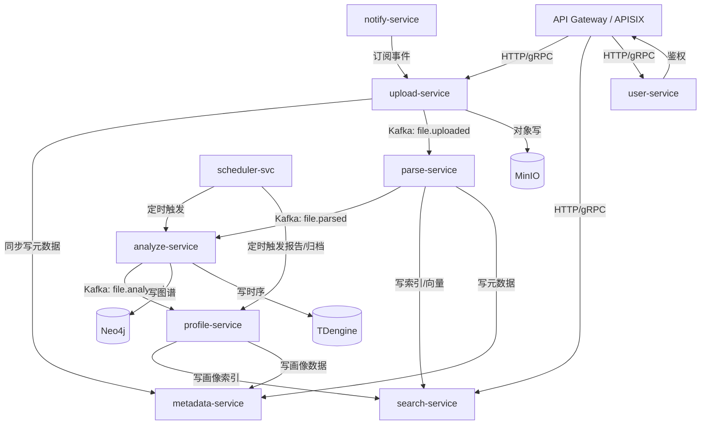

# 网络安全红方文件汇聚平台架构设计文档

## 文档信息

| 项目名称 | 网络安全红方文件汇聚平台 |
|---------|----------------------|
| 版本     | v2.1                 |
| 创建日期 | 2026-03-15           |
| 修订日期 | 2026-07-27           |
| 文档状态 | P1/P2 评审修复版       |

---

## 目录

1. [项目概述](#1-项目概述)
2. [整体架构设计](#2-整体架构设计)
3. [存储架构设计](#3-存储架构设计)
4. [文件上传模块设计](#4-文件上传模块设计)
5. [文件解析模块设计](#5-文件解析模块设计)
6. [混合检索模块设计](#6-混合检索模块设计)
7. [文件分析模块设计](#7-文件分析模块设计)
8. [目标画像刻画模块设计](#8-目标画像刻画模块设计)
9. [关键技术难点与解决方案](#9-关键技术难点与解决方案)
10. [部署架构建议](#10-部署架构建议)
11. [安全设计](#11-安全设计)
12. [监控与运维](#12-监控与运维)
13. [跨数据源一致性设计](#13-跨数据源一致性设计)
14. [附录](#附录)

---

## 1. 项目概述

### 1.1 业务背景

网络安全红方业务需要处理海量安全相关文件，包括但不限于：
- 渗透测试报告
- 漏洞扫描结果
- 流量捕获文件（PCAP）
- 日志文件
- 恶意样本
- 配置文件
- 目标资产信息

### 1.2 业务需求

| 需求项 | 描述 |
|-------|------|
| 文件上传 | 支持大文件、批量上传、断点续传 |
| 文件解析 | 支持多种格式解析，提取结构化信息 |
| 混合检索 | 全文检索 + 元数据检索 + 向量语义检索 |
| 文件分析 | 自动化安全分析、关联分析 |
| 目标画像 | 基于文件信息刻画目标特征画像 |

### 1.3 数据规模

| 指标 | 数值 |
|-----|------|
| 文件数量 | 1000万+ |
| 存储容量 | 1010 TB（可用容量，详见 §10.4） |
| 并发上传 | 1000 QPS |
| 检索响应（检索P99） | < 200ms |
| 检索响应（端到端P99） | < 800ms |
| 最终一致性SLA | PG→ES < 30s / PG→Milvus < 60s / PG→Neo4j < 120s |

> **P99指标说明**：原"端到端 P99 < 500ms"不可行（embedding推理本身约200-400ms）。已拆分为检索P99<200ms（不含embedding）和端到端P99<800ms（含embedding+融合+排序），并通过查询向量缓存、Embedding独立线程池、CompletableFuture显式Executor等手段保障（详见 §6.4）。

---

## 2. 整体架构设计

### 2.1 架构原则

```
+---------------------------------------------------------------------+
|                        架构设计原则                                   |
+---------------------------------------------------------------------+
|  1. 高可用性    - 多副本部署，故障自动转移                         |
|  2. 可扩展性    - 水平扩展优先，支持弹性伸缩                        |
|  3. 高性能      - 异步处理，缓存优化，读写分离                      |
|  4. 安全性      - 多层防护，数据加密，访问控制                      |
|  5. 可观测性    - 全链路监控，日志聚合，告警机制                    |
+---------------------------------------------------------------------+
```

### 2.2 微服务划分

```
+-----------------------------------------------------------------------------+
|                              API Gateway Layer                               |
|                         (Kong / APISIX / Spring Cloud Gateway)               |
+-----------------------------------------------------------------------------+
                                      |
        +-----------------------------+-----------------------------+
        |                             |                             |
        v                             v                             v
+---------------+           +---------------+           +---------------+
|  文件上传服务   |           |  文件解析服务   |           |  检索服务      |
| upload-service |           | parse-service  |           | search-service |
+---------------+           +---------------+           +---------------+
| - 文件接收     |           | - 格式识别     |           | - 全文检索     |
| - 分片管理     |           | - 内容提取     |           | - 元数据检索   |
| - 断点续传     |           | - 元数据提取   |           | - 向量检索     |
| - 上传限流     |           | - 异步处理     |           | - 混合查询     |
+---------------+           +---------------+           +---------------+
        |                             |                             |
        |                             |                             |
        v                             v                             v
+---------------+           +---------------+           +---------------+
|  文件分析服务   |           |  画像服务      |           |  元数据服务    |
| analyze-service|           | profile-service|           | metadata-svc   |
+---------------+           +---------------+           +---------------+
| - 安全分析     |           | - 特征提取     |           | - 元数据管理   |
| - 关联分析     |           | - 画像生成     |           | - 标签管理     |
| - 威胁检测     |           | - 关系图谱     |           | - 分类管理     |
| - 报告生成     |           | - 动态更新     |           | - 权限控制     |
+---------------+           +---------------+           +---------------+
        |                             |                             |
        +-----------------------------+-----------------------------+
                                      |
        +-----------------------------+-----------------------------+
        |                             |                             |
        v                             v                             v
+---------------+           +---------------+           +---------------+
|  任务调度服务   |           |  通知服务      |           |  用户服务      |
| scheduler-svc  |           | notify-service |           | user-service   |
+---------------+           +---------------+           +---------------+
| - 任务分发     |           | - 消息推送     |           | - 认证授权     |
| - 状态追踪     |           | - 邮件通知     |           | - 权限管理     |
| - 失败重试     |           | - 系统告警     |           | - 审计日志     |
+---------------+           +---------------+           +---------------+
```

### 2.3 技术选型

#### 2.3.1 后端技术栈

| 层次 | 技术选型 | 选型理由 |
|-----|---------|---------|
| 开发语言 | Java 17 / Python 3.11 | Java用于核心业务服务，Python用于AI/分析模块；跨语言通过 gRPC + Protobuf 通信，AI推理统一通过 ONNX Runtime（Java 可直接调用，减少跨语言调用开销） |
| 核心框架 | Spring Boot 3.x / Spring Cloud OpenFeign | Java 核心业务服务；OpenFeign 用于声明式同步调用；Python 侧使用 FastAPI |
| 服务网关 | Apache APISIX | 高性能、动态配置、插件丰富 |
| 服务注册 | Nacos 2.x | 仅作配置中心；服务注册发现统一由 Istio 通过 DNS + Envoy sidecar 完成 |
| 服务通信 | gRPC (HTTP/2) + Spring Cloud OpenFeign | gRPC 用于跨语言/流式/高频调用，OpenFeign 用于简单 HTTP 调用；服务治理统一由 Istio Service Mesh 承担 |
| 异步消息 | Apache Kafka 3.x | 统一消息队列：3.x 支持事务消息与精确一次语义；Kafka Streams 用于流处理；移除 RocketMQ，避免双套消息体系 |
| 任务调度 | Apache DolphinScheduler | 分布式任务调度，支持复杂DAG |
| Service Mesh | Istio 1.x + Envoy sidecar | 明确选择 Istio Service Mesh，移除 Dubbo 3.x（避免双套服务治理体系冲突）；流量治理/mTLS/可观测性统一由 Istio 承担 |

> **多语言混用方案（Java + Python）**：
> - 核心业务服务（upload/parse/search/analyze/profile/metadata）：Java（Spring Boot 3.x）
> - AI 模块（embedding/NER/OCR/LLM）：Python（FastAPI + ONNX Runtime）
> - 跨语言通信：gRPC + Protobuf（idl 集中管理于 `proto/` 仓库）
> - 模型推理：ONNX Runtime（Java 侧可通过 onnx-runtime-java 直接调用，避免高频跨语言 RPC）

#### 2.3.2 存储技术栈

| 存储类型 | 技术选型 | 选型理由 |
|---------|---------|---------|
| 对象存储 | MinIO | 统一对象存储，支持 S3 协议；冷热分层通过 MinIO Object Tiering + 生命周期策略实现，冷层 Tiering 到 S3 兼容存储；移除 Ceph，避免双套对象存储体系 |
| 关系数据库 | PostgreSQL 15 + Citus | 分布式PostgreSQL，强一致性 |
| 时序数据库 | TDengine | 仅用于安全事件时序分析（文件访问日志、攻击时间线回放）；纯监控指标继续使用 Prometheus 自带 TSDB |
| 全文检索 | Elasticsearch 8.x | 成熟的全文检索引擎 |
| 向量数据库 | Milvus 2.x | 高性能向量检索，支持多种索引；统一嵌入模型 BGE-large-zh-v1.5，向量维度 1024 |
| 图数据库 | Neo4j / NebulaGraph | 关系图谱，目标关联分析 |
| 缓存 | Redis 7.x Cluster | 高性能缓存，支持多种数据结构 |
| 消息队列 | Apache Kafka 3.x | 高吞吐，持久化存储；统一消息队列 |

#### 2.3.3 AI/分析技术栈

| 功能 | 技术选型 | 选型理由 |
|-----|---------|---------|
| NLP处理 | HuggingFace Transformers | 丰富的预训练模型 |
| 向量模型 | BGE / M3E | 中文语义向量模型 |
| OCR识别 | PaddleOCR | 高精度中文OCR |
| 文件解析 | Apache Tika + 自研解析器 | 多格式支持，可扩展 |
| 恶意检测 | YARA + ClamAV + ML模型 | 多引擎检测 |

### 2.4 服务通信架构

```
+-----------------------------------------------------------------------------+
|                            Service Mesh (Istio)                             |
+-----------------------------------------------------------------------------+
|                                                                             |
|   +---------+    +---------+    +---------+    +---------+                |
|   | Service |    | Service |    | Service |    | Service |                |
|   |    A    |--->|    B    |--->|    C    |--->|    D    |                |
|   +---------+    +---------+    +---------+    +---------+                |
|        |              |              |              |                      |
|        v              v              v              v                      |
|   +---------+    +---------+    +---------+    +---------+                |
|   | Envoy   |    | Envoy   |    | Envoy   |    | Envoy   |                |
|   | Sidecar |    | Sidecar |    | Sidecar |    | Sidecar |    |
|   +---------+    +---------+    +---------+    +---------+                |
|        |              |              |              |                      |
|        +--------------+--------------+--------------+                      |
|                              |                                              |
|                              v                                              |
|                    +-----------------+                                     |
|                    |   mTLS Tunnel   |                                     |
|                    +-----------------+                                     |
+-----------------------------------------------------------------------------+

通信协议选择:
+----------------+----------------------------------------------------------+
| 场景            | 协议选择                                                  |
+----------------+----------------------------------------------------------+
| 同步调用        | gRPC (protobuf序列化，HTTP/2多路复用)                      |
| 简单HTTP调用    | Spring Cloud OpenFeign (声明式 REST 客户端)                |
| 异步通知        | Kafka 3.x (事务消息，精确一次语义)                          |
| 日志流          | Kafka (高吞吐，分区有序)                                   |
| 流处理          | Kafka Streams (轻量级流处理，避免引入 Flink 之外第二套)     |
| 文件传输        | gRPC Stream (流式传输，背压控制)                           |
| 事件驱动        | CloudEvents + Kafka (标准化事件格式)                       |
+----------------+----------------------------------------------------------+

> **消息队列统一说明**：已移除 RocketMQ，统一使用 Kafka 3.x。
> - 事务消息场景：Kafka 3.x 事务 API（`transactional.id` + ISR 2 + acks=all）
> - 延迟/定时消息：Kafka 分层 Topic + 定时器转发，或 DolphinScheduler 调度
> - 业务消息/日志流/CDC：统一 Kafka，topic 命名规范 `{domain}.{event}.{version}`
```

### 2.5 服务依赖关系图与循环依赖检查

#### 2.5.1 服务依赖关系图（Mermaid 描述）



#### 2.5.2 依赖关系清单

| 上游服务 | 下游服务 | 通信方式 | 用途 |
|---------|---------|---------|------|
| upload-service | metadata-service | gRPC（同步） | 写入文件元数据 |
| upload-service | parse-service | Kafka `file.uploaded` | 触发异步解析 |
| upload-service | MinIO | S3 SDK | 写入文件对象 |
| parse-service | search-service | gRPC（同步） | 写入 ES/Milvus 索引 |
| parse-service | analyze-service | Kafka `file.parsed` | 触发异步分析 |
| analyze-service | profile-service | Kafka `file.analyzed` | 触发画像生成 |
| analyze-service | Neo4j | Bolt | 写入关系图谱 |
| analyze-service | TDengine | JDBC | 写入时序数据 |
| profile-service | search-service | gRPC（同步） | 写入画像索引 |
| profile-service | metadata-service | gRPC（同步） | 写入画像数据 |
| scheduler-svc | analyze-service / profile-service | DolphinScheduler API | 定时调度周期任务 |

#### 2.5.3 循环依赖检查与消除

依赖关系（同步/异步有向边）：

```
upload → metadata → ∅
upload → parse → search → ∅
upload → parse → analyze → profile → search → ∅
analyze → profile → metadata → ∅
```

**检查结论**：上述依赖图严格无环（DAG）。曾存在的潜在环路风险及消除方式：

1. **search ↔ metadata 互调风险**：search-service 不直接写 metadata-service，所有写入路径由 parse/profile 通过 metadata 完成；search 只读 metadata（只读不构成强依赖环）
2. **analyze ↔ profile 双向触发风险**：profile → analyze 方向走 Kafka `profile.completed` 事件回流至 analyze 仅做"画像引用文件"的反向标注，单向依赖（analyze → profile）保持，反向标注通过事件订阅实现，不形成同步调用环
3. **metadata 反向依赖风险**：metadata-service 不依赖任何上游业务服务，仅向 MinIO/PG 写入；如需文件内容预览，统一通过 MinIO 直连，禁止反向调用 upload-service

**强制约束（编码规范）**：

- 微服务间禁止同步双向调用；如需双向交互，必须通过 Kafka 事件解耦
- 引入新依赖前需在 `arch-deps.yaml` 登记，由 CI 执行拓扑排序检查是否引入环
- Istio AuthorizationPolicy 默认拒绝，仅显式声明允许的 (src, dst, method) 三元组放行

---

## 3. 存储架构设计

### 3.1 存储分层设计

```
+-----------------------------------------------------------------------------+
|                              存储分层架构                                    |
+-----------------------------------------------------------------------------+
|                                                                             |
|  +---------------------------------------------------------------------+   |
|  |                        热数据层 (Hot Tier)                           |   |
|  |  +-------------+  +-------------+  +-------------+                  |   |
|  |  | Redis Cache |  |  Local SSD  |  |  Memory DB  |                  |   |
|  |  |  (热点数据)  |  | (近期文件)  |  | (会话状态)  |                  |   |
|  |  |   500GB     |  |   10TB      |  |   100GB     |                  |   |
|  |  +-------------+  +-------------+  +-------------+                  |   |
|  +---------------------------------------------------------------------+   |
|                                    |                                        |
|                                    v                                        |
|  +---------------------------------------------------------------------+   |
|  |                        温数据层 (Warm Tier)                          |   |
|  |  +-------------------------------------------------------------+    |   |
|  |  |              MinIO Cluster (NVMe SSD)                        |    |   |
|  |  |              6节点 × 4×30TB = 720TB 原始                      |    |   |
|  |  |              EC:4(4数据+4校验) → 360TB 可用                   |    |   |
|  |  |              (近3个月活跃文件，检索索引)                        |    |   |
|  |  +-------------------------------------------------------------+    |   |
|  +---------------------------------------------------------------------+   |
|                                    |                                        |
|                                    v                                        |
|  +---------------------------------------------------------------------+   |
|  |                        冷数据层 (Cold Tier)                          |   |
|  |  +-------------------------------------------------------------+    |   |
|  |  |              MinIO Cluster (HDD)                              |    |   |
|  |  |              6节点 × 8×20TB = 960TB 原始                       |    |   |
|  |  |              EC:4(4数据+4校验) → 480TB 可用                    |    |   |
|  |  |              (历史归档文件，长期存储)                          |    |   |
|  |  +-------------------------------------------------------------+    |   |
|  +---------------------------------------------------------------------+   |
|                                    |                                        |
|                                    v                                        |
|  +---------------------------------------------------------------------+   |
|  |                        归档层 (Archive Tier)                         |   |
|  |  +-------------------------------------------------------------+    |   |
|  |  |              对象存储 / 磁带库                                |    |   |
|  |  |              (合规归档，长期保存)                             |    |   |
|  |  +-------------------------------------------------------------+    |   |
|  +---------------------------------------------------------------------+   |
|                                                                             |
+-----------------------------------------------------------------------------+
```

### 3.2 MinIO集群架构

```
+-----------------------------------------------------------------------------+
|                         MinIO Distributed Cluster                           |
+-----------------------------------------------------------------------------+
|                                                                             |
|   +---------------------------------------------------------------------+  |
|   |                        Load Balancer (HAProxy)                       |  |
|   +---------------------------------------------------------------------+  |
|                                      |                                      |
|            +-------------------------+-------------------------+           |
|            |                         |                         |           |
|            v                         v                         v           |
|   +---------------+        +---------------+        +---------------+     |
|   |  MinIO Node 1 |        |  MinIO Node 2 |        |  MinIO Node 3 |     |
|   |  +---------+  |        |  +---------+  |        |  +---------+  |     |
|   |  | Disk 1  |  |        |  | Disk 1  |  |        |  | Disk 1  |  |     |
|   |  | Disk 2  |  |        |  | Disk 2  |  |        |  | Disk 2  |  |     |
|   |  | Disk 3  |  |        |  | Disk 3  |  |        |  | Disk 3  |  |     |
|   |  | Disk 4  |  |        |  | Disk 4  |  |        |  | Disk 4  |  |     |
|   |  +---------+  |        |  +---------+  |        |  +---------+  |     |
|   |   4×30TB NVMe |        |   4×30TB NVMe |        |   4×30TB NVMe |     |
|   +---------------+        +---------------+        +---------------+     |
|            |                         |                         |           |
|            +-------------------------+-------------------------+           |
|                                      |                                      |
|            +-------------------------+-------------------------+           |
|            |                         |                         |           |
|            v                         v                         v           |
|   +---------------+        +---------------+        +---------------+     |
|   |  MinIO Node 4 |        |  MinIO Node 5 |        |  MinIO Node 6 |     |
|   |  +---------+  |        |  +---------+  |        |  +---------+  |     |
|   |  | Disk 1  |  |        |  | Disk 1  |  |        |  | Disk 1  |  |     |
|   |  | Disk 2  |  |        |  | Disk 2  |  |        |  | Disk 2  |  |     |
|   |  | Disk 3  |  |        |  | Disk 3  |  |        |  | Disk 3  |  |     |
|   |  | Disk 4  |  |        |  | Disk 4  |  |        |  | Disk 4  |  |     |
|   |  +---------+  |        |  +---------+  |        |  +---------+  |     |
|   |   4×30TB NVMe |        |   4×30TB NVMe |        |   4×30TB NVMe |     |
|   +---------------+        +---------------+        +---------------+     |
|                                                                             |
|   配置: EC:4 (纠删码，4数据+4校验，纠删集8盘)                                 |
|   容量: 6节点 × 4盘 × 30TB = 720TB 原始容量                                   |
|   纠删集: 24盘 / 8 = 3个纠删集                                                |
|   可用: 720TB × (4/8) = 360TB (EC:4模式)                                     |
|   容灾: 每个纠删集允许任意4块盘故障（非"2个节点"）                              |
|                                                                             |
+-----------------------------------------------------------------------------+
```

### 3.3 数据库架构

```
+-----------------------------------------------------------------------------+
|                           数据库集群架构                                     |
+-----------------------------------------------------------------------------+
|                                                                             |
|  +---------------------------------------------------------------------+   |
|  |                    PostgreSQL + Citus (分布式)                       |   |
|  |  +-------------------------------------------------------------+    |   |
|  |  |                     Coordinator Node                        |    |   |
|  |  |              (路由查询、分布式事务协调)                        |    |   |
|  |  +-------------------------------------------------------------+    |   |
|  |                              |                                       |   |
|  |           +------------------+------------------+                   |   |
|  |           |                  |                  |                   |   |
|  |           v                  v                  v                   |   |
|  |  +-------------+    +-------------+    +-------------+             |   |
|  |  |  Worker 1   |    |  Worker 2   |    |  Worker 3   |             |   |
|  |  | (文件元数据) |    | (用户数据)  |    | (分析结果)  |             |   |
|  |  |  Primary    |    |  Primary    |    |  Primary    |             |   |
|  |  |  Replica    |    |  Replica    |    |  Replica    |             |   |
|  |  +-------------+    +-------------+    +-------------+             |   |
|  |                                                                     |   |
|  |  分片策略: Citus分布式表，按 file_id hash 分片                       |   |
|  |           不使用PG原生RANGE分区（避免与Citus冲突）                   |   |
|  |           大表使用Citus partition_table功能按时间二级分区            |   |
|  |  副本数: 2 (主从复制, sync replication)                              |   |
|  +---------------------------------------------------------------------+   |
|                                                                             |
|  +---------------------------------------------------------------------+   |
|  |                    Elasticsearch Cluster (检索)                      |   |
|  |  +-------------------------------------------------------------+    |   |
|  |  |                     Master Nodes (3)                        |    |   |
|  |  +-------------------------------------------------------------+    |   |
|  |                              |                                       |   |
|  |           +------------------+------------------+                   |   |
|  |           |                  |                  |                   |   |
|  |           v                  v                  v                   |   |
|  |  +-------------+    +-------------+    +-------------+             |   |
|  |  |  Data Node  |    |  Data Node  |    |  Data Node  |             |   |
|  |  |  (Hot)      |    |  (Hot)      |    |  (Hot)      |             |   |
|  |  |  4TB SSD    |    |  4TB SSD    |    |  4TB SSD    |             |   |
|  |  +-------------+    +-------------+    +-------------+             |   |
|  |           |                  |                  |                   |   |
|  |           v                  v                  v                   |   |
|  |  +-------------+    +-------------+    +-------------+             |   |
|  |  |  Data Node  |    |  Data Node  |    |  Data Node  |             |   |
|  |  |  (Warm)     |    |  (Warm)     |    |  (Warm)     |             |   |
|  |  |  8TB HDD    |    |  8TB HDD    |    |  8TB HDD    |             |   |
|  |  +-------------+    +-------------+    +-------------+             |   |
|  |                                                                     |   |
|  |  索引策略: 按月滚动索引，热数据SSD，冷数据HDD                          |   |
|  |  副本数: 2 (生产环境)                                                |   |
|  +---------------------------------------------------------------------+   |
|                                                                             |
|  +---------------------------------------------------------------------+   |
|  |                       Milvus Cluster (向量检索)                      |   |
|  |  +-------------+    +-------------+    +-------------+             |   |
|  |  |  Root Coord |    |  Query Coord|    | Data Coord  |             |   |
|  |  +-------------+    +-------------+    +-------------+             |   |
|  |           |                  |                  |                   |   |
|  |           v                  v                  v                   |   |
|  |  +-------------+    +-------------+    +-------------+             |   |
|  |  | Query Node  |    | Query Node  |    | Data Node   |             |   |
|  |  |  (查询)     |    |  (查询)     |    |  (存储)     |             |   |
|  |  +-------------+    +-------------+    +-------------+             |   |
|  |                              |                                       |   |
|  |                              v                                       |   |
|  |                    +-----------------+                              |   |
|  |                    |   MinIO (向量)   |                              |   |
|  |                    |   etcd (元数据)  |                              |   |
|  |                    +-----------------+                              |   |
|  |                                                                     |   |
|  |  索引类型: HNSW (高性能) / IVF_FLAT (高精度)                          |   |
|  |  向量维度: 1024 (BGE-large-zh-v1.5，统一嵌入模型)                    |   |
|  +---------------------------------------------------------------------+   |
|                                                                             |
+-----------------------------------------------------------------------------+
```

### 3.4 数据流转架构

```
+-----------------------------------------------------------------------------+
|                            数据流转架构                                      |
+-----------------------------------------------------------------------------+
|                                                                             |
|  文件上传流程:                                                               |
|  +--------+    +--------+    +--------+    +--------+    +--------+      |
|  | 客户端  |--->| API网关 |--->|上传服务 |--->| MinIO  |--->| Kafka  |      |
|  +--------+    +--------+    +--------+    +--------+    +--------+      |
|                                    |              |              |         |
|                                    v              |              v         |
|                              +--------+          |       +--------+       |
|                              |PostgreSQL|<--------+       | 解析队列 |       |
|                              |(元数据) |                  +--------+       |
|                              +--------+                       |            |
|                                                               v            |
|  文件解析流程:                                                 |            |
|  +--------+    +--------+    +--------+    +--------+    +--------+      |
|  | Kafka  |--->|解析服务 |--->| Tika   |--->| ES/PG  |--->| Milvus |      |
|  |(消息)  |    |(Worker) |    |(提取)  |    |(存储)  |    |(向量)  |      |
|  +--------+    +--------+    +--------+    +--------+    +--------+      |
|                                     |                                       |
|                                     v                                       |
|                              +------------+                                |
|                              | 分析队列    |                                |
|                              | (Kafka)    |                                |
|                              +------------+                                |
|                                     |                                       |
|                                     v                                       |
|  文件分析流程:                                                            |
|  +--------+    +--------+    +--------+    +--------+    +--------+      |
|  | Kafka  |--->|分析服务 |--->| AI模型 |--->| Neo4j  |--->|画像服务 |      |
|  |(消息)  |    |(Worker) |    |(推理)  |    |(图谱)  |    |(画像)  |      |
|  +--------+    +--------+    +--------+    +--------+    +--------+      |
|                                                                             |
+-----------------------------------------------------------------------------+
```

### 3.5 数据生命周期管理

平台按数据访问热度与合规要求，将数据分为热、温、冷、归档四层。MinIO 通过 Object Tiering + 生命周期策略（ILM）实现自动迁移，PostgreSQL/ES 通过定时任务实现冷热分层。

#### 3.5.1 数据分层与迁移策略

| 层级 | 存储介质 | 保留时间 | 迁移条件 | 实现方式 |
|------|---------|---------|---------|---------|
| 热数据 | NVMe SSD（MinIO Warm Tier / PG Hot / ES Hot Node） | 3 个月 | 90 天未访问 → 温 | MinIO ILM：`NoncurrentVersionTransition` + 访问标签 |
| 温数据 | SAS HDD（MinIO Standard Tier / ES Warm Node） | 1 年 | 365 天未访问 → 冷 | MinIO Object Tiering 自动下沉 |
| 冷数据 | 高密度 HDD（MinIO Cold Tier） | 3 年 | 1095 天未访问 → 归档 | MinIO Transition 到 S3 兼容归档存储 |
| 归档 | 对象存储/磁带库（S3 Glacier 兼容） | 7 年 | 2555 天后 → 安全销毁 | MinIO `Expiration` 规则触发删除并写入销毁审计 |

#### 3.5.2 MinIO 生命周期策略示例

```bash
# 为 files bucket 配置 ILM：90 天后转入温层，365 天后转入冷层
mc ilm add --transition-days 90 --transition-tier WARM-TIER redteam/files
mc ilm add --transition-days 365 --transition-tier COLD-TIER redteam/files
# 7 年后合规过期删除（先归档再删除，留下销毁凭证）
mc ilm add --expiry-days 2555 redteam/files
```

#### 3.5.3 索引层生命周期

- **PostgreSQL**：Citus 二级分区按月滚动，3 个月外分区迁移至慢盘；超出保留期归档后 `DETACH PARTITION`
- **Elasticsearch**：按月滚动索引（`files-yyyy.MM`），3 个月以上索引从 Hot 节点迁至 Warm，12 个月迁至 Cold，超 7 年删除
- **Milvus**：按月建 Collection，冷数据 Collection 迁移到低成本 HDD Data Node
- **Neo4j**：超过 7 年的图节点导出为 GraphML 归档至 MinIO，原节点删除

#### 3.5.4 合规销毁

- 所有层级销毁均写入 `audit_events` 表（事件类型 `DATA_DESTROY`），含对象 ID、哈希、操作人、销毁时间
- 销毁前 30 天自动发邮件预警，避免误销毁
- 物理销毁由 MinIO `Expiration` 触发，配合 WORM（Write Once Read Many）合规模式防止提前删除

---

## 4. 文件上传模块设计

### 4.1 上传架构设计

```
+-----------------------------------------------------------------------------+
|                            文件上传架构                                      |
+-----------------------------------------------------------------------------+
|                                                                             |
|  +---------------------------------------------------------------------+   |
|  |                           客户端层                                   |   |
|  |  +-----------+  +-----------+  +-----------+  +-----------+        |   |
|  |  | Web Client|  | CLI Tool  |  | SDK/Agent |  | API Client|        |   |
|  |  +-----------+  +-----------+  +-----------+  +-----------+        |   |
|  +---------------------------------------------------------------------+   |
|                                    |                                        |
|                                    v                                        |
|  +---------------------------------------------------------------------+   |
|  |                          接入层 (CDN + WAF)                          |   |
|  |  +-------------------------------------------------------------+    |   |
|  |  |  - DDoS防护                                                  |    |   |
|  |  |  - SSL卸载                                                   |    |   |
|  |  |  - 请求限流 (令牌桶算法)                                       |    |   |
|  |  |  - 文件类型校验                                               |    |   |
|  |  +-------------------------------------------------------------+    |   |
|  +---------------------------------------------------------------------+   |
|                                    |                                        |
|                                    v                                        |
|  +---------------------------------------------------------------------+   |
|  |                          API Gateway (APISIX)                        |   |
|  |  +-------------------------------------------------------------+    |   |
|  |  |  - 认证授权 (JWT/OAuth2)                                     |    |   |
|  |  |  - 请求路由                                                  |    |   |
|  |  |  - 熔断限流                                                  |    |   |
|  |  |  - 请求日志                                                  |    |   |
|  |  +-------------------------------------------------------------+    |   |
|  +---------------------------------------------------------------------+   |
|                                    |                                        |
|                                    v                                        |
|  +---------------------------------------------------------------------+   |
|  |                        Upload Service Cluster                        |   |
|  |  +-----------+  +-----------+  +-----------+  +-----------+        |   |
|  |  | Upload Pod|  | Upload Pod|  | Upload Pod|  | Upload Pod|        |   |
|  |  |    (1)    |  |    (2)    |  |    (3)    |  |    (4)    |        |   |
|  |  +-----------+  +-----------+  +-----------+  +-----------+        |   |
|  +---------------------------------------------------------------------+   |
|                                    |                                        |
|                                    v                                        |
|  +---------------------------------------------------------------------+   |
|  |                          存储层 (MinIO)                              |   |
|  +---------------------------------------------------------------------+   |
|                                                                             |
+-----------------------------------------------------------------------------+
```

### 4.2 分片上传流程

```
+-----------------------------------------------------------------------------+
|                          分片上传流程                                        |
+-----------------------------------------------------------------------------+
|                                                                             |
|  1. 初始化上传                                                               |
|  +--------+                              +--------+                        |
|  | 客户端  |---- 1. 初始化请求 --------->|服务端  |                        |
|  |        |     {fileHash, size, name}   |        |                        |
|  |        |<--- 2. 返回uploadId ---------|        |                        |
|  |        |     {uploadId, chunkSize}    |        |                        |
|  +--------+                              +--------+                        |
|                                                                             |
|  2. 分片上传 (并发)                                                          |
|  +--------+                              +--------+                        |
|  | 客户端  |---- 3. 上传分片 ------------>|服务端  |                        |
|  |        |     {uploadId, chunkIndex,   |        |                        |
|  |        |      chunkData, chunkHash}   |        |                        |
|  |        |<--- 4. 分片确认 -------------|        |                        |
|  |        |     {chunkIndex, etag}       |        |                        |
|  |        |                              |        |                        |
|  |        |---- 5. 上传下一分片 --------->|        |                        |
|  |        |     ... (并发上传多个分片)    |        |                        |
|  +--------+                              +--------+                        |
|                                                                             |
|  3. 完成上传                                                                 |
|  +--------+                              +--------+                        |
|  | 客户端  |---- 6. 合并请求 ------------>|服务端  |                        |
|  |        |     {uploadId, chunkList}    |        |                        |
|  |        |<--- 7. 返回fileId -----------|        |                        |
|  |        |     {fileId, status}         |        |                        |
|  +--------+                              +--------+                        |
|                                                                             |
|  4. 断点续传                                                                 |
|  +--------+                              +--------+                        |
|  | 客户端  |---- 8. 查询进度 ------------>|服务端  |                        |
|  |        |     {uploadId}               |        |                        |
|  |        |<--- 9. 返回已上传分片 -------|        |                        |
|  |        |     {uploadedChunks: [...]}  |        |                        |
|  |        |                              |        |                        |
|  |        |---- 10. 继续上传缺失分片 --->|        |                        |
|  +--------+                              +--------+                        |
|                                                                             |
+-----------------------------------------------------------------------------+
```

### 4.3 核心代码设计

```java
/**
 * 文件上传服务核心接口
 */
public interface FileUploadService {
    
    /**
     * 初始化分片上传
     * @param request 初始化请求
     * @return 上传会话信息
     */
    UploadSession initMultipartUpload(UploadInitRequest request);
    
    /**
     * 上传分片
     * @param uploadId 上传ID
     * @param chunkIndex 分片索引
     * @param chunkData 分片数据
     * @return 分片上传结果
     */
    ChunkUploadResult uploadChunk(String uploadId, int chunkIndex, 
                                   InputStream chunkData, String chunkHash);
    
    /**
     * 完成分片上传
     * @param uploadId 上传ID
     * @param chunkInfoList 分片信息列表
     * @return 文件信息
     */
    FileInfo completeMultipartUpload(String uploadId, List<ChunkInfo> chunkInfoList);
    
    /**
     * 获取上传进度
     * @param uploadId 上传ID
     * @return 上传进度
     */
    UploadProgress getUploadProgress(String uploadId);
    
    /**
     * 取消上传
     * @param uploadId 上传ID
     */
    void abortUpload(String uploadId);
}

/**
 * 上传会话管理
 */
@Service
public class UploadSessionManager {
    
    @Autowired
    private RedisTemplate<String, Object> redisTemplate;
    
    private static final String SESSION_PREFIX = "upload:session:";
    private static final long SESSION_EXPIRE = 7 * 24 * 60 * 60; // 7天
    
    /**
     * 创建上传会话
     */
    public UploadSession createSession(UploadInitRequest request) {
        String uploadId = generateUploadId();
        UploadSession session = UploadSession.builder()
            .uploadId(uploadId)
            .fileHash(request.getFileHash())
            .fileSize(request.getFileSize())
            .fileName(request.getFileName())
            .chunkSize(calculateChunkSize(request.getFileSize()))
            .totalChunks(calculateTotalChunks(request.getFileSize()))
            .uploadedChunks(new HashSet<>())
            .status(UploadStatus.INITIALIZED)
            .createTime(LocalDateTime.now())
            .build();
        
        // 存储到Redis
        String key = SESSION_PREFIX + uploadId;
        redisTemplate.opsForValue().set(key, session, SESSION_EXPIRE, TimeUnit.SECONDS);
        
        return session;
    }
    
    /**
     * 计算分片大小 (动态调整)
     */
    private int calculateChunkSize(long fileSize) {
        if (fileSize < 10 * 1024 * 1024) {        // < 10MB
            return 1 * 1024 * 1024;                // 1MB
        } else if (fileSize < 100 * 1024 * 1024) { // < 100MB
            return 5 * 1024 * 1024;                // 5MB
        } else if (fileSize < 1024 * 1024 * 1024) {// < 1GB
            return 10 * 1024 * 1024;               // 10MB
        } else {                                   // >= 1GB
            return 50 * 1024 * 1024;               // 50MB
        }
    }
    
    /**
     * 更新上传进度
     */
    public void updateProgress(String uploadId, int chunkIndex, String etag) {
        String key = SESSION_PREFIX + uploadId;
        UploadSession session = (UploadSession) redisTemplate.opsForValue().get(key);
        if (session != null) {
            session.getUploadedChunks().add(chunkIndex);
            session.getChunkEtags().put(chunkIndex, etag);
            redisTemplate.opsForValue().set(key, session, SESSION_EXPIRE, TimeUnit.SECONDS);
        }
    }
}

/**
 * 分片上传控制器
 */
@RestController
@RequestMapping("/api/v1/upload")
public class FileUploadController {
    
    @Autowired
    private FileUploadService uploadService;
    
    /**
     * 初始化分片上传
     */
    @PostMapping("/init")
    public Result<UploadSession> initUpload(@RequestBody @Valid UploadInitRequest request) {
        // 计算文件Hash，防止重复上传
        if (uploadService.checkFileExists(request.getFileHash())) {
            return Result.success(uploadService.getFileInfoByHash(request.getFileHash()));
        }
        
        UploadSession session = uploadService.initMultipartUpload(request);
        return Result.success(session);
    }
    
    /**
     * 上传分片
     */
    @PostMapping("/chunk")
    public Result<ChunkUploadResult> uploadChunk(
            @RequestParam String uploadId,
            @RequestParam int chunkIndex,
            @RequestParam String chunkHash,
            @RequestParam("file") MultipartFile file) {
        
        // 校验分片Hash
        String actualHash = DigestUtils.md5DigestAsHex(file.getInputStream());
        if (!actualHash.equals(chunkHash)) {
            throw new BusinessException("分片校验失败");
        }
        
        ChunkUploadResult result = uploadService.uploadChunk(
            uploadId, chunkIndex, file.getInputStream(), chunkHash);
        
        return Result.success(result);
    }
    
    /**
     * 完成上传
     */
    @PostMapping("/complete")
    public Result<FileInfo> completeUpload(
            @RequestParam String uploadId,
            @RequestBody List<ChunkInfo> chunkInfoList) {
        
        FileInfo fileInfo = uploadService.completeMultipartUpload(uploadId, chunkInfoList);
        
        // 发送文件上传完成事件
        eventPublisher.publishEvent(new FileUploadedEvent(fileInfo));
        
        return Result.success(fileInfo);
    }
    
    /**
     * 获取上传进度
     */
    @GetMapping("/progress/{uploadId}")
    public Result<UploadProgress> getProgress(@PathVariable String uploadId) {
        return Result.success(uploadService.getUploadProgress(uploadId));
    }
}
```

### 4.4 高并发优化策略

```
+-----------------------------------------------------------------------------+
|                          高并发优化策略                                      |
+-----------------------------------------------------------------------------+
|                                                                             |
|  1. 多级限流策略                                                             |
|  +---------------------------------------------------------------------+   |
|  |  +-------------+   +-------------+   +-------------+              |   |
|  |  |  网关限流    |-->|  服务限流    |-->|  用户限流    |              |   |
|  |  | 10000 QPS   |   | 5000 QPS    |   | 100 QPS/user|              |   |
|  |  | (令牌桶)     |   | (滑动窗口)   |   | (漏桶算法)   |              |   |
|  |  +-------------+   +-------------+   +-------------+              |   |
|  +---------------------------------------------------------------------+   |
|                                                                             |
|  2. 分片并发上传                                                             |
|  +---------------------------------------------------------------------+   |
|  |  客户端配置:                                                         |   |
|  |  - 最大并发分片数: 5                                                  |   |
|  |  - 分片大小: 5-50MB (动态)                                           |   |
|  |  - 失败重试: 3次，指数退避                                           |   |
|  |  - 超时时间: 30秒                                                    |   |
|  +---------------------------------------------------------------------+   |
|                                                                             |
|  3. 秒传优化                                                                 |
|  +---------------------------------------------------------------------+   |
|  |  流程:                                                               |   |
|  |  1. 客户端计算文件Hash (SHA-256)                                     |   |
|  |  2. 服务端查询Hash是否存在                                           |   |
|  |  3. 存在则返回文件信息，跳过上传                                      |   |
|  |  4. 不存在则执行分片上传                                             |   |
|  |                                                                      |   |
|  |  优化:                                                               |   |
|  |  - Hash计算: Web Worker后台计算                                      |   |
|  |  - 快速判断: Redis Bloom Filter                                      |   |
|  |  - 去重存储: 相同文件只存储一份                                       |   |
|  +---------------------------------------------------------------------+   |
|                                                                             |
|  4. 缓存优化                                                                 |
|  +---------------------------------------------------------------------+   |
|  |  - 上传会话: Redis存储，7天过期                                       |   |
|  |  - 文件Hash: Redis Set存储，快速判断                                  |   |
|  |  - 用户配额: Redis计数器，实时更新                                    |   |
|  |  - 热点文件: 本地缓存 + Redis二级缓存                                 |   |
|  +---------------------------------------------------------------------+   |
|                                                                             |
+-----------------------------------------------------------------------------+
```

### 4.5 多级缓存一致性策略

针对元数据、画像、热点查询结果等高频读场景，统一采用 L1+L2 多级缓存策略。

#### 4.5.1 缓存层级

| 层级 | 实现 | 容量 | TTL | 用途 |
|------|------|------|-----|------|
| L1 | Caffeine（进程内本地缓存） | 最大 1 万条 | 5 秒 | 抵御突发流量、降低网络往返 |
| L2 | Redis Cluster | 弹性 | 30 分钟 + 主动失效 | 全局共享缓存，跨节点一致 |

#### 4.5.2 缓存模式（Cache Aside）

- **读路径**：先查 L1 → 命中返回；未命中查 L2 → 命中回填 L1 返回；仍未命中查 DB → 回填 L2 + L1
- **写路径**：先写 DB，成功后 **删除** L2 与 L1 缓存（非更新，避免并发写覆盖）
- **失效广播**：写操作完成后通过 Redis Pub/Sub 广播 `invalidate(key)`，所有节点收到后清理本地 L1，确保跨节点本地缓存一致

```
       ┌── 读路径 ──┐
       │ L1 → L2 → DB │  命中即回填上层
       └────────────┘
       ┌── 写路径 ──┐
       │ DB → 删L2 → Pub/Sub 广播 → 各节点删L1 │
       └────────────────────────────────────┘
```

#### 4.5.3 三大典型风险防护

| 风险 | 防护手段 | 实现 |
|------|---------|------|
| 缓存击穿（热 key 过期瞬间被大量请求穿透） | 布隆过滤器 + 互斥重建 | RedisBloom 模块过滤非法 key；热 key 未命中时 `SETNX` 加锁，单实例回源 |
| 缓存雪崩（大量 key 同时过期） | 随机过期时间 | 基础 TTL ± 20% 随机抖动（30 min → 24~36 min） |
| 缓存穿透（查询不存在的 key） | 空值缓存 + 布隆过滤器 | 空值缓存 TTL 5 分钟；布隆过滤器前置拦截非法 key |

#### 4.5.4 跨节点本地缓存同步

由于 L1 为进程内缓存，多实例部署时需保证 L1 一致性：

- 所有写操作完成后，向 Redis `pub/sub` 频道 `cache:invalidate` 发布 `{cacheKey, ts}`
- 各实例订阅该频道，收到消息后清理本地 L1 对应 key
- 极端场景（消息丢失）由 L1 自身 5 秒短 TTL 兜底，最终一致

```java
@Component
public class CacheInvalidationListener {
    @Autowired private Cache<String, Object> l1Caffeine;

    @PostConstruct
    public void subscribe() {
        redisTemplate.getConnection().subscribe(msg -> {
            String key = new String(msg.getBody());
            l1Caffeine.invalidate(key);
        }, "cache:invalidate".getBytes());
    }

    public void publishInvalidation(String key) {
        redisTemplate.convertAndSend("cache:invalidate", key);
    }
}
```

### 4.6 文件上传限制与白名单

为防止恶意上传、超大文件拖垮系统、危险格式文件入库，统一在网关层与上传服务双层校验。

#### 4.6.1 上传规模限制

| 限制项 | 数值 | 说明 |
|-------|------|------|
| 单文件上限 | 50 GB | 超过即拒，引导用户分卷压缩或联系运维 |
| 批量上传上限 | 单次 1000 个文件 | 单批次总大小 100 GB |
| 单用户配额 | 100 GB / 用户 | 超额禁止上传，需申请扩容 |
| 单租户配额 | 1 TB / 租户 | 由 metadata-service 计数，Redis 实时统计 |
| 上传速率 | 1000 QPS | 全局；单用户 100 QPS（令牌桶） |

#### 4.6.2 文件类型白名单（MIME）

支持的安全专业与文档类型：

| 类别 | 扩展名 | MIME |
|------|--------|------|
| 文档 | `.pdf .doc .docx .xls .xlsx .ppt .pptx .txt .md .rtf` | `application/pdf` `application/msword` `application/vnd.openxmlformats-*` `text/plain` `text/markdown` |
| 数据交换 | `.json .xml .yaml .yml .csv` | `application/json` `application/xml` `application/yaml` `text/csv` |
| 压缩包 | `.zip .rar .7z .tar .gz .tgz` | `application/zip` `application/x-rar-compressed` `application/x-7z-compressed` `application/gzip` `application/x-tar` |
| 安全专业 | `.pcap .pcapng .evtx .nessus .nmap .yara .stix` | `application/vnd.tcpdump.pcap` `application/x-evtx` `application/xml` `text/yara` `application/json` |

#### 4.6.3 双重校验机制

仅校验扩展名极易绕过（恶意文件改扩展名），故采用 **扩展名 + 文件头魔数（magic number）** 双重校验：

```
客户端上传文件
    ↓
1. 扩展名白名单检查 (HTTP 头 Content-Type / filename 后缀)
    ↓ 通过
2. 文件头魔数检查 (读取前 512 字节, 比对 magic number 数据库)
    ↓ 通过
3. ClamAV 快速预扫描 (上传前网关旁路扫描, 5 秒内完成)
    ↓ 通过
4. 进入分片上传流程
```

典型魔数示例：

| 类型 | Magic Number (Hex) | 偏移 |
|------|-------------------|------|
| PDF | `25 50 44 46` (%PDF) | 0 |
| ZIP | `50 4B 03 04` (PK..) | 0 |
| RAR | `52 61 72 21 1A 07` (Rar!..) | 0 |
| 7Z | `37 7A BC AF 27 1C` (7z...) | 0 |
| PCAP | `D4 C3 B2 A1` 或 `A1 B2 C3 D4` | 0 |
| EVTX | `45 6C 66 46 69 6C 65` (ElfFile) | 0 |
| Office OOXML | `50 4B 03 04`（实为 ZIP 容器）+ 后续 ZIP 内容校验 | 0 |

```java
@Component
public class FileTypeValidator {
    private static final Map<String, byte[]> MAGIC_MAP = Map.of(
        "pdf",  hex("25504446"),
        "zip",  hex("504B0304"),
        "rar",  hex("526172211A07"),
        "7z",   hex("377ABCAF271C"),
        "pcap", hex("D4C3B2A1"),
        "evtx", hex("456C6646696C65")
    );

    public void validate(String filename, InputStream stream) {
        String ext = getExtension(filename);
        if (!WHITELIST.contains(ext)) {
            throw new BusinessException("文件类型不在白名单: " + ext);
        }
        byte[] head = readHead(stream, 512);
        byte[] expected = MAGIC_MAP.get(ext);
        if (expected != null && !startsWith(head, expected)) {
            throw new BusinessException("文件头魔数与扩展名不匹配，疑似伪造");
        }
        // ClamAV 预扫描在网关层旁路完成，此处仅做格式校验
    }
}
```

#### 4.6.4 恶意文件预扫描

- **网关层**：APISIX 插件调用 ClamAV daemon（`clamd`）做上传前快速扫描，对 < 100 MB 文件要求 5 秒内完成；超时放行并标记，由 parse-service 沙箱二次扫描
- **解析层**：所有文件进入沙箱（gVisor/Kata）后再执行 YARA/ClamAV 全量扫描（详见 §11.7）
- **可疑处置**：发现恶意特征立即隔离，写入 `quarantine_files` 表，不进入解析队列

---

## 5. 文件解析模块设计

### 5.1 解析架构设计

```
+-----------------------------------------------------------------------------+
|                            文件解析架构                                      |
+-----------------------------------------------------------------------------+
|                                                                             |
|  +---------------------------------------------------------------------+   |
|  |                         消息队列 (Kafka)                             |   |
|  |  +-------------------------------------------------------------+    |   |
|  |  |  Topic: file-parse-queue                                     |    |   |
|  |  |  Partitions: 50 (支持高并发消费)                               |    |   |
|  |  |  Retention: 7 days                                           |    |   |
|  |  +-------------------------------------------------------------+    |   |
|  +---------------------------------------------------------------------+   |
|                                    |                                        |
|                                    v                                        |
|  +---------------------------------------------------------------------+   |
|  |                       Parse Service Cluster                          |   |
|  |  +-------------------------------------------------------------+    |   |
|  |  |                   Kubernetes Deployment                      |    |   |
|  |  |  +-----------+ +-----------+ +-----------+ +-----------+   |    |   |
|  |  |  |Parse Pod 1| |Parse Pod 2| |Parse Pod 3| |Parse Pod N|   |    |   |
|  |  |  |  (Java)   | |  (Java)   | |  (Java)   | |  (Java)   |   |    |   |
|  |  |  +-----------+ +-----------+ +-----------+ +-----------+   |    |   |
|  |  |  +-----------+ +-----------+ +-----------+                 |    |   |
|  |  |  |Python Pod1| |Python Pod2| |Python Pod3|                 |    |   |
|  |  |  |  (AI)     | |  (AI)     | |  (AI)     |                 |    |   |
|  |  |  +-----------+ +-----------+ +-----------+                 |    |   |
|  |  +-------------------------------------------------------------+    |   |
|  +---------------------------------------------------------------------+   |
|                                    |                                        |
|                                    v                                        |
|  +---------------------------------------------------------------------+   |
|  |                         解析引擎层                                   |   |
|  |  +-----------+ +-----------+ +-----------+ +-----------+          |   |
|  |  |Apache Tika| | PaddleOCR | | 自研解析器 | | AI模型    |          |   |
|  |  |(通用格式) | | (图片OCR) | | (专业格式) | | (语义提取)|          |   |
|  |  +-----------+ +-----------+ +-----------+ +-----------+          |   |
|  +---------------------------------------------------------------------+   |
|                                    |                                        |
|                                    v                                        |
|  +---------------------------------------------------------------------+   |
|  |                         存储层                                       |   |
|  |  +-----------+ +-----------+ +-----------+ +-----------+          |   |
|  |  |PostgreSQL | |   ES      | |  Milvus   | |  Neo4j    |          |   |
|  |  |(元数据)   | | (全文索引)| | (向量)    | | (关系)    |          |   |
|  |  +-----------+ +-----------+ +-----------+ +-----------+          |   |
|  +---------------------------------------------------------------------+   |
|                                                                             |
+-----------------------------------------------------------------------------+
```

### 5.2 支持的文件格式

```
+-----------------------------------------------------------------------------+
|                          支持的文件格式                                      |
+-----------------------------------------------------------------------------+
|                                                                             |
|  +---------------------------------------------------------------------+   |
|  | 文档类                                                               |   |
|  |  +----------+--------------------------------------------------+    |   |
|  |  | 格式      | 解析方式                                          |    |   |
|  |  +----------+--------------------------------------------------+    |   |
|  |  | PDF      | Apache PDFBox + OCR (扫描件)                      |    |   |
|  |  | Word     | Apache POI                                        |    |   |
|  |  | Excel    | Apache POI + 结构化提取                            |    |   |
|  |  | PPT      | Apache POI                                        |    |   |
|  |  | TXT/MD   | 原生读取 + 编码检测                                |    |   |
|  |  | RTF      | Apache Tika                                       |    |   |
|  |  +----------+--------------------------------------------------+    |   |
|  +---------------------------------------------------------------------+   |
|                                                                             |
|  +---------------------------------------------------------------------+   |
|  | 安全专业类                                                           |   |
|  |  +----------+--------------------------------------------------+    |   |
|  |  | 格式      | 解析方式                                          |    |   |
|  |  +----------+--------------------------------------------------+    |   |
|  |  | PCAP     | dpkt/scapy + 流量分析                             |    |   |
|  |  | EVTX     | python-evtx + 日志解析                            |    |   |
|  |  | Nessus   | XML解析 + 漏洞结构化                               |    |   |
|  |  | Nmap     | XML解析 + 资产结构化                               |    |   |
|  |  | Cobalt   | Beacon配置解析                                     |    |   |
|  |  | Metasploit| Resource脚本解析                                  |    |   |
|  |  | YARA     | 规则解析 + 结构化                                  |    |   |
|  |  | STIX     | JSON解析 + 威胁情报结构化                          |    |   |
|  |  +----------+--------------------------------------------------+    |   |
|  +---------------------------------------------------------------------+   |
|                                                                             |
|  +---------------------------------------------------------------------+   |
|  | 代码/配置类                                                          |   |
|  |  +----------+--------------------------------------------------+    |   |
|  |  | 格式      | 解析方式                                          |    |   |
|  |  +----------+--------------------------------------------------+    |   |
|  |  | JSON/XML | 结构化解析 + Schema校验                           |    |   |
|  |  | YAML     | yaml解析 + 配置提取                               |    |   |
|  |  | 源代码    | AST解析 + 代码分析                                |    |   |
|  |  | 配置文件  | 格式识别 + 敏感信息提取                           |    |   |
|  |  +----------+--------------------------------------------------+    |   |
|  +---------------------------------------------------------------------+   |
|                                                                             |
|  +---------------------------------------------------------------------+   |
|  | 压缩包类                                                             |   |
|  |  +----------+--------------------------------------------------+    |   |
|  |  | 格式      | 解析方式                                          |    |   |
|  |  +----------+--------------------------------------------------+    |   |
|  |  | ZIP      | 递归解压 + 批量解析                                |    |   |
|  |  | RAR      | unrar + 递归解析                                  |    |   |
|  |  | 7Z       | 7z解压 + 递归解析                                  |    |   |
|  |  | TAR/GZ   | tarfile + 递归解析                                |    |   |
|  |  +----------+--------------------------------------------------+    |   |
|  +---------------------------------------------------------------------+   |
|                                                                             |
+-----------------------------------------------------------------------------+
```

### 5.3 解析流程设计

```
+-----------------------------------------------------------------------------+
|                          文件解析流程                                        |
+-----------------------------------------------------------------------------+
|                                                                             |
|  +--------+    +--------+    +--------+    +--------+    +--------+      |
|  | 文件上传|--->| 发送消息|--->| 格式识别|--->| 内容提取|--->| 数据存储|      |
|  | 完成    |    | 到Kafka |    |         |    |         |    |         |      |
|  +--------+    +--------+    +--------+    +--------+    +--------+      |
|                                    |              |                        |
|                                    v              v                        |
|                             +------------+  +------------+                |
|                             | 解析器选择  |  | AI增强处理 |                |
|                             +------------+  +------------+                |
|                                                                             |
|  详细流程:                                                                   |
|                                                                             |
|  Step 1: 格式识别                                                           |
|  +---------------------------------------------------------------------+   |
|  |  - 文件魔数检测 (Magic Number)                                       |   |
|  |  - MIME类型识别                                                      |   |
|  |  - 扩展名校验                                                        |   |
|  |  - 编码检测 (UTF-8, GBK, etc.)                                       |   |
|  +---------------------------------------------------------------------+   |
|                                                                             |
|  Step 2: 内容提取                                                           |
|  +---------------------------------------------------------------------+   |
|  |  - 文本内容提取                                                      |   |
|  |  - 元数据提取 (作者、时间、大小等)                                    |   |
|  |  - 结构化数据提取 (表格、列表等)                                      |   |
|  |  - 嵌入资源提取 (图片、附件等)                                        |   |
|  +---------------------------------------------------------------------+   |
|                                                                             |
|  Step 3: AI增强处理                                                         |
|  +---------------------------------------------------------------------+   |
|  |  - OCR识别 (图片/PDF扫描件)                                          |   |
|  |  - 实体识别 (NER: IP、域名、邮箱、漏洞编号等)                         |   |
|  |  - 关键词提取                                                        |   |
|  |  - 文本摘要                                                          |   |
|  |  - 向量嵌入                                                          |   |
|  +---------------------------------------------------------------------+   |
|                                                                             |
|  Step 4: 数据存储                                                           |
|  +---------------------------------------------------------------------+   |
|  |  - PostgreSQL: 元数据、结构化数据                                    |   |
|  |  - Elasticsearch: 全文索引、检索数据                                 |   |
|  |  - Milvus: 向量嵌入                                                  |   |
|  |  - Neo4j: 实体关系                                                   |   |
|  +---------------------------------------------------------------------+   |
|                                                                             |
+-----------------------------------------------------------------------------+
```

### 5.4 核心代码设计

```java
/**
 * 文件解析服务接口
 */
public interface FileParseService {
    
    /**
     * 解析文件
     * @param fileId 文件ID
     * @return 解析结果
     */
    ParseResult parseFile(String fileId);
    
    /**
     * 异步解析文件
     * @param fileId 文件ID
     * @return 任务ID
     */
    String parseFileAsync(String fileId);
    
    /**
     * 获取解析状态
     * @param taskId 任务ID
     * @return 解析状态
     */
    ParseStatus getParseStatus(String taskId);
}

/**
 * 解析器工厂
 */
@Component
public class ParserFactory {
    
    private final Map<String, FileParser> parserMap = new ConcurrentHashMap<>();
    
    @Autowired
    private List<FileParser> parsers;
    
    @PostConstruct
    public void init() {
        parsers.forEach(parser -> {
            parser.getSupportedTypes().forEach(type -> 
                parserMap.put(type, parser)
            );
        });
    }
    
    /**
     * 获取解析器
     */
    public FileParser getParser(String fileType) {
        FileParser parser = parserMap.get(fileType);
        if (parser == null) {
            parser = parserMap.get("default");
        }
        return parser;
    }
}

/**
 * 文件解析器接口
 */
public interface FileParser {
    
    /**
     * 获取支持的文件类型
     */
    List<String> getSupportedTypes();
    
    /**
     * 解析文件
     */
    ParseResult parse(ParseContext context);
    
    /**
     * 解析优先级
     */
    default int getPriority() {
        return 0;
    }
}

/**
 * PDF解析器
 */
@Component
public class PdfParser implements FileParser {
    
    @Autowired
    private OcrService ocrService;
    
    @Override
    public List<String> getSupportedTypes() {
        return Arrays.asList("application/pdf", ".pdf");
    }
    
    @Override
    public ParseResult parse(ParseContext context) {
        ParseResult result = new ParseResult();
        
        try (PDDocument document = PDDocument.load(context.getInputStream())) {
            // 提取元数据
            PDDocumentInformation info = document.getDocumentInformation();
            result.setMetadata(FileMetadata.builder()
                .title(info.getTitle())
                .author(info.getAuthor())
                .creator(info.getCreator())
                .creationDate(info.getCreationDate())
                .pageCount(document.getNumberOfPages())
                .build());
            
            // 提取文本
            PDFTextStripper stripper = new PDFTextStripper();
            StringBuilder textBuilder = new StringBuilder();
            
            for (int i = 1; i <= document.getNumberOfPages(); i++) {
                stripper.setStartPage(i);
                stripper.setEndPage(i);
                String pageText = stripper.getText(document);
                
                if (pageText.trim().isEmpty()) {
                    // 可能是扫描件，使用OCR
                    PDFRenderer renderer = new PDFRenderer(document);
                    BufferedImage image = renderer.renderImage(i - 1);
                    pageText = ocrService.recognize(image);
                }
                
                textBuilder.append(pageText).append("\n");
            }
            
            result.setContent(textBuilder.toString());
            
            // 提取嵌入资源
            extractEmbeddedResources(document, result);
            
        } catch (Exception e) {
            throw new ParseException("PDF解析失败", e);
        }
        
        return result;
    }
}

/**
 * PCAP流量解析器（流式解析 + 沙箱隔离，避免OOM）
 * 修正：原实现 PcapFile.read(inputStream) 全量加载到内存，大PCAP文件导致OOM
 * 现改为流式逐包解析，并通过沙箱隔离执行
 */
@Component
public class PcapParser implements FileParser {
    
    private static final long MAX_PCAP_SIZE = 5L * 1024 * 1024 * 1024;  // 5GB上限
    private static final int MAX_PACKETS = 5_000_000;  // 最大包数限制
    private static final int BATCH_SIZE = 10000;       // 批处理大小
    
    @Autowired
    private PcapSandboxExecutor sandboxExecutor;  // 沙箱执行器
    
    @Override
    public List<String> getSupportedTypes() {
        return Arrays.asList("application/vnd.tcpdump.pcap", ".pcap", ".pcapng");
    }
    
    @Override
    public ParseResult parse(ParseContext context) {
        // 1. 文件大小预检，超限直接拒绝
        long fileSize = context.getFileSize();
        if (fileSize > MAX_PCAP_SIZE) {
            throw new ParseException("PCAP文件超过5GB上限: " + fileSize);
        }
        
        // 2. 在 gVisor/Kata 沙箱中执行解析（隔离恶意流量触发漏洞）
        return sandboxExecutor.executeInSandbox(() -> {
            return doStreamParse(context);
        });
    }
    
    /**
     * 流式解析：逐包读取，避免全量加载到内存
     */
    private ParseResult doStreamParse(ParseContext context) {
        ParseResult result = new ParseResult();
        TrafficStatistics stats = new TrafficStatistics();
        List<Connection> connections = new ArrayList<>();
        List<SensitiveInfo> sensitiveInfos = new ArrayList<>();
        
        int packetCount = 0;
        
        // 使用 net.sourceforge.jnetlib.pcap 流式API，逐包读取
        try (Pcap pcap = Pcap.openStream(context.getInputStream())) {
            while (pcap.hasNextPacket() && packetCount < MAX_PACKETS) {
                Packet packet = pcap.nextPacket();  // 单包加载，处理完即释放
                
                // 流式统计
                stats.accumulate(packet);
                
                // 批量提取连接信息
                if (packetCount % BATCH_SIZE == 0) {
                    extractConnectionsBatch(packet, connections);
                    extractSensitiveInfoBatch(packet, sensitiveInfos);
                    // 定期GC，控制内存峰值
                    if (packetCount % (BATCH_SIZE * 10) == 0) {
                        System.gc();
                    }
                } else {
                    extractConnectionsBatch(packet, connections);
                    extractSensitiveInfoBatch(packet, sensitiveInfos);
                }
                
                packetCount++;
            }
        } catch (Exception e) {
            throw new ParseException("PCAP流式解析失败", e);
        }
        
        result.setMetadata(FileMetadata.builder()
            .packetCount(stats.getPacketCount())
            .duration(stats.getDuration())
            .protocols(stats.getProtocols())
            .sourceIPs(stats.getSourceIPs())
            .destIPs(stats.getDestIPs())
            .build());
        result.setStructuredData(connections);
        result.setSensitiveData(sensitiveInfos);
        
        return result;
    }
    
    private void extractSensitiveInfoBatch(Packet packet, List<SensitiveInfo> infos) {
        // HTTP敏感信息
        if (packet.hasProtocol("HTTP")) {
            extractHttpSensitive(packet, infos);
        }
        if (packet.hasProtocol("DNS")) {
            extractDnsQueries(packet, infos);
        }
        if (packet.hasProtocol("FTP") || packet.hasProtocol("SMB")) {
            extractFileTransfers(packet, infos);
        }
    }
}

/**
 * PCAP沙箱执行器（gVisor/Kata 隔离）
 */
@Component
public class PcapSandboxExecutor {
    
    @Autowired
    private KubernetesClient k8sClient;
    
    private static final String SANDBOX_IMAGE = "pcap-parser-sandbox:latest";
    
    public ParseResult executeInSandbox(Supplier<ParseResult> task) {
        // 通过 Kubernetes API 启动 gVisor Pod 执行解析任务
        Pod sandboxPod = createSandboxPod();
        try {
            // 远程调用沙箱内的解析服务
            return remoteCallSandbox(sandboxPod, task);
        } finally {
            // 任务完成立即销毁沙箱，防止逃逸
            k8sClient.pods().delete(sandboxPod);
        }
    }
    
    private Pod createSandboxPod() {
        return k8sClient.pods().createNew()
            .withNewMetadata()
                .withName("pcap-sandbox-" + UUID.randomUUID())
                .withNamespace("red-team-sandbox")
            .endMetadata()
            .withNewSpec()
                .withRuntimeClassName("gvisor")  // gVisor 沙箱
                .withContainers(new ContainerBuilder()
                    .withName("parser")
                    .withImage(SANDBOX_IMAGE)
                    .withResources(new ResourceRequirementsBuilder()
                        .addToLimits("cpu", new Quantity("2"))
                        .addToLimits("memory", new Quantity("4Gi"))
                        .build())
                    .build())
            .endSpec()
            .done();
    }
}

/**
 * 解析任务消费者（幂等 + DLQ + 指数退避）
 * 修正：原实现无幂等校验，重复消费会导致重复解析和数据重复写入
 * 现改为 fileId 幂等键 + 死信队列 + 指数退避重试
 */
@Component
@Slf4j
public class ParseTaskConsumer {
    
    @Autowired
    private ParserFactory parserFactory;
    
    @Autowired
    private ParseResultProcessor resultProcessor;
    
    @Autowired
    private RedisTemplate<String, String> redisTemplate;
    
    private static final String IDEMPOTENT_KEY = "parse:done:";
    private static final String PROCESSING_KEY = "parse:processing:";
    private static final long IDEMPOTENT_TTL = 7 * 24 * 3600;  // 7天
    private static final long PROCESSING_TTL = 30 * 60;         // 30分钟（防死锁）
    
    @KafkaListener(topics = "file-parse-queue", groupId = "parse-service")
    public void consume(ParseTask task, Acknowledgment ack) {
        String fileId = task.getFileId();
        log.info("消费解析任务: fileId={}, retryCount={}", fileId, task.getRetryCount());
        
        // 1. 幂等校验：已完成则直接跳过
        if (Boolean.TRUE.equals(redisTemplate.hasKey(IDEMPOTENT_KEY + fileId))) {
            log.info("文件已解析完成，幂等跳过: {}", fileId);
            ack.acknowledge();
            return;
        }
        
        // 2. 防并发处理：SETNX 加锁，避免多消费者同时处理
        Boolean locked = redisTemplate.opsForValue()
            .setIfAbsent(PROCESSING_KEY + fileId, 
                         String.valueOf(System.currentTimeMillis()),
                         PROCESSING_TTL, TimeUnit.SECONDS);
        if (Boolean.FALSE.equals(locked)) {
            log.warn("文件正在被其他消费者处理，跳过: {}", fileId);
            ack.acknowledge();  // 确认消息，避免重复投递
            return;
        }
        
        try {
            // 3. 更新状态为解析中
            updateParseStatus(fileId, ParseStatus.PARSING);
            
            // 4. 获取文件
            InputStream inputStream = fileStorageService.getFileStream(fileId);
            String fileType = detectFileType(inputStream);
            
            // 5. 获取解析器
            FileParser parser = parserFactory.getParser(fileType);
            
            // 6. 执行解析
            ParseContext context = ParseContext.builder()
                .fileId(fileId)
                .inputStream(inputStream)
                .fileType(fileType)
                .build();
            
            ParseResult result = parser.parse(context);
            
            // 7. AI增强处理
            enhanceWithAI(result);
            
            // 8. 存储结果（通过Outbox Pattern保证最终一致性）
            resultProcessor.process(fileId, result);
            
            // 9. 标记完成（幂等键，7天TTL）
            redisTemplate.opsForValue().set(IDEMPOTENT_KEY + fileId, "1", 
                IDEMPOTENT_TTL, TimeUnit.SECONDS);
            updateParseStatus(fileId, ParseStatus.COMPLETED);
            
            // 10. 清理处理锁
            redisTemplate.delete(PROCESSING_KEY + fileId);
            
            ack.acknowledge();
            
        } catch (Exception e) {
            log.error("文件解析失败: fileId={}, retryCount={}", fileId, 
                task.getRetryCount(), e);
            
            // 清理处理锁
            redisTemplate.delete(PROCESSING_KEY + fileId);
            updateParseStatus(fileId, ParseStatus.FAILED);
            
            // 11. 失败处理：指数退避重试 + 死信队列
            handleFailure(task, e, ack);
        }
    }
    
    /**
     * 失败处理：指数退避重试，超过最大次数转入死信队列
     */
    private void handleFailure(ParseTask task, Exception e, Acknowledgment ack) {
        int maxRetry = 5;
        int currentRetry = task.getRetryCount() == null ? 0 : task.getRetryCount();
        
        if (currentRetry < maxRetry) {
            // 指数退避：1s, 4s, 16s, 64s, 256s
            long backoffMs = (long) Math.pow(4, currentRetry) * 1000;
            task.setRetryCount(currentRetry + 1);
            task.setNextRetryTime(System.currentTimeMillis() + backoffMs);
            
            log.warn("解析任务重试: fileId={}, retryCount={}, backoff={}ms", 
                task.getFileId(), task.getRetryCount(), backoffMs);
            
            // 延迟投递到重试topic
            kafkaTemplate.send("file-parse-retry", task);
            ack.acknowledge();
        } else {
            // 超过最大重试次数，转入死信队列
            log.error("解析任务达到最大重试次数，转入死信队列: fileId={}", task.getFileId());
            
            task.setLastError(e.getMessage());
            task.setFailedAt(System.currentTimeMillis());
            kafkaTemplate.send("file-parse-DLQ", task);
            
            // 告警通知
            alertManager.send(Alert.builder()
                .level("HIGH")
                .title("文件解析失败，已进入死信队列")
                .description("fileId=" + task.getFileId() + 
                    ", retryCount=" + maxRetry + 
                    ", error=" + e.getMessage())
                .build());
            
            ack.acknowledge();
        }
    }
    
    /**
     * 死信队列监听器（人工介入入口）
     */
    @KafkaListener(topics = "file-parse-DLQ", groupId = "parse-dlq-handler")
    public void handleDlq(ParseTask task) {
        log.error("死信队列消息: fileId={}, error={}", 
            task.getFileId(), task.getLastError());
        // 写入DB供后台补偿任务扫描重试
        failedTaskRepo.save(task);
    }
    
    /**
     * AI增强处理
     */
    private void enhanceWithAI(ParseResult result) {
        // 实体识别（security-BERT模型，正则仅作后处理）
        List<Entity> entities = nerService.extractEntities(result.getContent());
        result.setEntities(entities);
        
        // 向量嵌入
        float[] embedding = embeddingService.embed(result.getContent());
        result.setEmbedding(embedding);
        
        // 关键词提取
        List<String> keywords = keywordExtractor.extract(result.getContent());
        result.setKeywords(keywords);
        
        // 文本摘要
        String summary = summaryService.summarize(result.getContent());
        result.setSummary(summary);
    }
}
```

### 5.5 AI增强处理

```
+-----------------------------------------------------------------------------+
|                          AI增强处理架构                                      |
+-----------------------------------------------------------------------------+
|                                                                             |
|  +---------------------------------------------------------------------+   |
|  |                        AI处理Pipeline                                |   |
|  |                                                                      |   |
|  |  +----------+   +----------+   +----------+   +----------+        |   |
|  |  |  OCR识别  |-->| 实体识别  |-->| 向量嵌入  |-->| 摘要生成  |        |   |
|  |  |          |   |  (NER)   |   |          |   |          |        |   |
|  |  +----------+   +----------+   +----------+   +----------+        |   |
|  |       |              |              |              |                |   |
|  |       v              v              v              v                |   |
|  |  +----------------------------------------------------------+      |   |
|  |  |                    结果聚合                               |      |   |
|  |  +----------------------------------------------------------+      |   |
|  +---------------------------------------------------------------------+   |
|                                                                             |
|  实体识别类型:                                                               |
|  +---------------------------------------------------------------------+   |
|  |  +--------------+--------------------------------------------+      |   |
|  |  | 实体类型      | 示例                                        |      |   |
|  |  +--------------+--------------------------------------------+      |   |
|  |  | IP地址       | 192.168.1.1, 10.0.0.1                       |      |   |
|  |  | 域名         | example.com, test.org                       |      |   |
|  |  | URL          | http://example.com/path                     |      |   |
|  |  | 邮箱         | user@example.com                            |      |   |
|  |  | 漏洞编号      | CVE-2021-1234, CNVD-2021-1234              |      |   |
|  |  | 端口         | 80, 443, 8080                               |      |   |
|  |  | 哈希值       | MD5, SHA1, SHA256                           |      |   |
|  |  | 文件路径      | /etc/passwd, C:\Windows\System32           |      |   |
|  |  | 敏感信息      | 密码、密钥、Token                           |      |   |
|  |  +--------------+--------------------------------------------+      |   |
|  +---------------------------------------------------------------------+   |
|                                                                             |
|  向量嵌入模型:                                                               |
|  +---------------------------------------------------------------------+   |
|  |  - 统一嵌入模型: BGE-large-zh-v1.5（中文语义向量，1024维）            |   |
|  |  - 备选模型（不在主链路）: BGE-M3 多语言多粒度，长文本场景按需切换      |   |
|  |  - 向量维度: 1024（全链路统一，含 Milvus / 查询向量缓存）              |   |
|  |                                                                      |   |
|  |  部署方式:                                                           |   |
|  |  - 模型服务: vLLM / Triton Inference Server                         |   |
|  |  - 推理优化: ONNX Runtime + INT8 量化，降低延迟                      |   |
|  |  - GPU资源: NVIDIA A10/A100                                         |   |
|  |  - 批处理: 动态批处理，提高吞吐量                                     |   |
|  +---------------------------------------------------------------------+   |
|                                                                             |
+-----------------------------------------------------------------------------+
```

#### 5.5.1 实体识别 (security-BERT 模型)

```java
/**
 * 实体识别服务（security-BERT模型，正则仅作后处理）
 * 修正：原实现使用正则表达式提取实体，准确率低且无法处理复杂上下文
 * 现改为基于 security-BERT 微调模型，正则仅用于后处理校验
 */
@Service
@Slf4j
public class SecurityBertNerService implements NerService {
    
    @Autowired
    private TritonInferenceClient tritonClient;  // Triton推理服务客户端
    
    // security-BERT 模型：基于 BERT-base 在安全语料上微调
    // 实体类型: IP, DOMAIN, URL, EMAIL, CVE, CNVD, PORT, HASH, FILE_PATH, 
    //          PASSWORD, API_KEY, EXPLOIT, TOOL, TECHNIQUE
    private static final String MODEL_NAME = "security-bert-ner";
    private static final int MAX_SEQ_LENGTH = 512;
    
    // 后处理正则：仅用于模型结果的格式校验与归一化
    private static final Pattern CVE_PATTERN = 
        Pattern.compile("CVE-\\d{4}-\\d{4,}");
    private static final Pattern IP_PATTERN = 
        Pattern.compile("\\b(?:(?:25[0-5]|2[0-4]\\d|[01]?\\d\\d?)\\.){3}(?:25[0-5]|2[0-4]\\d|[01]?\\d\\d?)\\b");
    private static final Pattern HASH_PATTERN = 
        Pattern.compile("\\b[a-fA-F0-9]{32}|[a-fA-F0-9]{40}|[a-fA-F0-9]{64}\\b");
    
    /**
     * 批量实体识别（security-BERT + 正则后处理）
     */
    @Override
    public List<Entity> extractEntities(String content) {
        if (content == null || content.isEmpty()) {
            return Collections.emptyList();
        }
        
        // 1. 长文本分块（security-BERT 最大512 token）
        List<String> chunks = splitIntoChunks(content, MAX_SEQ_LENGTH);
        
        // 2. 批量推理（动态批处理，提高GPU利用率）
        List<Entity> entities = new ArrayList<>();
        for (String chunk : chunks) {
            List<Entity> chunkEntities = tritonClient.predict(MODEL_NAME, chunk, Entity.class);
            entities.addAll(chunkEntities);
        }
        
        // 3. 正则后处理：校验与归一化（仅作为模型结果的补充）
        entities = postProcessWithRegex(content, entities);
        
        // 4. 去重
        return entities.stream()
            .collect(Collectors.toMap(
                e -> e.getType() + ":" + e.getValue(),
                e -> e,
                (e1, e2) -> e1))
            .values()
            .stream()
            .collect(Collectors.toList());
    }
    
    /**
     * 正则后处理：补充模型遗漏的高置信度实体
     * 模型识别准确率优先，正则仅作格式校验与归一化
     */
    private List<Entity> postProcessWithRegex(String content, List<Entity> modelEntities) {
        Set<String> existingKeys = modelEntities.stream()
            .map(e -> e.getType() + ":" + e.getValue())
            .collect(Collectors.toSet());
        
        List<Entity> result = new ArrayList<>(modelEntities);
        
        // CVE 校验：模型可能识别为 "vulnerability"，正则确认格式
        Matcher cveMatcher = CVE_PATTERN.matcher(content);
        while (cveMatcher.find()) {
            String cve = cveMatcher.group();
            String key = "CVE:" + cve;
            if (!existingKeys.contains(key)) {
                result.add(Entity.builder()
                    .type("CVE")
                    .value(cve)
                    .confidence(1.0)  // 正则匹配置信度高
                    .source("regex_postprocess")
                    .build());
                existingKeys.add(key);
            }
        }
        
        // IP 格式归一化（模型可能输出 "192.168.001.001"）
        for (Entity entity : result) {
            if ("IP".equals(entity.getType())) {
                Matcher ipMatcher = IP_PATTERN.matcher(entity.getValue());
                if (ipMatcher.find()) {
                    entity.setValue(ipMatcher.group());  // 归一化
                }
            }
        }
        
        return result;
    }
    
    private List<String> splitIntoChunks(String content, int maxLen) {
        // 按 sentence 分割，再聚合到 maxLen 范围内
        List<String> chunks = new ArrayList<>();
        String[] sentences = content.split("(?<=[。.!?\\n])");
        StringBuilder current = new StringBuilder();
        for (String s : sentences) {
            if (current.length() + s.length() > maxLen) {
                if (current.length() > 0) chunks.add(current.toString());
                current = new StringBuilder(s.length() > maxLen ? s.substring(0, maxLen) : s);
            } else {
                current.append(s);
            }
        }
        if (current.length() > 0) chunks.add(current.toString());
        return chunks;
    }
}
```

---

## 6. 混合检索模块设计

### 6.1 检索架构设计

```
+-----------------------------------------------------------------------------+
|                           混合检索架构                                       |
+-----------------------------------------------------------------------------+
|                                                                             |
|  +---------------------------------------------------------------------+   |
|  |                          检索入口层                                  |   |
|  |  +-------------------------------------------------------------+    |   |
|  |  |                    Search Gateway                            |    |   |
|  |  |  - 查询解析                                                   |    |   |
|  |  |  - 查询改写                                                   |    |   |
|  |  |  - 查询路由                                                   |    |   |
|  |  +-------------------------------------------------------------+    |   |
|  +---------------------------------------------------------------------+   |
|                                    |                                        |
|                                    v                                        |
|  +---------------------------------------------------------------------+   |
|  |                         并行检索层                                   |   |
|  |                                                                      |   |
|  |  +-------------+    +-------------+    +-------------+             |   |
|  |  |  全文检索    |    | 元数据检索   |    |  向量检索    |             |   |
|  |  |             |    |             |    |             |             |   |
|  |  | Elasticsearch|    | PostgreSQL  |    |   Milvus    |             |   |
|  |  |             |    |             |    |             |             |   |
|  |  | - 关键词匹配 |    | - 精确匹配   |    | - 语义相似   |             |   |
|  |  | - 模糊搜索   |    | - 范围查询   |    | - 向量相似   |             |   |
|  |  | - 短语匹配   |    | - 聚合统计   |    | - ANN检索   |             |   |
|  |  +-------------+    +-------------+    +-------------+             |   |
|  |         |                   |                   |                   |   |
|  |         +-------------------+-------------------+                   |   |
|  |                             v                                        |   |
|  |  +-------------------------------------------------------------+    |   |
|  |  |                    结果融合 (Fusion)                          |    |   |
|  |  |  - RRF (Reciprocal Rank Fusion)                              |    |   |
|  |  |  - 加权融合                                                   |    |   |
|  |  |  - 学习排序                                                   |    |   |
|  |  +-------------------------------------------------------------+    |   |
|  +---------------------------------------------------------------------+   |
|                                    |                                        |
|                                    v                                        |
|  +---------------------------------------------------------------------+   |
|  |                         结果处理层                                   |   |
|  |  +-------------------------------------------------------------+    |   |
|  |  |  - 结果排序                                                   |    |   |
|  |  |  - 结果高亮                                                   |    |   |
|  |  |  - 分页返回                                                   |    |   |
|  |  |  - 缓存优化                                                   |    |   |
|  |  +-------------------------------------------------------------+    |   |
|  +---------------------------------------------------------------------+   |
|                                                                             |
+-----------------------------------------------------------------------------+
```

### 6.2 检索类型详解

```
+-----------------------------------------------------------------------------+
|                           检索类型详解                                       |
+-----------------------------------------------------------------------------+
|                                                                             |
|  1. 全文检索 (Elasticsearch)                                                |
|  +---------------------------------------------------------------------+   |
|  |  索引设计:                                                           |   |
|  |  {                                                                   |   |
|  |    "mappings": {                                                     |   |
|  |      "properties": {                                                 |   |
|  |        "file_id": { "type": "keyword" },                            |   |
|  |        "file_name": {                                               |   |
|  |          "type": "text",                                            |   |
|  |          "analyzer": "ik_max_word",                                 |   |
|  |          "search_analyzer": "ik_smart"                              |   |
|  |        },                                                            |   |
|  |        "content": {                                                  |   |
|  |          "type": "text",                                            |   |
|  |          "analyzer": "ik_max_word",                                 |   |
|  |          "search_analyzer": "ik_smart",                             |   |
|  |          "term_vector": "with_positions_offsets"                    |   |
|  |        },                                                            |   |
|  |        "summary": { "type": "text", "analyzer": "ik_smart" },       |   |
|  |        "keywords": { "type": "keyword" },                           |   |
|  |        "entities": {                                                |   |
|  |          "properties": {                                            |   |
|  |            "type": { "type": "keyword" },                           |   |
|  |            "value": { "type": "keyword" }                           |   |
|  |          }                                                           |   |
|  |        },                                                            |   |
|  |        "create_time": { "type": "date" },                           |   |
|  |        "file_size": { "type": "long" }                              |   |
|  |      }                                                               |   |
|  |    }                                                                 |   |
|  |  }                                                                   |   |
|  |                                                                      |   |
|  |  分片/副本策略 (量化):                                               |   |
|  |  - 单分片推荐容量: 30-50 GB                                         |   |
|  |  - 索引滚动: 按月滚动索引 files-yyyy.MM                              |   |
|  |  - 单月文档量: ~100 万 (基于 1000 万文件 / 12 个月估算)               |   |
|  |  - 单索引配置: 6 主分片 × 2 副本 = 12 shard                         |   |
|  |  - 单分片约 50 GB, 单索引约 300 GB                                  |   |
|  |  - 热节点: 3 节点 × 4 TB SSD = 12 TB, 可容纳约 4 个月热索引          |   |
|  |  - 冷热分层: 3 个月以上索引迁至 Warm 节点 (8 TB HDD × 3)            |   |
|  |  - 路由策略: routing_path = file_id (相关数据落同分片)              |   |
|  |                                                                      |   |
|  |  查询示例:                                                           |   |
|  |  - 关键词查询: match / multi_match                                   |   |
|  |  - 短语查询: match_phrase                                            |   |
|  |  - 模糊查询: fuzzy                                                   |   |
|  |  - 通配符查询: wildcard                                              |   |
|  |  - 高亮显示: highlight                                               |   |
|  +---------------------------------------------------------------------+   |
|                                                                             |
|  2. 元数据检索 (PostgreSQL)                                                 |
|  +---------------------------------------------------------------------+   |
|  |  表设计:                                                             |   |
|  |  CREATE TABLE file_metadata (                                       |   |
|  |    id BIGINT PRIMARY KEY,             -- 雪花算法ID (Snowflake), 时间有序利于B-Tree插入 |   |
|  |    file_id VARCHAR(64) NOT NULL,     -- 业务文件ID (UUID v7, 时间有序), 唯一索引 |   |
|  |    tenant_id BIGINT NOT NULL,         -- 多租户隔离字段 (详见 §11.10) |   |
|  |    file_name VARCHAR(512),                                          |   |
|  |    file_type VARCHAR(128),                                          |   |
|  |    file_size BIGINT,                                                |   |
|  |    file_hash VARCHAR(128),                                          |   |
|  |    upload_user VARCHAR(64),                                         |   |
|  |    dept_id INT,                                                     |   |
|  |    classification VARCHAR(8),  -- 数据分级 L1-L5                     |   |
|  |    create_time TIMESTAMP,                                           |   |
|  |    update_time TIMESTAMP,                                           |   |
|  |    tags JSONB,                                                      |   |
|  |    attributes JSONB,                                                |   |
|  |    status VARCHAR(32)                                               |   |
|  |  );                                                                 |   |
|  |  -- 业务 file_id 作为唯一索引（非主键）                              |   |
|  |  CREATE UNIQUE INDEX uk_file_metadata_file_id ON file_metadata (file_id); |   |
|  |  -- 多租户 RLS 策略字段                                              |   |
|  |  ALTER TABLE file_metadata ENABLE ROW LEVEL SECURITY;                |   |
|  |  -- Citus分布式表：按 id (雪花ID) hash 分片，file_id 作为分布列不合适（业务可读）|   |
|  |  SELECT create_distributed_table('file_metadata', 'id');             |   |
|  |  -- 不使用PG原生RANGE分区（与Citus冲突），改用Citus二级分区          |   |
|  |  SELECT create_time_partitions('file_metadata',                     |   |
|  |         partition_interval := '1 month',                            |   |
|  |         partition_start := '2026-01-01',                            |   |
|  |         partition_end := '2027-01-01');                             |   |
|  |                                                                      |   |
|  |  主键设计说明:                                                       |   |
|  |  - 物理主键: id BIGINT (雪花算法, 时间有序, 利于B-Tree插入)            |   |
|  |  - 业务唯一索引: file_id (UUID v7, 时间有序, 暴露给业务)               |   |
|  |  - 选型理由: VARCHAR(64) 主键存在4个问题:                            |   |
|  |    1) B-Tree插入随机写, 大表性能差                                   |   |
|  |    2) 字符串比较成本高于 BIGINT                                       |   |
|  |    3) 索引膨胀严重 (varchar 占用空间是 bigint 的 8 倍)                |   |
|  |    4) 分布式表分片键使用字符串效率低                                  |   |
|  |                                                                      |   |
|  |  索引设计:                                                           |   |
|  |  - file_type: B-tree索引                                            |   |
|  |  - file_hash: Hash索引                                              |   |
|  |  - tags: GIN索引 (JSONB数组查询)                                     |   |
|  |  - attributes: GIN索引 (JSONB属性查询)                               |   |
|  |  - create_time: BRIN索引 (时间范围查询)                              |   |
|  |                                                                      |   |
|  |  查询示例:                                                           |   |
|  |  - 精确匹配: file_type = 'pdf'                                       |   |
|  |  - 范围查询: file_size BETWEEN 1MB AND 10MB                         |   |
|  |  - 标签查询: tags @> ['渗透测试', '报告']                            |   |
|  |  - 属性查询: attributes->>'author' = 'admin'                        |   |
|  +---------------------------------------------------------------------+   |
|                                                                             |
|  3. 向量检索 (Milvus)                                                       |
|  +---------------------------------------------------------------------+   |
|  |  Collection设计:                                                     |   |
|  |  {                                                                   |   |
|  |    "name": "file_embeddings",                                       |   |
|  |    "fields": [                                                       |   |
|  |      {"name": "file_id", "type": "VARCHAR", "is_primary": true},    |   |
|  |      {"name": "content_vec", "type": "FLOAT_VECTOR", "dim": 1024},  |   |
|  |      {"name": "summary_vec", "type": "FLOAT_VECTOR", "dim": 1024},  |   |
|  |      {"name": "create_time", "type": "INT64"}                       |   |
|  |    ],                                                                |   |
|  |    "index": {                                                        |   |
|  |      "type": "HNSW",                                                |   |
|  |      "params": {                                                     |   |
|  |        "M": 32,                                                     |   |
|  |        "efConstruction": 512                                        |   |
|  |      }                                                               |   |
|  |    }                                                                 |   |
|  |  }                                                                   |   |
|  |                                                                      |   |
|  |  检索参数:                                                           |   |
|  |  - 索引类型: HNSW (高性能) / IVF_FLAT (高精度)                       |   |
|  |  - 相似度: Cosine / L2 / IP                                         |   |
|  |  - TopK: 100                                                        |   |
|  |  - efSearch: 128 (HNSW搜索参数, M=32/efConstruction=512 已调优)        |   |
|  +---------------------------------------------------------------------+   |
|                                                                             |
+-----------------------------------------------------------------------------+
```

### 6.3 混合检索流程

```
+-----------------------------------------------------------------------------+
|                          混合检索流程                                        |
+-----------------------------------------------------------------------------+
|                                                                             |
|  用户查询: "查找包含SQL注入漏洞的渗透测试报告"                                |
|                                                                             |
|  Step 1: 查询解析                                                           |
|  +---------------------------------------------------------------------+   |
|  |  输入: "查找包含SQL注入漏洞的渗透测试报告"                            |   |
|  |                                                                      |   |
|  |  解析结果:                                                           |   |
|  |  {                                                                   |   |
|  |    "keywords": ["SQL注入", "漏洞", "渗透测试", "报告"],              |   |
|  |    "filters": {                                                      |   |
|  |      "file_type": ["pdf", "doc", "docx"],                           |   |
|  |      "tags": ["渗透测试", "安全报告"]                                |   |
|  |    },                                                                |   |
|  |    "semantic_query": "SQL注入漏洞渗透测试报告",                      |   |
|  |    "entities": [                                                     |   |
|  |      {"type": "vulnerability", "value": "SQL注入"}                  |   |
|  |    ]                                                                 |   |
|  |  }                                                                   |   |
|  +---------------------------------------------------------------------+   |
|                                                                             |
|  Step 2: 并行检索                                                           |
|  +---------------------------------------------------------------------+   |
|  |                                                                      |   |
|  |  +-----------------+                                                |   |
|  |  |   全文检索 (ES)  |                                                |   |
|  |  |                 |                                                |   |
|  |  | Query:          |                                                |   |
|  |  | {               |                                                |   |
|  |  |   "bool": {     |                                                |   |
|  |  |     "must": [   |                                                |   |
|  |  |       {"match": {                                                |   |
|  |  |         "content": "SQL注入"                                     |   |
|  |  |       }},        |                                                |   |
|  |  |       {"match": {                                                |   |
|  |  |         "content": "渗透测试"                                    |   |
|  |  |       }}         |                                                |   |
|  |  |     ],           |                                                |   |
|  |  |     "filter": [  |                                                |   |
|  |  |       {"terms": {                                                |   |
|  |  |         "file_type": ["pdf", "doc"]                              |   |
|  |  |       }}         |                                                |   |
|  |  |     ]            |                                                |   |
|  |  |   }              |                                                |   |
|  |  | }                |                                                |   |
|  |  |                 |                                                |   |
|  |  | Result: Top 100  |                                                |   |
|  |  +-----------------+                                                |   |
|  |                                                                      |   |
|  |  +-----------------+                                                |   |
|  |  | 元数据检索 (PG)  |                                                |   |
|  |  |                 |                                                |   |
|  |  | Query:          |                                                |   |
|  |  | SELECT * FROM   |                                                |   |
|  |  | file_metadata   |                                                |   |
|  |  | WHERE           |                                                |   |
|  |  |   file_type IN  |                                                |   |
|  |  |     ('pdf','doc')|                                                |   |
|  |  |   AND tags @>   |                                                |   |
|  |  |     ['渗透测试'] |                                                |   |
|  |  |                 |                                                |   |
|  |  | Result: Top 100  |                                                |   |
|  |  +-----------------+                                                |   |
|  |                                                                      |   |
|  |  +-----------------+                                                |   |
|  |  | 向量检索(Milvus)|                                                |   |
|  |  |                 |                                                |   |
|  |  | Query:          |                                                |   |
|  |  | search(         |                                                |   |
|  |  |   collection,   |                                                |   |
|  |  |   vector=embed( |                                                |   |
|  |  |     "SQL注入漏洞|                                                |   |
|  |  |      渗透测试报告"|                                                |   |
|  |  |   ),            |                                                |   |
|  |  |   top_k=100,    |                                                |   |
|  |  |   metric="COSINE"|                                                |   |
|  |  | )               |                                                |   |
|  |  |                 |                                                |   |
|  |  | Result: Top 100  |                                                |   |
|  |  +-----------------+                                                |   |
|  |                                                                      |   |
|  +---------------------------------------------------------------------+   |
|                                                                             |
|  Step 3: 结果融合 (RRF)                                                     |
|  +---------------------------------------------------------------------+   |
|  |  RRF公式:                                                            |   |
|  |  RRF_score(d) = Sum (1 / (k + rank_i(d)))                             |   |
|  |  其中 k = 60 (常数)                                                  |   |
|  |                                                                      |   |
|  |  示例:                                                               |   |
|  |  文件A: ES排名=1, PG排名=3, Milvus排名=2                             |   |
|  |  RRF_score = 1/(60+1) + 1/(60+3) + 1/(60+2)                         |   |
|  |           = 0.0164 + 0.0159 + 0.0161                                |   |
|  |           = 0.0484                                                  |   |
|  |                                                                      |   |
|  |  加权融合:                                                           |   |
|  |  final_score = w1*text_score + w2*meta_score + w3*vec_score         |   |
|  |  默认权重: w1=0.4, w2=0.2, w3=0.4                                    |   |
|  +---------------------------------------------------------------------+   |
|                                                                             |
|  Step 4: 结果返回                                                           |
|  +---------------------------------------------------------------------+   |
|  |  {                                                                   |   |
|  |    "total": 156,                                                     |   |
|  |    "results": [                                                      |   |
|  |      {                                                               |   |
|  |        "file_id": "f001",                                           |   |
|  |        "file_name": "XX系统渗透测试报告.pdf",                        |   |
|  |        "score": 0.95,                                               |   |
|  |        "highlight": {                                                |   |
|  |          "content": ["发现<em>SQL注入</em>漏洞..."]                  |   |
|  |        },                                                            |   |
|  |        "metadata": {...}                                             |   |
|  |      }                                                               |   |
|  |    ],                                                                |   |
|  |    "aggregations": {...}                                             |   |
|  |  }                                                                   |   |
|  +---------------------------------------------------------------------+   |
|                                                                             |
+-----------------------------------------------------------------------------+
```

### 6.4 核心代码设计

```java
/**
 * 混合检索服务
 */
@Service
@Slf4j
public class HybridSearchService {
    
    @Autowired
    private ElasticsearchService esService;
    
    @Autowired
    private MetadataSearchService metaService;
    
    @Autowired
    private VectorSearchService vectorService;
    
    @Autowired
    private EmbeddingService embeddingService;
    
    @Autowired
    private QueryVectorCache queryVectorCache;  // 查询向量缓存
    
    // 显式Executor：避免使用ForkJoinPool.commonPool导致线程饥饿
    @Resource(name = "searchExecutor")
    private Executor searchExecutor;
    
    // Embedding独立线程池（与检索线程池隔离，避免AI推理阻塞检索）
    @Resource(name = "embeddingExecutor")
    private Executor embeddingExecutor;
    
    /**
     * 混合检索
     * P99目标：检索P99<200ms (不含embedding)，端到端P99<800ms
     */
    public SearchResult hybridSearch(HybridSearchRequest request) {
        // 1. 查询解析
        ParsedQuery parsedQuery = queryParser.parse(request.getQuery());
        
        // 2. 查询向量复用：相同查询复用embedding，命中缓存0ms
        CompletableFuture<SearchResult> vecFuture = CompletableFuture
            .supplyAsync(() -> {
                // 查询向量缓存：SHA-256(query) 作为key，TTL 1h
                float[] queryVector = queryVectorCache.getOrCompute(
                    parsedQuery.getSemanticQuery(),
                    () -> embeddingService.embed(parsedQuery.getSemanticQuery())
                );
                return vectorService.search(queryVector, request.getTopK());
            }, embeddingExecutor);
        
        // 3. 并行执行ES和PG检索（与向量检索独立线程池）
        CompletableFuture<SearchResult> esFuture = CompletableFuture.supplyAsync(
            () -> esService.search(buildEsQuery(parsedQuery)),
            searchExecutor
        );
        
        CompletableFuture<SearchResult> metaFuture = CompletableFuture.supplyAsync(
            () -> metaService.search(buildMetaQuery(parsedQuery)),
            searchExecutor
        );
        
        // 4. 等待所有检索完成，统一超时控制 500ms
        try {
            CompletableFuture.allOf(esFuture, metaFuture, vecFuture)
                .get(500, TimeUnit.MILLISECONDS);
        } catch (TimeoutException e) {
            log.warn("混合检索部分超时，返回已完成的子结果");
            // 降级：返回已完成的子结果，未完成的返回空
        }
        
        SearchResult esResult = esFuture.isDone() ? esFuture.join() : SearchResult.empty();
        SearchResult metaResult = metaFuture.isDone() ? metaFuture.join() : SearchResult.empty();
        SearchResult vecResult = vecFuture.isDone() ? vecFuture.join() : SearchResult.empty();
        
        // 5. 结果融合
        List<ScoredDocument> fusedResults = fuseResults(
            esResult.getDocuments(),
            metaResult.getDocuments(),
            vecResult.getDocuments(),
            request.getFusionStrategy()
        );
        
        // 6. 结果排序和分页
        List<ScoredDocument> pagedResults = paginate(
            fusedResults, 
            request.getPage(), 
            request.getPageSize()
        );
        
        return SearchResult.builder()
            .total(fusedResults.size())
            .documents(pagedResults)
            .aggregations(aggregateResults(esResult, metaResult))
            .build();
    }
    
    /**
     * RRF结果融合
     */
    private List<ScoredDocument> fuseResults(
            List<ScoredDocument> esDocs,
            List<ScoredDocument> metaDocs,
            List<ScoredDocument> vecDocs,
            FusionStrategy strategy) {
        
        Map<String, ScoredDocument> docMap = new HashMap<>();
        Map<String, Double> scoreMap = new HashMap<>();
        
        int k = 60; // RRF常数
        
        // ES结果
        for (int i = 0; i < esDocs.size(); i++) {
            ScoredDocument doc = esDocs.get(i);
            String docId = doc.getFileId();
            docMap.putIfAbsent(docId, doc);
            scoreMap.merge(docId, 1.0 / (k + i + 1), Double::sum);
        }
        
        // 元数据结果
        for (int i = 0; i < metaDocs.size(); i++) {
            ScoredDocument doc = metaDocs.get(i);
            String docId = doc.getFileId();
            docMap.putIfAbsent(docId, doc);
            scoreMap.merge(docId, 1.0 / (k + i + 1), Double::sum);
        }
        
        // 向量结果
        for (int i = 0; i < vecDocs.size(); i++) {
            ScoredDocument doc = vecDocs.get(i);
            String docId = doc.getFileId();
            docMap.putIfAbsent(docId, doc);
            scoreMap.merge(docId, 1.0 / (k + i + 1), Double::sum);
        }
        
        // 按融合分数排序
        return scoreMap.entrySet().stream()
            .sorted(Map.Entry.<String, Double>comparingByValue().reversed())
            .map(entry -> {
                ScoredDocument doc = docMap.get(entry.getKey());
                doc.setFusionScore(entry.getValue());
                return doc;
            })
            .collect(Collectors.toList());
    }
}

/**
 * 线程池配置
 */
@Configuration
public class SearchThreadPoolConfig {
    
    @Bean("searchExecutor")
    public Executor searchExecutor() {
        ThreadPoolTaskExecutor executor = new ThreadPoolTaskExecutor();
        executor.setCorePoolSize(32);
        executor.setMaxPoolSize(64);
        executor.setQueueCapacity(200);
        executor.setKeepAliveSeconds(60);
        executor.setThreadNamePrefix("search-");
        executor.setRejectedExecutionHandler(new ThreadPoolExecutor.CallerRunsPolicy());
        executor.initialize();
        return executor;
    }
    
    @Bean("embeddingExecutor")
    public Executor embeddingExecutor() {
        ThreadPoolTaskExecutor executor = new ThreadPoolTaskExecutor();
        executor.setCorePoolSize(16);
        executor.setMaxPoolSize(32);
        executor.setQueueCapacity(100);
        executor.setKeepAliveSeconds(120);
        executor.setThreadNamePrefix("embedding-");
        executor.setRejectedExecutionHandler(new ThreadPoolExecutor.CallerRunsPolicy());
        executor.initialize();
        return executor;
    }
}

/**
 * 查询向量缓存 (Caffeine + Redis二级缓存)
 * 相同查询复用embedding，避免重复调用AI推理服务
 */
@Component
public class QueryVectorCache {
    
    @Autowired
    private EmbeddingService embeddingService;
    
    @Autowired
    private RedisTemplate<String, float[]> redisTemplate;
    
    private final Cache<String, float[]> localCache = Caffeine.newBuilder()
        .maximumSize(10000)
        .expireAfterWrite(1, TimeUnit.HOURS)
        .build();
    
    private static final long REDIS_TTL = 3600; // 1小时
    
    public float[] getOrCompute(String query, Supplier<float[]> loader) {
        String key = "qvec:" + DigestUtils.sha256Hex(query);
        
        // L1: 本地Caffeine缓存 (微秒级)
        float[] cached = localCache.getIfPresent(key);
        if (cached != null) return cached;
        
        // L2: Redis缓存 (毫秒级)
        cached = redisTemplate.opsForValue().get(key);
        if (cached != null) {
            localCache.put(key, cached);
            return cached;
        }
        
        // 未命中：调用embedding服务 (200-400ms)
        float[] vector = loader.get();
        localCache.put(key, vector);
        redisTemplate.opsForValue().set(key, vector, REDIS_TTL, TimeUnit.SECONDS);
        return vector;
    }
}

/**
 * 向量检索服务
 */
@Service
public class VectorSearchService {
    
    @Autowired
    private MilvusClient milvusClient;
    
    /**
     * 向量相似检索
     */
    public SearchResult search(float[] queryVector, int topK) {
        SearchParam searchParam = SearchParam.newBuilder()
            .withCollectionName("file_embeddings")
            .withVectors(Collections.singletonList(queryVector))
            .withTopK(topK)
            .withMetricType(MetricType.COSINE)
            .withParams("{\"ef\": 128}")
            .build();
        
        R<SearchResults> response = milvusClient.search(searchParam);
        
        List<ScoredDocument> documents = response.getData().getResultsList().stream()
            .flatMap(results -> results.getIds().getStringIdList().stream()
                .zip(results.getDistancesList().stream()))
            .map(pair -> ScoredDocument.builder()
                .fileId(pair.getLeft())
                .score(pair.getRight())
                .build())
            .collect(Collectors.toList());
        
        return SearchResult.builder()
            .documents(documents)
            .build();
    }
    
    /**
     * 批量向量检索
     */
    public List<SearchResult> batchSearch(List<float[]> queryVectors, int topK) {
        SearchParam searchParam = SearchParam.newBuilder()
            .withCollectionName("file_embeddings")
            .withVectors(queryVectors)
            .withTopK(topK)
            .withMetricType(MetricType.COSINE)
            .build();
        
        R<SearchResults> response = milvusClient.search(searchParam);
        
        return response.getData().getResultsList().stream()
            .map(this::convertToSearchResult)
            .collect(Collectors.toList());
    }
}

/**
 * 检索API控制器
 */
@RestController
@RequestMapping("/api/v1/search")
public class SearchController {
    
    @Autowired
    private HybridSearchService searchService;
    
    /**
     * 混合检索
     */
    @PostMapping("/hybrid")
    public Result<SearchResult> hybridSearch(@RequestBody HybridSearchRequest request) {
        return Result.success(searchService.hybridSearch(request));
    }
    
    /**
     * 全文检索
     */
    @PostMapping("/fulltext")
    public Result<SearchResult> fulltextSearch(@RequestBody FulltextSearchRequest request) {
        return Result.success(searchService.fulltextSearch(request));
    }
    
    /**
     * 向量检索
     */
    @PostMapping("/vector")
    public Result<SearchResult> vectorSearch(@RequestBody VectorSearchRequest request) {
        return Result.success(searchService.vectorSearch(request));
    }
    
    /**
     * 高级检索 (支持复杂条件组合)
     */
    @PostMapping("/advanced")
    public Result<SearchResult> advancedSearch(@RequestBody AdvancedSearchRequest request) {
        return Result.success(searchService.advancedSearch(request));
    }
    
    /**
     * 聚合统计
     */
    @PostMapping("/aggregate")
    public Result<AggregateResult> aggregate(@RequestBody AggregateRequest request) {
        return Result.success(searchService.aggregate(request));
    }
}
```

---

## 7. 文件分析模块设计

### 7.1 分析架构设计

```
+-----------------------------------------------------------------------------+
|                           文件分析架构                                       |
+-----------------------------------------------------------------------------+
|                                                                             |
|  +---------------------------------------------------------------------+   |
|  |                        分析任务调度层                                |   |
|  |  +-------------------------------------------------------------+    |   |
|  |  |              DolphinScheduler                                |    |   |
|  |  |  - DAG任务编排                                               |    |   |
|  |  |  - 依赖管理                                                  |    |   |
|  |  |  - 失败重试                                                  |    |   |
|  |  |  - 资源调度                                                  |    |   |
|  |  +-------------------------------------------------------------+    |   |
|  +---------------------------------------------------------------------+   |
|                                    |                                        |
|                                    v                                        |
|  +---------------------------------------------------------------------+   |
|  |                         分析引擎层                                   |   |
|  |                                                                      |   |
|  |  +-----------+ +-----------+ +-----------+ +-----------+          |   |
|  |  | 安全分析   | | 关联分析   | | 威胁检测   | | 合规检查   |          |   |
|  |  |  Engine   | |  Engine   | |  Engine   | |  Engine   |          |   |
|  |  +-----------+ +-----------+ +-----------+ +-----------+          |   |
|  |        |             |             |             |                  |   |
|  |        +-------------+-------------+-------------+                  |   |
|  |                      |             |                                 |   |
|  |                      v             v                                 |   |
|  |  +-------------------------------------------------------------+    |   |
|  |  |                      AI分析引擎                              |    |   |
|  |  |  - LLM分析 (GPT/Claude/开源模型)                            |    |   |
|  |  |  - 规则引擎 (Drools)                                        |    |   |
|  |  |  - 机器学习模型                                              |    |   |
|  |  +-------------------------------------------------------------+    |   |
|  +---------------------------------------------------------------------+   |
|                                    |                                        |
|                                    v                                        |
|  +---------------------------------------------------------------------+   |
|  |                         结果存储层                                   |   |
|  |  +-----------+ +-----------+ +-----------+ +-----------+          |   |
|  |  |PostgreSQL | |   Neo4j   | |  TDengine | |   Redis   |          |   |
|  |  | (分析结果) | | (关联图谱) | | (时序数据) | | (实时统计) |          |   |
|  |  +-----------+ +-----------+ +-----------+ +-----------+          |   |
|  +---------------------------------------------------------------------+   |
|                                                                             |
|  TDengine 用途说明 (选型已明确):                                            |
|  - 场景: 文件访问日志时序分析、攻击时间线回放 (按时间戳聚合, 滑动窗口)        |
|  - 不用于: 监控指标采集 (Prometheus 自带 TSDB 承担)                        |
|  - 替代方案评估: 若仅做监控指标聚合, Prometheus 即可, 无需引入 TDengine       |
|  - 决策: 保留 TDengine 用于安全事件时序分析 (高基数标签场景下优于 Prometheus) |
|                                                                             |
+-----------------------------------------------------------------------------+
```

### 7.2 分析类型详解

```
+-----------------------------------------------------------------------------+
|                           分析类型详解                                       |
+-----------------------------------------------------------------------------+
|                                                                             |
|  1. 安全分析                                                                 |
|  +---------------------------------------------------------------------+   |
|  |  分析内容:                                                           |   |
|  |  - 漏洞信息提取 (CVE编号、漏洞类型、危害等级)                         |   |
|  |  - 攻击路径分析 (攻击链、攻击向量)                                    |   |
|  |  - 敏感信息识别 (密码、密钥、Token、PII)                              |   |
|  |  - 资产信息提取 (IP、域名、端口、服务)                                |   |
|  |  - 恶意代码检测 (Shellcode、Webshell、后门)                          |   |
|  |                                                                      |   |
|  |  输出示例:                                                           |   |
|  |  {                                                                   |   |
|  |    "vulnerabilities": [                                              |   |
|  |      {                                                               |   |
|  |        "cve_id": "CVE-2021-44228",                                  |   |
|  |        "name": "Log4j RCE",                                         |   |
|  |        "severity": "CRITICAL",                                      |   |
|  |        "affected_assets": ["192.168.1.100:8080"],                   |   |
|  |        "description": "远程代码执行漏洞"                             |   |
|  |      }                                                               |   |
|  |    ],                                                                |   |
|  |    "sensitive_info": [                                               |   |
|  |      {"type": "password", "location": "config.yml:15"},             |   |
|  |      {"type": "api_key", "location": "settings.json:8"}             |   |
|  |    ],                                                                |   |
|  |    "assets": [                                                       |   |
|  |      {"ip": "192.168.1.100", "ports": [22, 80, 443, 8080]}          |   |
|  |    ]                                                                 |   |
|  |  }                                                                   |   |
|  +---------------------------------------------------------------------+   |
|                                                                             |
|  2. 关联分析                                                                 |
|  +---------------------------------------------------------------------+   |
|  |  分析内容:                                                           |   |
|  |  - 文件关联 (相同目标、相同漏洞、相同时间)                            |   |
|  |  - 资产关联 (同一网段、同一域名、同一服务)                            |   |
|  |  - 漏洞关联 (相同CVE、相同类型、相同影响)                            |   |
|  |  - 时间关联 (时间序列、攻击时间线)                                   |   |
|  |  - 攻击者关联 (相同工具、相同手法、相同特征)                          |   |
|  |                                                                      |   |
|  |  关联图谱示例:                                                       |   |
|  |  +---------+     +---------+     +---------+                       |   |
|  |  | 文件A   |---->| 目标X   |<----| 文件B   |                       |   |
|  |  |渗透报告 |     |资产     |     |扫描结果 |                       |   |
|  |  +---------+     +---------+     +---------+                       |   |
|  |       |               |               |                            |   |
|  |       v               v               v                            |   |
|  |  +---------+     +---------+     +---------+                       |   |
|  |  |漏洞CVE-|     |服务SSH  |     |端口22   |                       |   |
|  |  |2021-123|     |         |     |         |                       |   |
|  |  +---------+     +---------+     +---------+                       |   |
|  +---------------------------------------------------------------------+   |
|                                                                             |
|  3. 威胁检测                                                                 |
|  +---------------------------------------------------------------------+   |
|  |  检测引擎:                                                           |   |
|  |  - YARA规则检测 (恶意样本特征)                                       |   |
|  |  - ClamAV扫描 (病毒检测)                                             |   |
|  |  - ML模型检测 (异常行为)                                             |   |
|  |  - 威胁情报匹配 (IOC匹配)                                            |   |
|  |                                                                      |   |
|  |  检测内容:                                                           |   |
|  |  - 恶意文件检测                                                      |   |
|  |  - Webshell检测                                                      |   |
|  |  - 后门程序检测                                                      |   |
|  |  - 僵尸网络特征                                                      |   |
|  |  - APT攻击特征                                                       |   |
|  +---------------------------------------------------------------------+   |
|                                                                             |
|  4. 合规检查                                                                 |
|  +---------------------------------------------------------------------+   |
|  |  检查标准:                                                           |   |
|  |  - 等保2.0                                                          |   |
|  |  - ISO 27001                                                        |   |
|  |  - GDPR                                                             |   |
|  |  - 行业规范                                                          |   |
|  |                                                                      |   |
|  |  检查内容:                                                           |   |
|  |  - 敏感数据处理合规                                                  |   |
|  |  - 访问控制合规                                                      |   |
|  |  - 日志审计合规                                                      |   |
|  |  - 数据存储合规                                                      |   |
|  +---------------------------------------------------------------------+   |
|                                                                             |
+-----------------------------------------------------------------------------+
```

### 7.3 核心代码设计

```java
/**
 * 文件分析服务
 */
@Service
@Slf4j
public class FileAnalyzeService {
    
    @Autowired
    private List<AnalyzeEngine> analyzeEngines;
    
    @Autowired
    private GraphDatabaseService graphService;
    
    @Autowired
    private ThreatIntelligenceService threatService;
    
    /**
     * 综合分析
     */
    public AnalyzeResult analyze(String fileId) {
        // 获取文件信息
        FileInfo fileInfo = fileService.getFileInfo(fileId);
        ParseResult parseResult = parseService.getParseResult(fileId);
        
        AnalyzeResult result = AnalyzeResult.builder()
            .fileId(fileId)
            .analyzeTime(LocalDateTime.now())
            .build();
        
        // 执行各分析引擎
        for (AnalyzeEngine engine : analyzeEngines) {
            try {
                EngineResult engineResult = engine.analyze(fileInfo, parseResult);
                result.addEngineResult(engine.getName(), engineResult);
            } catch (Exception e) {
                log.error("分析引擎执行失败: {}", engine.getName(), e);
            }
        }
        
        // 构建关联图谱
        buildRelationGraph(fileId, result);
        
        // 威胁情报匹配
        matchThreatIntelligence(result);
        
        // 保存分析结果
        saveAnalyzeResult(result);
        
        return result;
    }
    
    /**
     * 构建关联图谱
     */
    private void buildRelationGraph(String fileId, AnalyzeResult result) {
        // 创建文件节点
        graphService.createNode("File", Map.of(
            "file_id", fileId,
            "file_name", result.getFileName(),
            "create_time", result.getAnalyzeTime()
        ));
        
        // 创建资产节点和关系
        for (Asset asset : result.getAssets()) {
            String assetId = graphService.createNode("Asset", Map.of(
                "ip", asset.getIp(),
                "hostname", asset.getHostname(),
                "type", asset.getType()
            ));
            graphService.createRelationship(fileId, assetId, "CONTAINS");
        }
        
        // 创建漏洞节点和关系
        for (Vulnerability vuln : result.getVulnerabilities()) {
            String vulnId = graphService.createNode("Vulnerability", Map.of(
                "cve_id", vuln.getCveId(),
                "severity", vuln.getSeverity(),
                "name", vuln.getName()
            ));
            graphService.createRelationship(fileId, vulnId, "HAS_VULNERABILITY");
        }
        
        // 创建实体关系
        for (Entity entity : result.getEntities()) {
            String entityId = graphService.createNode("Entity", Map.of(
                "type", entity.getType(),
                "value", entity.getValue()
            ));
            graphService.createRelationship(fileId, entityId, "MENTIONS");
        }
    }
}

/**
 * 安全分析引擎
 */
@Component
public class SecurityAnalyzeEngine implements AnalyzeEngine {
    
    @Autowired
    private VulnerabilityRepository vulnRepo;
    
    @Autowired
    private SensitiveInfoDetector sensitiveDetector;
    
    @Override
    public String getName() {
        return "SecurityAnalyzer";
    }
    
    @Override
    public EngineResult analyze(FileInfo fileInfo, ParseResult parseResult) {
        EngineResult result = new EngineResult();
        
        // 漏洞信息提取
        List<Vulnerability> vulnerabilities = extractVulnerabilities(parseResult);
        result.setVulnerabilities(vulnerabilities);
        
        // 敏感信息检测
        List<SensitiveInfo> sensitiveInfos = sensitiveDetector.detect(
            parseResult.getContent(),
            fileInfo.getFileName()
        );
        result.setSensitiveInfo(sensitiveInfos);
        
        // 资产信息提取
        List<Asset> assets = extractAssets(parseResult);
        result.setAssets(assets);
        
        // 风险评分
        int riskScore = calculateRiskScore(vulnerabilities, sensitiveInfos);
        result.setRiskScore(riskScore);
        
        return result;
    }
    
    /**
     * 提取漏洞信息
     */
    private List<Vulnerability> extractVulnerabilities(ParseResult parseResult) {
        List<Vulnerability> vulnerabilities = new ArrayList<>();
        String content = parseResult.getContent();
        
        // 正则匹配CVE编号
        Pattern cvePattern = Pattern.compile("CVE-\\d{4}-\\d{4,}");
        Matcher matcher = cvePattern.matcher(content);
        
        while (matcher.find()) {
            String cveId = matcher.group();
            Vulnerability vuln = vulnRepo.findByCveId(cveId);
            if (vuln == null) {
                // 从NVD API获取漏洞信息
                vuln = fetchVulnerabilityFromNVD(cveId);
            }
            if (vuln != null) {
                vulnerabilities.add(vuln);
            }
        }
        
        return vulnerabilities;
    }
    
    /**
     * 提取资产信息
     */
    private List<Asset> extractAssets(ParseResult parseResult) {
        List<Asset> assets = new ArrayList<>();
        String content = parseResult.getContent();
        
        // 提取IP地址
        Pattern ipPattern = Pattern.compile(
            "\\b(?:(?:25[0-5]|2[0-4][0-9]|[01]?[0-9][0-9]?)\\.){3}" +
            "(?:25[0-5]|2[0-4][0-9]|[01]?[0-9][0-9]?)\\b"
        );
        Matcher ipMatcher = ipPattern.matcher(content);
        
        Set<String> ips = new HashSet<>();
        while (ipMatcher.find()) {
            String ip = ipMatcher.group();
            if (!isPrivateIP(ip)) {
                ips.add(ip);
            }
        }
        
        // 提取域名
        Pattern domainPattern = Pattern.compile(
            "\\b(?:[a-zA-Z0-9](?:[a-zA-Z0-9\\-]{0,61}[a-zA-Z0-9])?\\.)+" +
            "[a-zA-Z]{2,}\\b"
        );
        Matcher domainMatcher = domainPattern.matcher(content);
        
        Set<String> domains = new HashSet<>();
        while (domainMatcher.find()) {
            domains.add(domainMatcher.group());
        }
        
        // 构建资产列表
        for (String ip : ips) {
            assets.add(Asset.builder()
                .ip(ip)
                .type("IP")
                .build());
        }
        
        for (String domain : domains) {
            assets.add(Asset.builder()
                .domain(domain)
                .type("Domain")
                .build());
        }
        
        return assets;
    }
}

/**
 * 威胁检测引擎
 */
@Component
public class ThreatDetectionEngine implements AnalyzeEngine {
    
    @Autowired
    private YaraScanner yaraScanner;
    
    @Autowired
    private ClamAVScanner clamScanner;
    
    @Autowired
    private ThreatIntelligenceClient threatClient;
    
    @Override
    public String getName() {
        return "ThreatDetector";
    }
    
    @Override
    public EngineResult analyze(FileInfo fileInfo, ParseResult parseResult) {
        EngineResult result = new EngineResult();
        
        // YARA规则扫描
        List<YaraMatch> yaraMatches = yaraScanner.scan(fileInfo.getFilePath());
        result.setYaraMatches(yaraMatches);
        
        // ClamAV病毒扫描
        ClamAVResult clamResult = clamScanner.scan(fileInfo.getFilePath());
        result.setClamAVResult(clamResult);
        
        // 威胁情报匹配
        List<ThreatMatch> threatMatches = matchThreatIntelligence(parseResult);
        result.setThreatMatches(threatMatches);
        
        // 综合威胁评分
        int threatScore = calculateThreatScore(yaraMatches, clamResult, threatMatches);
        result.setThreatScore(threatScore);
        
        return result;
    }
    
    /**
     * 威胁情报匹配
     */
    private List<ThreatMatch> matchThreatIntelligence(ParseResult parseResult) {
        List<ThreatMatch> matches = new ArrayList<>();
        
        // 提取的实体进行IOC匹配
        for (Entity entity : parseResult.getEntities()) {
            if ("IP".equals(entity.getType()) || "Domain".equals(entity.getType())) {
                ThreatIntelResult intel = threatClient.query(entity.getValue());
                if (intel != null && intel.isMalicious()) {
                    matches.add(ThreatMatch.builder()
                        .ioc(entity.getValue())
                        .type(entity.getType())
                        .threatType(intel.getThreatType())
                        .confidence(intel.getConfidence())
                        .source(intel.getSource())
                        .build());
                }
            }
        }
        
        return matches;
    }
}

/**
 * YARA扫描器（规则一次性编译并缓存，避免每次扫描重复编译）
 * 修正：原实现每次 scan() 都重新 compiler.compile()，规则数量大时性能极差
 * 现改为 @PostConstruct 一次性编译，缓存 YaraScanner 实例，scan时直接复用
 */
@Component
@Slf4j
public class YaraScanner {
    
    private List<YaraRule> rules;
    
    // 编译后的扫描器（线程安全，长期复用）
    private volatile io.github.thibaultmeyer.yara.YaraScanner compiledScanner;
    
    @PostConstruct
    public void loadRules() {
        // 1. 从DB加载YARA规则
        rules = loadYaraRulesFromDB();
        
        // 2. 一次性编译所有规则，缓存编译结果
        try {
            YaraCompiler compiler = new YaraCompiler();
            for (YaraRule rule : rules) {
                compiler.addRule(rule.getRuleContent());
            }
            YaraContext context = compiler.compile();
            this.compiledScanner = context.createScanner();  // 编译一次，长期复用
            log.info("YARA规则编译完成，共 {} 条规则", rules.size());
        } catch (Exception e) {
            log.error("YARA规则编译失败，请检查规则语法", e);
            throw new IllegalStateException("YARA规则编译失败", e);
        }
    }
    
    /**
     * 扫描文件（使用预编译的YaraScanner，无编译开销）
     */
    public List<YaraMatch> scan(String filePath) {
        List<YaraMatch> matches = new ArrayList<>();
        
        if (compiledScanner == null) {
            log.error("YARA扫描器未初始化，跳过扫描: {}", filePath);
            return matches;
        }
        
        try {
            // 直接使用缓存的 compiledScanner，无需重新编译
            YaraScanResult result = compiledScanner.scanFile(filePath);
            
            for (YaraMatch match : result.getMatches()) {
                matches.add(YaraMatch.builder()
                    .ruleName(match.getRuleName())
                    .ruleNamespace(match.getNamespace())
                    .tags(match.getTags())
                    .metadata(match.getMetadata())
                    .build());
            }
        } catch (Exception e) {
            log.error("YARA扫描失败: {}", filePath, e);
        }
        
        return matches;
    }
    
    /**
     * 规则热更新（运行时重新加载规则，不影响在线扫描）
     */
    @Scheduled(cron = "0 0 3 * * ?")  // 每日凌晨3点检查规则更新
    public void refreshRules() {
        List<YaraRule> newRules = loadYaraRulesFromDB();
        if (newRules.size() != rules.size() || rulesChanged(newRules)) {
            log.info("检测到YARA规则变更，重新编译...");
            // 双缓冲切换：先编译新规则，再原子替换
            YaraCompiler compiler = new YaraCompiler();
            for (YaraRule rule : newRules) {
                compiler.addRule(rule.getRuleContent());
            }
            YaraContext context = compiler.compile();
            this.compiledScanner = context.createScanner();  // volatile 保证可见性
            this.rules = newRules;
            log.info("YARA规则热更新完成，共 {} 条规则", newRules.size());
        }
    }
}
```

### 7.4 分析报告生成

```
+-----------------------------------------------------------------------------+
|                          分析报告生成                                        |
+-----------------------------------------------------------------------------+
|                                                                             |
|  报告类型:                                                                   |
|  +---------------------------------------------------------------------+   |
|  |  1. 单文件分析报告                                                    |   |
|  |     - 文件基本信息                                                    |   |
|  |     - 安全分析结果                                                    |   |
|  |     - 威胁检测结果                                                    |   |
|  |     - 风险评估                                                        |   |
|  |     - 修复建议                                                        |   |
|  |                                                                      |   |
|  |  2. 批量分析报告                                                      |   |
|  |     - 统计概览                                                        |   |
|  |     - 风险分布                                                        |   |
|  |     - 漏洞统计                                                        |   |
|  |     - 资产统计                                                        |   |
|  |                                                                      |   |
|  |  3. 目标分析报告                                                      |   |
|  |     - 目标资产清单                                                    |   |
|  |     - 漏洞清单                                                        |   |
|  |     - 攻击路径                                                        |   |
|  |     - 风险评估                                                        |   |
|  |                                                                      |   |
|  |  4. 周期性报告                                                        |   |
|  |     - 日/周/月报                                                      |   |
|  |     - 趋势分析                                                        |   |
|  |     - 对比分析                                                        |   |
|  +---------------------------------------------------------------------+   |
|                                                                             |
|  报告生成流程:                                                               |
|  +--------+    +--------+    +--------+    +--------+    +--------+      |
|  | 数据收集|--->| 数据处理|--->| 模板渲染|--->| 报告生成|--->| 报告存储|      |
|  +--------+    +--------+    +--------+    +--------+    +--------+      |
|                                                                             |
|  报告格式:                                                                   |
|  - PDF (正式报告)                                                           |
|  - Word (可编辑报告)                                                        |
|  - HTML (在线预览)                                                          |
|  - JSON (API返回)                                                           |
|  - Excel (数据表格)                                                         |
|                                                                             |
+-----------------------------------------------------------------------------+
```

### 7.5 调度边界与编排策略（DolphinScheduler vs Kafka）

为避免 DolphinScheduler 与 Kafka 事件驱动职责重叠，明确分工如下：

#### 7.5.1 调度边界

| 调度类型 | 引擎 | 适用场景 | 触发方式 |
|---------|------|---------|---------|
| 事件驱动（实时） | Kafka 消费者 | 文件解析、AI 分析、画像生成等实时任务 | 上游事件到达即触发，秒级响应 |
| 定时调度（周期） | DolphinScheduler | 报告生成、数据归档、对账、画像重建等周期任务 | CRON 表达式，分钟级粒度 |
| DAG 编排 | DolphinScheduler | 复杂多步任务编排 | 前置任务成功后触发后续任务 |
| 流处理 | Kafka Streams | 实时聚合、滑动窗口统计 | 事件流持续处理 |

#### 7.5.2 典型场景归属

| 业务场景 | 选择 | 理由 |
|---------|------|------|
| 单文件解析完成后触发分析 | Kafka 事件 `file.parsed` | 实时性要求高，无复杂依赖 |
| 单文件分析完成后触发画像 | Kafka 事件 `file.analyzed` | 同上 |
| 解析 → 分析 → 画像 → 报告 全链路编排 | DolphinScheduler DAG | 多任务依赖、需要重试/补偿/可视化 |
| 每日凌晨生成风险趋势报告 | DolphinScheduler CRON | 周期性任务 |
| 每月对账 PG vs ES 数据一致性 | DolphinScheduler CRON | 周期性任务 |
| 季度合规数据归档 | DolphinScheduler CRON | 周期性任务 |
| 实时上传 QPS 聚合 | Kafka Streams | 实时窗口统计 |

#### 7.5.3 DAG 编排示例（DolphinScheduler）

```
[文件入库]
    ↓
[解析任务] ── 失败 ──→ [告警 + 重试3次] ── 仍失败 ──→ [人工介入]
    ↓ 成功
[分析任务] ── 并行 ── [威胁情报匹配] ── [合规检查]
    ↓ 全部成功
[画像构建]
    ↓
[报告生成]
    ↓
[归档 + 通知]
```

#### 7.5.4 边界约束

- Kafka 消费者只做无状态、单步处理，不编排长链路
- DolphinScheduler 工作流可调用 Kafka 消费者所在服务的 REST 接口触发任务，但不消费 Kafka 消息
- 周期任务的回填与补偿统一由 DolphinScheduler 重试机制处理，Kafka 侧重试只处理瞬时故障（详见 §5.4 ParseTaskConsumer）

---

## 8. 目标画像刻画模块设计

### 8.1 画像架构设计

```
+-----------------------------------------------------------------------------+
|                          目标画像架构                                        |
+-----------------------------------------------------------------------------+
|                                                                             |
|  +---------------------------------------------------------------------+   |
|  |                         数据源层                                     |   |
|  |  +-----------+ +-----------+ +-----------+ +-----------+          |   |
|  |  | 渗透报告  | | 扫描结果  | | 流量分析  | | 漏洞信息  |          |   |
|  |  +-----------+ +-----------+ +-----------+ +-----------+          |   |
|  |        |             |             |             |                  |   |
|  |        +-------------+-------------+-------------+                  |   |
|  |                      |             |                                 |   |
|  |                      v             v                                 |   |
|  |  +-------------------------------------------------------------+    |   |
|  |  |                    特征提取层                                |    |   |
|  |  |  - 资产特征提取                                              |    |   |
|  |  |  - 漏洞特征提取                                              |    |   |
|  |  |  - 行为特征提取                                              |    |   |
|  |  |  - 防护特征提取                                              |    |   |
|  |  +-------------------------------------------------------------+    |   |
|  +---------------------------------------------------------------------+   |
|                                    |                                        |
|                                    v                                        |
|  +---------------------------------------------------------------------+   |
|  |                         画像构建层                                   |   |
|  |  +-------------------------------------------------------------+    |   |
|  |  |                    Profile Builder                           |    |   |
|  |  |  - 基础画像构建                                              |    |   |
|  |  |  - 关系图谱构建                                              |    |   |
|  |  |  - 风险评估                                                  |    |   |
|  |  |  - 标签系统                                                  |    |   |
|  |  +-------------------------------------------------------------+    |   |
|  +---------------------------------------------------------------------+   |
|                                    |                                        |
|                                    v                                        |
|  +---------------------------------------------------------------------+   |
|  |                         画像存储层                                   |   |
|  |  +-----------+ +-----------+ +-----------+ +-----------+          |   |
|  |  |PostgreSQL | |   Neo4j   | |  Milvus   | |   Redis   |          |   |
|  |  | (画像数据) | | (关系图谱) | | (画像向量) | | (实时画像) |          |   |
|  |  +-----------+ +-----------+ +-----------+ +-----------+          |   |
|  +---------------------------------------------------------------------+   |
|                                    |                                        |
|                                    v                                        |
|  +---------------------------------------------------------------------+   |
|  |                         画像应用层                                   |   |
|  |  +-----------+ +-----------+ +-----------+ +-----------+          |   |
|  |  | 画像查询  | | 画像对比  | | 画像推荐  | | 画像导出  |          |   |
|  |  +-----------+ +-----------+ +-----------+ +-----------+          |   |
|  +---------------------------------------------------------------------+   |
|                                                                             |
+-----------------------------------------------------------------------------+
```

### 8.2 画像维度设计

```
+-----------------------------------------------------------------------------+
|                          画像维度设计                                        |
+-----------------------------------------------------------------------------+
|                                                                             |
|  目标画像 = {                                                                |
|    基础信息,                                                                 |
|    资产画像,                                                                 |
|    漏洞画像,                                                                 |
|    防护画像,                                                                 |
|    行为画像,                                                                 |
|    风险画像                                                                  |
|  }                                                                          |
|                                                                             |
|  1. 基础信息                                                                 |
|  +---------------------------------------------------------------------+   |
|  |  {                                                                   |   |
|  |    "target_id": "target_001",                                       |   |
|  |    "target_name": "XX公司",                                         |   |
|  |    "target_type": "企业",                                           |   |
|  |    "industry": "金融",                                              |   |
|  |    "scale": "大型",                                                 |   |
|  |    "region": "北京",                                                |   |
|  |    "create_time": "2026-01-01",                                     |   |
|  |    "update_time": "2026-03-15"                                      |   |
|  |  }                                                                   |   |
|  +---------------------------------------------------------------------+   |
|                                                                             |
|  2. 资产画像                                                                 |
|  +---------------------------------------------------------------------+   |
|  |  {                                                                   |   |
|  |    "total_assets": 156,                                             |   |
|  |    "asset_types": {                                                  |   |
|  |      "服务器": 45,                                                   |   |
|  |      "网络设备": 23,                                                 |   |
|  |      "安全设备": 12,                                                 |   |
|  |      "Web应用": 38,                                                  |   |
|  |      "数据库": 15,                                                   |   |
|  |      "其他": 23                                                      |   |
|  |    },                                                                |   |
|  |    "os_distribution": {                                              |   |
|  |      "Linux": 35,                                                   |   |
|  |      "Windows": 28,                                                 |   |
|  |      "Unknown": 37                                                  |   |
|  |    },                                                                |   |
|  |    "service_distribution": {                                         |   |
|  |      "SSH": 45,                                                     |   |
|  |      "HTTP/HTTPS": 38,                                              |   |
|  |      "MySQL": 15,                                                   |   |
|  |      "Redis": 12                                                    |   |
|  |    },                                                                |   |
|  |    "network_topology": {                                             |   |
|  |      "external_ips": 12,                                            |   |
|  |      "internal_segments": ["192.168.1.0/24", "10.0.0.0/16"],        |   |
|  |      "domains": ["example.com", "api.example.com"]                  |   |
|  |    }                                                                 |   |
|  |  }                                                                   |   |
|  +---------------------------------------------------------------------+   |
|                                                                             |
|  3. 漏洞画像                                                                 |
|  +---------------------------------------------------------------------+   |
|  |  {                                                                   |   |
|  |    "total_vulnerabilities": 234,                                    |   |
|  |    "severity_distribution": {                                        |   |
|  |      "CRITICAL": 12,                                                |   |
|  |      "HIGH": 45,                                                    |   |
|  |      "MEDIUM": 89,                                                  |   |
|  |      "LOW": 88                                                      |   |
|  |    },                                                                |   |
|  |    "type_distribution": {                                            |   |
|  |      "SQL注入": 23,                                                  |   |
|  |      "XSS": 45,                                                     |   |
|  |      "RCE": 12,                                                     |   |
|  |      "信息泄露": 34,                                                 |   |
|  |      "弱口令": 56                                                    |   |
|  |    },                                                                |   |
|  |    "top_vulnerabilities": [                                          |   |
|  |      {"cve": "CVE-2021-44228", "name": "Log4j RCE", "count": 8},    |   |
|  |      {"cve": "CVE-2022-22965", "name": "Spring4Shell", "count": 5}  |   |
|  |    ],                                                                |   |
|  |    "exploit_available": 23,                                          |   |
|  |    "patch_status": {                                                 |   |
|  |      "patched": 156,                                                |   |
|  |      "unpatched": 78                                                |   |
|  |    }                                                                 |   |
|  |  }                                                                   |   |
|  +---------------------------------------------------------------------+   |
|                                                                             |
|  4. 防护画像                                                                 |
|  +---------------------------------------------------------------------+   |
|  |  {                                                                   |   |
|  |    "security_devices": [                                             |   |
|  |      {"type": "防火墙", "vendor": "华为", "count": 2},               |   |
|  |      {"type": "WAF", "vendor": "阿里云", "count": 1},                |   |
|  |      {"type": "IDS/IPS", "vendor": "绿盟", "count": 1}              |   |
|  |    ],                                                                |   |
|  |    "security_controls": {                                            |   |
|  |      "network_segmentation": true,                                  |   |
|  |      "two_factor_auth": true,                                       |   |
|  |      "log_monitoring": true,                                        |   |
|  |      "vulnerability_scanning": true                                 |   |
|  |    },                                                                |   |
|  |    "security_level": "中等",                                         |   |
|  |    "compliance_status": {                                            |   |
|  |      "等保2.0": "三级",                                              |   |
|  |      "ISO27001": "已认证"                                            |   |
|  |    }                                                                 |   |
|  |  }                                                                   |   |
|  +---------------------------------------------------------------------+   |
|                                                                             |
|  5. 行为画像                                                                 |
|  +---------------------------------------------------------------------+   |
|  |  {                                                                   |   |
|  |    "activity_timeline": [                                            |   |
|  |      {"time": "2026-01-15", "event": "首次渗透测试"},                |   |
|  |      {"time": "2026-02-20", "event": "漏洞修复"},                   |   |
|  |      {"time": "2026-03-10", "event": "复测验证"}                    |   |
|  |    ],                                                                |   |
|  |    "attack_history": {                                               |   |
|  |      "total_attacks": 156,                                          |   |
|  |      "successful_attacks": 23,                                      |   |
|  |      "attack_vectors": ["Web攻击", "钓鱼邮件", "暴力破解"]           |   |
|  |    },                                                                |   |
|  |    "response_capability": {                                          |   |
|  |      "avg_response_time": "2小时",                                  |   |
|  |      "incident_handling": "良好"                                    |   |
|  |    }                                                                 |   |
|  |  }                                                                   |   |
|  +---------------------------------------------------------------------+   |
|                                                                             |
|  6. 风险画像                                                                 |
|  +---------------------------------------------------------------------+   |
|  |  {                                                                   |   |
|  |    "risk_score": 72,                                                |   |
|  |    "risk_level": "中高",                                            |   |
|  |    "risk_factors": [                                                 |   |
|  |      {"factor": "高危漏洞", "weight": 0.35, "score": 80},           |   |
|  |      {"factor": "资产暴露", "weight": 0.25, "score": 65},           |   |
|  |      {"factor": "防护能力", "weight": 0.20, "score": 70},           |   |
|  |      {"factor": "历史攻击", "weight": 0.20, "score": 75}            |   |
|  |    ],                                                                |   |
|  |    "risk_trend": [                                                   |   |
|  |      {"month": "2026-01", "score": 85},                             |   |
|  |      {"month": "2026-02", "score": 78},                             |   |
|  |      {"month": "2026-03", "score": 72}                              |   |
|  |    ],                                                                |   |
|  |    "recommendations": [                                              |   |
|  |      "修复Log4j高危漏洞",                                            |   |
|  |      "加强外网资产防护",                                             |   |
|  |      "实施网络分段"                                                  |   |
|  |    ]                                                                 |   |
|  |  }                                                                   |   |
|  +---------------------------------------------------------------------+   |
|                                                                             |
+-----------------------------------------------------------------------------+
```

### 8.3 核心代码设计

```java
/**
 * 目标画像服务
 */
@Service
@Slf4j
public class TargetProfileService {
    
    @Autowired
    private ProfileRepository profileRepo;
    
    @Autowired
    private GraphDatabaseService graphService;
    
    @Autowired
    private RiskCalculator riskCalculator;
    
    /**
     * 构建目标画像
     */
    public TargetProfile buildProfile(String targetId) {
        // 获取目标相关的所有文件
        List<FileInfo> files = fileService.getFilesByTarget(targetId);
        
        // 获取分析结果
        List<AnalyzeResult> analyzeResults = files.stream()
            .map(f -> analyzeService.getAnalyzeResult(f.getFileId()))
            .collect(Collectors.toList());
        
        // 构建画像
        TargetProfile profile = TargetProfile.builder()
            .targetId(targetId)
            .basicInfo(buildBasicInfo(targetId))
            .assetProfile(buildAssetProfile(analyzeResults))
            .vulnerabilityProfile(buildVulnerabilityProfile(analyzeResults))
            .securityProfile(buildSecurityProfile(analyzeResults))
            .behaviorProfile(buildBehaviorProfile(targetId, analyzeResults))
            .riskProfile(buildRiskProfile(analyzeResults))
            .build();
        
        // 构建关系图谱
        buildRelationGraph(targetId, profile);
        
        // 保存画像
        profileRepo.save(profile);
        
        // 生成画像向量
        generateProfileVector(profile);
        
        return profile;
    }
    
    /**
     * 构建资产画像
     */
    private AssetProfile buildAssetProfile(List<AnalyzeResult> results) {
        AssetProfileBuilder builder = AssetProfile.builder();
        
        Set<String> ips = new HashSet<>();
        Set<String> domains = new HashSet<>();
        Map<String, Integer> osCount = new HashMap<>();
        Map<String, Integer> serviceCount = new HashMap<>();
        
        for (AnalyzeResult result : results) {
            for (Asset asset : result.getAssets()) {
                if (asset.getIp() != null) {
                    ips.add(asset.getIp());
                }
                if (asset.getDomain() != null) {
                    domains.add(asset.getDomain());
                }
                if (asset.getOs() != null) {
                    osCount.merge(asset.getOs(), 1, Integer::sum);
                }
                for (String service : asset.getServices()) {
                    serviceCount.merge(service, 1, Integer::sum);
                }
            }
        }
        
        return builder
            .totalAssets(ips.size() + domains.size())
            .ips(new ArrayList<>(ips))
            .domains(new ArrayList<>(domains))
            .osDistribution(osCount)
            .serviceDistribution(serviceCount)
            .build();
    }
    
    /**
     * 构建漏洞画像
     */
    private VulnerabilityProfile buildVulnerabilityProfile(List<AnalyzeResult> results) {
        Map<String, Integer> severityCount = new HashMap<>();
        Map<String, Integer> typeCount = new HashMap<>();
        List<Vulnerability> allVulns = new ArrayList<>();
        
        for (AnalyzeResult result : results) {
            for (Vulnerability vuln : result.getVulnerabilities()) {
                allVulns.add(vuln);
                severityCount.merge(vuln.getSeverity(), 1, Integer::sum);
                typeCount.merge(vuln.getType(), 1, Integer::sum);
            }
        }
        
        // 统计Top漏洞
        Map<String, Long> cveCount = allVulns.stream()
            .collect(Collectors.groupingBy(Vulnerability::getCveId, Collectors.counting()));
        
        List<TopVulnerability> topVulns = cveCount.entrySet().stream()
            .sorted(Map.Entry.<String, Long>comparingByValue().reversed())
            .limit(10)
            .map(e -> TopVulnerability.builder()
                .cveId(e.getKey())
                .count(e.getValue().intValue())
                .build())
            .collect(Collectors.toList());
        
        return VulnerabilityProfile.builder()
            .totalVulnerabilities(allVulns.size())
            .severityDistribution(severityCount)
            .typeDistribution(typeCount)
            .topVulnerabilities(topVulns)
            .build();
    }
    
    /**
     * 构建风险画像
     */
    private RiskProfile buildRiskProfile(List<AnalyzeResult> results) {
        // 计算各风险因子分数
        double vulnScore = riskCalculator.calculateVulnerabilityRisk(results);
        double assetScore = riskCalculator.calculateAssetExposureRisk(results);
        double securityScore = riskCalculator.calculateSecurityControlRisk(results);
        double historyScore = riskCalculator.calculateHistoryRisk(results);
        
        // 加权计算总风险分数
        double totalScore = vulnScore * 0.35 
                          + assetScore * 0.25 
                          + securityScore * 0.20 
                          + historyScore * 0.20;
        
        // 确定风险等级
        String riskLevel = determineRiskLevel(totalScore);
        
        // 生成建议
        List<String> recommendations = generateRecommendations(results);
        
        return RiskProfile.builder()
            .riskScore((int) totalScore)
            .riskLevel(riskLevel)
            .riskFactors(Arrays.asList(
                RiskFactor.builder().factor("高危漏洞").weight(0.35).score(vulnScore).build(),
                RiskFactor.builder().factor("资产暴露").weight(0.25).score(assetScore).build(),
                RiskFactor.builder().factor("防护能力").weight(0.20).score(securityScore).build(),
                RiskFactor.builder().factor("历史攻击").weight(0.20).score(historyScore).build()
            ))
            .recommendations(recommendations)
            .build();
    }
    
    /**
     * 构建关系图谱
     */
    private void buildRelationGraph(String targetId, TargetProfile profile) {
        // 创建目标节点
        graphService.createNode("Target", Map.of(
            "target_id", targetId,
            "target_name", profile.getBasicInfo().getTargetName(),
            "risk_score", profile.getRiskProfile().getRiskScore()
        ));
        
        // 创建资产节点和关系
        for (String ip : profile.getAssetProfile().getIps()) {
            String assetId = graphService.createNode("Asset", Map.of(
                "ip", ip,
                "type", "IP"
            ));
            graphService.createRelationship(targetId, assetId, "HAS_ASSET");
        }
        
        // 创建漏洞节点和关系
        for (TopVulnerability vuln : profile.getVulnerabilityProfile().getTopVulnerabilities()) {
            String vulnId = graphService.createNode("Vulnerability", Map.of(
                "cve_id", vuln.getCveId(),
                "count", vuln.getCount()
            ));
            graphService.createRelationship(targetId, vulnId, "HAS_VULNERABILITY");
        }
    }
    
    /**
     * 生成画像向量
     */
    private void generateProfileVector(TargetProfile profile) {
        // 构建画像文本描述
        String profileText = buildProfileText(profile);
        
        // 生成向量嵌入
        float[] embedding = embeddingService.embed(profileText);
        
        // 存储到Milvus
        milvusService.insert("target_profiles", Map.of(
            "target_id", profile.getTargetId(),
            "profile_vec", embedding,
            "update_time", System.currentTimeMillis()
        ));
    }
}

/**
 * 画像查询服务
 */
@Service
public class ProfileQueryService {
    
    /**
     * 获取目标画像
     */
    public TargetProfile getProfile(String targetId) {
        return profileRepo.findById(targetId)
            .orElseThrow(() -> new NotFoundException("目标画像不存在"));
    }
    
    /**
     * 相似目标推荐
     */
    public List<TargetProfile> findSimilarTargets(String targetId, int topK) {
        // 获取目标画像向量
        float[] targetVector = milvusService.getVector("target_profiles", targetId);
        
        // 向量相似检索
        List<SearchResult> results = milvusService.search(
            "target_profiles", 
            targetVector, 
            topK + 1  // +1 排除自己
        );
        
        return results.stream()
            .filter(r -> !r.getId().equals(targetId))
            .limit(topK)
            .map(r -> profileRepo.findById(r.getId()).orElse(null))
            .filter(Objects::nonNull)
            .collect(Collectors.toList());
    }
    
    /**
     * 画像对比
     */
    public ProfileCompareResult compareProfiles(String targetId1, String targetId2) {
        TargetProfile profile1 = getProfile(targetId1);
        TargetProfile profile2 = getProfile(targetId2);
        
        return ProfileCompareResult.builder()
            .target1(profile1)
            .target2(profile2)
            .assetDiff(compareAssets(profile1, profile2))
            .vulnDiff(compareVulnerabilities(profile1, profile2))
            .riskDiff(compareRisks(profile1, profile2))
            .similarityScore(calculateSimilarity(profile1, profile2))
            .build();
    }
    
    /**
     * 画像搜索
     */
    public List<TargetProfile> searchProfiles(ProfileSearchRequest request) {
        // 构建查询条件
        Specification<TargetProfile> spec = buildSpecification(request);
        
        // 分页查询
        Page<TargetProfile> page = profileRepo.findAll(spec, request.toPageable());
        
        return page.getContent();
    }
}

/**
 * 画像API控制器
 */
@RestController
@RequestMapping("/api/v1/profile")
public class ProfileController {
    
    @Autowired
    private TargetProfileService profileService;
    
    @Autowired
    private ProfileQueryService queryService;
    
    /**
     * 构建目标画像
     */
    @PostMapping("/build/{targetId}")
    public Result<TargetProfile> buildProfile(@PathVariable String targetId) {
        return Result.success(profileService.buildProfile(targetId));
    }
    
    /**
     * 获取目标画像
     */
    @GetMapping("/{targetId}")
    public Result<TargetProfile> getProfile(@PathVariable String targetId) {
        return Result.success(queryService.getProfile(targetId));
    }
    
    /**
     * 更新目标画像
     */
    @PutMapping("/{targetId}")
    public Result<TargetProfile> updateProfile(@PathVariable String targetId) {
        return Result.success(profileService.buildProfile(targetId));
    }
    
    /**
     * 相似目标推荐
     */
    @GetMapping("/{targetId}/similar")
    public Result<List<TargetProfile>> findSimilarTargets(
            @PathVariable String targetId,
            @RequestParam(defaultValue = "5") int topK) {
        return Result.success(queryService.findSimilarTargets(targetId, topK));
    }
    
    /**
     * 画像对比
     */
    @PostMapping("/compare")
    public Result<ProfileCompareResult> compareProfiles(
            @RequestParam String targetId1,
            @RequestParam String targetId2) {
        return Result.success(queryService.compareProfiles(targetId1, targetId2));
    }
    
    /**
     * 画像搜索
     */
    @PostMapping("/search")
    public Result<PageResult<TargetProfile>> searchProfiles(
            @RequestBody ProfileSearchRequest request) {
        return Result.success(queryService.searchProfiles(request));
    }
    
    /**
     * 导出画像报告
     */
    @GetMapping("/{targetId}/export")
    public void exportProfile(
            @PathVariable String targetId,
            @RequestParam(defaultValue = "pdf") String format,
            HttpServletResponse response) {
        
        TargetProfile profile = queryService.getProfile(targetId);
        byte[] report = reportGenerator.generate(profile, format);
        
        response.setContentType("application/octet-stream");
        response.setHeader("Content-Disposition", 
            "attachment; filename=profile_" + targetId + "." + format);
        
        response.getOutputStream().write(report);
    }
}
```

---

## 9. 关键技术难点与解决方案

### 9.1 大规模文件存储挑战

```
+-----------------------------------------------------------------------------+
|                       大规模文件存储挑战与解决方案                            |
+-----------------------------------------------------------------------------+
|                                                                             |
|  挑战1: 100TB数据存储与管理                                                  |
|  +---------------------------------------------------------------------+   |
|  |  问题:                                                               |   |
|  |  - 单机存储容量不足                                                  |   |
|  |  - 数据可靠性要求高                                                  |   |
|  |  - 存储成本控制                                                      |   |
|  |                                                                      |   |
|  |  解决方案:                                                           |   |
|  |  1. 分布式对象存储 (MinIO)                                           |   |
|  |     - 横向扩展，支持PB级存储                                         |   |
|  |     - 纠删码技术，保证数据可靠性                                     |   |
|  |     - S3兼容接口，易于集成                                           |   |
|  |                                                                      |   |
|  |  2. 分层存储策略                                                     |   |
|  |     - 热数据: NVMe SSD (高性能)                                      |   |
|  |     - 温数据: SATA SSD (平衡)                                        |   |
|  |     - 冷数据: HDD (低成本)                                           |   |
|  |     - 归档数据: 对象存储/磁带 (极低成本)                              |   |
|  |                                                                      |   |
|  |  3. 数据生命周期管理                                                 |   |
|  |     - 自动迁移策略                                                   |   |
|  |     - 过期数据自动清理                                               |   |
|  |     - 压缩存储优化                                                   |   |
|  +---------------------------------------------------------------------+   |
|                                                                             |
|  挑战2: 千万级文件元数据管理                                                 |
|  +---------------------------------------------------------------------+   |
|  |  问题:                                                               |   |
|  |  - 元数据查询性能                                                   |   |
|  |  - 索引维护开销                                                     |   |
|  |  - 分布式事务一致性                                                 |   |
|  |                                                                      |   |
|  |  解决方案:                                                           |   |
|  |  1. 分布式数据库 (PostgreSQL + Citus)                                |   |
|  |     - 水平分片，按file_id哈希分片                                    |   |
|  |     - 读写分离，主从复制                                            |   |
|  |     - 连接池优化                                                    |   |
|  |                                                                      |   |
|  |  2. 索引优化策略                                                     |   |
|  |     - B-tree索引: 精确查询                                          |   |
|  |     - GIN索引: JSONB数组查询                                        |   |
|  |     - BRIN索引: 时间范围查询                                        |   |
|  |     - 部分索引: 减少索引大小                                        |   |
|  |                                                                      |   |
|  |  3. 缓存策略                                                         |   |
|  |     - Redis缓存热点元数据                                           |   |
|  |     - 本地缓存减少网络开销                                          |   |
|  |     - 多级缓存保证一致性                                            |   |
|  +---------------------------------------------------------------------+   |
|                                                                             |
+-----------------------------------------------------------------------------+
```

### 9.2 高并发上传挑战

```
+-----------------------------------------------------------------------------+
|                       高并发上传挑战与解决方案                                |
+-----------------------------------------------------------------------------+
|                                                                             |
|  挑战1: 1000 QPS并发上传                                                     |
|  +---------------------------------------------------------------------+   |
|  |  问题:                                                               |   |
|  |  - 网络带宽瓶颈                                                     |   |
|  |  - 服务端处理能力                                                   |   |
|  |  - 存储IO瓶颈                                                      |   |
|  |                                                                      |   |
|  |  解决方案:                                                           |   |
|  |  1. CDN加速                                                         |   |
|  |     - 就近上传节点                                                  |   |
|  |     - 智能调度                                                      |   |
|  |     - 带宽优化                                                      |   |
|  |                                                                      |   |
|  |  2. 分片并发上传                                                     |   |
|  |     - 大文件分片处理                                                |   |
|  |     - 多线程并发上传                                                |   |
|  |     - 断点续传支持                                                  |   |
|  |                                                                      |   |
|  |  3. 异步处理架构                                                     |   |
|  |     - 上传与解析分离                                                |   |
|  |     - 消息队列削峰                                                  |   |
|  |     - 弹性伸缩                                                      |   |
|  +---------------------------------------------------------------------+   |
|                                                                             |
|  挑战2: 大文件上传稳定性                                                     |
|  +---------------------------------------------------------------------+   |
|  |  问题:                                                               |   |
|  |  - 网络中断导致失败                                                 |   |
|  |  - 上传超时                                                         |   |
|  |  - 内存占用过高                                                     |   |
|  |                                                                      |   |
|  |  解决方案:                                                           |   |
|  |  1. 断点续传                                                         |   |
|  |     - 分片上传状态记录                                              |   |
|  |     - 已上传分片检测                                                |   |
|  |     - 断点恢复上传                                                  |   |
|  |                                                                      |   |
|  |  2. 流式处理                                                         |   |
|  |     - 边接收边存储                                                  |   |
|  |     - 避免内存缓存                                                  |   |
|  |     - 背压控制                                                      |   |
|  |                                                                      |   |
|  |  3. 超时与重试                                                       |   |
|  |     - 分片级别超时                                                  |   |
|  |     - 指数退避重试                                                  |   |
|  |     - 失败告警                                                      |   |
|  +---------------------------------------------------------------------+   |
|                                                                             |
+-----------------------------------------------------------------------------+
```

### 9.3 混合检索性能挑战

```
+-----------------------------------------------------------------------------+
|                       混合检索性能挑战与解决方案                              |
+-----------------------------------------------------------------------------+
|                                                                             |
|  挑战1: 千万级文档全文检索                                                   |
|  +---------------------------------------------------------------------+   |
|  |  问题:                                                               |   |
|  |  - 索引大小膨胀                                                    |   |
|  |  - 查询响应慢                                                      |   |
|  |  - 资源消耗高                                                      |   |
|  |                                                                      |   |
|  |  解决方案:                                                           |   |
|  |  1. 索引优化                                                         |   |
|  |     - 滚动索引: 按月创建索引                                        |   |
|  |     - 冷热分离: 热数据SSD，冷数据HDD                               |   |
|  |     - 索引压缩: 减少存储空间                                        |   |
|  |                                                                      |   |
|  |  2. 查询优化                                                         |   |
|  |     - 查询缓存: 热点查询缓存                                        |   |
|  |     - 预聚合: 统计数据预计算                                        |   |
|  |     - 分页优化: 避免深度分页                                        |   |
|  |                                                                      |   |
|  |  3. 集群优化                                                         |   |
|  |     - 分片策略: 合理分片数量                                        |   |
|  |     - 副本配置: 保证查询吞吐                                        |   |
|  |     - 路由优化: 相关数据同分片                                      |   |
|  +---------------------------------------------------------------------+   |
|                                                                             |
|  挑战2: 向量检索性能                                                         |
|  +---------------------------------------------------------------------+   |
|  |  问题:                                                               |   |
|  |  - 向量维度高，计算量大                                             |   |
|  |  - 精确检索性能差                                                   |   |
|  |  - 内存占用高                                                       |   |
|  |                                                                      |   |
|  |  解决方案:                                                           |   |
|  |  1. 近似最近邻 (ANN) 算法                                            |   |
|  |     - HNSW: 高性能，适合生产                                        |   |
|  |     - IVF: 可调节精度/速度                                          |   |
|  |     - PQ: 内存优化                                                  |   |
|  |                                                                      |   |
|  |  2. 索引优化                                                         |   |
|  |     - 参数调优: M, efConstruction                                   |   |
|  |     - 量化压缩: 减少内存占用                                        |   |
|  |     - 分区索引: 加速查询                                            |   |
|  |                                                                      |   |
|  |  3. 硬件加速                                                         |   |
|  |     - GPU加速: 向量计算                                             |   |
|  |     - SIMD指令: CPU优化                                             |   |
|  |     - NVMe存储: IO加速                                              |   |
|  +---------------------------------------------------------------------+   |
|                                                                             |
|  挑战3: 多路检索结果融合                                                     |
|  +---------------------------------------------------------------------+   |
|  |  问题:                                                               |   |
|  |  - 不同检索结果相关性差异                                           |   |
|  |  - 融合策略选择                                                     |   |
|  |  - 实时性要求                                                       |   |
|  |                                                                      |   |
|  |  解决方案:                                                           |   |
|  |  1. RRF融合算法                                                      |   |
|  |     - 无需归一化分数                                                |   |
|  |     - 对异常值鲁棒                                                  |   |
|  |     - 计算简单高效                                                  |   |
|  |                                                                      |   |
|  |  2. 学习排序                                                         |   |
|  |     - 基于用户反馈学习                                              |   |
|  |     - 个性化排序                                                    |   |
|  |     - 持续优化                                                      |   |
|  |                                                                      |   |
|  |  3. 并行检索                                                         |   |
|  |     - CompletableFuture并行                                         |   |
|  |     - 超时控制                                                      |   |
|  |     - 结果缓存                                                      |   |
|  +---------------------------------------------------------------------+   |
|                                                                             |
+-----------------------------------------------------------------------------+
```

### 9.4 AI处理性能挑战

```
+-----------------------------------------------------------------------------+
|                       AI处理性能挑战与解决方案                                |
+-----------------------------------------------------------------------------+
|                                                                             |
|  挑战1: 大规模文本向量嵌入                                                   |
|  +---------------------------------------------------------------------+   |
|  |  问题:                                                               |   |
|  |  - 模型推理延迟高                                                  |   |
|  |  - GPU资源有限                                                     |   |
|  |  - 批处理效率低                                                    |   |
|  |                                                                      |   |
|  |  解决方案:                                                           |   |
|  |  1. 模型优化                                                         |   |
|  |     - 模型量化: INT8/FP16                                          |   |
|  |     - 模型蒸馏: 小模型替代                                          |   |
|  |     - ONNX Runtime: 推理加速                                        |   |
|  |                                                                      |   |
|  |  2. 批处理优化                                                       |   |
|  |     - 动态批处理: 自动合并请求                                      |   |
|  |     - 异步推理: 提高吞吐                                            |   |
|  |     - 序列长度优化: 减少padding                                     |   |
|  |                                                                      |   |
|  |  3. 部署优化                                                         |   |
|  |     - vLLM: 高吞吐推理框架                                          |   |
|  |     - Triton: 多模型服务                                            |   |
|  |     - 模型并行: 大模型分布式                                        |   |
|  +---------------------------------------------------------------------+   |
|                                                                             |
|  挑战2: 实体识别准确性                                                       |
|  +---------------------------------------------------------------------+   |
|  |  问题:                                                               |   |
|  |  - 安全领域专业术语                                                |   |
|  |  - 实体边界识别                                                    |   |
|  |  - 嵌套实体处理                                                    |   |
|  |                                                                      |   |
|  |  解决方案:                                                           |   |
|  |  1. 领域模型微调                                                     |   |
|  |     - 安全领域语料训练                                              |   |
|  |     - 专业术语词典                                                  |   |
|  |     - 持续学习更新                                                  |   |
|  |                                                                      |   |
|  |  2. 规则+模型混合                                                    |   |
|  |     - 正则表达式: 高准确率实体                                      |   |
|  |     - NER模型: 复杂实体                                             |   |
|  |     - 后处理校验                                                    |   |
|  |                                                                      |   |
|  |  3. 主动学习                                                         |   |
|  |     - 不确定样本标注                                                |   |
|  |     - 模型迭代优化                                                  |   |
|  |     - 人工反馈机制                                                  |   |
|  +---------------------------------------------------------------------+   |
|                                                                             |
+-----------------------------------------------------------------------------+
```

---

## 10. 部署架构建议

### 10.1 生产环境部署架构

```
+-----------------------------------------------------------------------------+
|                          生产环境部署架构                                    |
+-----------------------------------------------------------------------------+
|                                                                             |
|  +---------------------------------------------------------------------+   |
|  |                          接入层                                      |   |
|  |  +-------------------------------------------------------------+    |   |
|  |  |  CDN (阿里云/腾讯云)                                         |    |   |
|  |  |  - 静态资源加速                                              |    |   |
|  |  |  - 上传加速                                                  |    |   |
|  |  +-------------------------------------------------------------+    |   |
|  |  +-------------------------------------------------------------+    |   |
|  |  |  WAF + DDoS防护                                              |    |   |
|  |  |  - Web攻击防护                                               |    |   |
|  |  |  - DDoS清洗                                                  |    |   |
|  |  +-------------------------------------------------------------+    |   |
|  +---------------------------------------------------------------------+   |
|                                    |                                        |
|                                    v                                        |
|  +---------------------------------------------------------------------+   |
|  |                          负载均衡层                                  |   |
|  |  +-------------------------------------------------------------+    |   |
|  |  |  F5 / Nginx / HAProxy                                        |    |   |
|  |  |  - 四层/七层负载均衡                                          |    |   |
|  |  |  - SSL卸载                                                   |    |   |
|  |  |  - 健康检查                                                  |    |   |
|  |  +-------------------------------------------------------------+    |   |
|  +---------------------------------------------------------------------+   |
|                                    |                                        |
|                                    v                                        |
|  +---------------------------------------------------------------------+   |
|  |                        Kubernetes集群                                |   |
|  |  +-------------------------------------------------------------+    |   |
|  |  |  Master Nodes (3)                                            |    |   |
|  |  |  - 高可用控制平面                                             |    |   |
|  |  |  - etcd集群                                                  |    |   |
|  |  +-------------------------------------------------------------+    |   |
|  |  +-------------------------------------------------------------+    |   |
|  |  |  Worker Nodes (20+)                                          |    |   |
|  |  |  - 计算节点: 10台 (32C/64G)                                   |    |   |
|  |  |  - 存储节点: 6台 (MinIO集群)                                  |    |   |
|  |  |  - GPU节点: 4台 (AI推理)                                      |    |   |
|  |  +-------------------------------------------------------------+    |   |
|  +---------------------------------------------------------------------+   |
|                                    |                                        |
|                                    v                                        |
|  +---------------------------------------------------------------------+   |
|  |                          存储层                                      |   |
|  |  +-----------+ +-----------+ +-----------+ +-----------+          |   |
|  |  | MinIO集群 | | PostgreSQL| |   ES集群  | |  Milvus   |          |   |
|  |  |温6冷6备3 | |Citus 3节点 | |  6节点    | |  3节点    |          |   |
|  |  | 1010TB可用| |  主从复制  | |  热冷分离  | |  分布式   |          |   |
|  |  +-----------+ +-----------+ +-----------+ +-----------+          |   |
|  |  +-----------+ +-----------+ +-----------+ +-----------+          |   |
|  |  |  Neo4j    | |  Redis    | |  Kafka    | |  Nacos    |          |   |
|  |  |  3节点    | |6主6从CL  | |3节点RF=3  | | 3节点集群  |          |   |
|  |  +-----------+ +-----------+ +-----------+ +-----------+          |   |
|  +---------------------------------------------------------------------+   |
|                                                                             |
+-----------------------------------------------------------------------------+
```

### 10.2 网络架构与带宽规划

#### 10.2.1 网络拓扑

```
+-----------------------------------------------------------------------------+
|                            网络拓扑架构                                       |
+-----------------------------------------------------------------------------+
|                                                                             |
|  +---------------------------------------------------------------------+   |
|  |                        互联网出口 (10Gbps×2)                          |   |
|  |     DDoS清洗 → WAF → 抗D设备 → 核心交换机                            |   |
|  +---------------------------------------------------------------------+   |
|                                    |                                        |
|                                    v                                        |
|  +---------------------------------------------------------------------+   |
|  |                     DMZ区 (安全区)                                    |   |
|  |  +-------------+  +-------------+  +-------------+                  |   |
|  |  | HAProxy主备 |  | APISIX集群  |  | Bastion跳板 |                  |   |
|  |  | (keepalived)|  |  (3节点)    |  |  (审计)     |                  |   |
|  |  +-------------+  +-------------+  +-------------+                  |   |
|  +---------------------------------------------------------------------+   |
|                                    |                                        |
|                                    v                                        |
|  +---------------------------------------------------------------------+   |
|  |                    业务区 (Kubernetes集群)                            |   |
|  |  - 计算: 25Gbps×2 双网卡bond (LACP)                                  |   |
|  |  - 存储: 25Gbps×2 双网卡bond (jumbo frame)                          |   |
|  |  - 管理: 1Gbps 独立管理网                                            |   |
|  +---------------------------------------------------------------------+   |
|                                    |                                        |
|                                    v                                        |
|  +---------------------------------------------------------------------+   |
|  |                    存储区 (后端存储网络)                              |   |
|  |  - MinIO/PG/ES/Milvus: 25Gbps×2 存储 network                         |   |
|  |  - 网络隔离: VLAN + 防火墙策略                                       |   |
|  +---------------------------------------------------------------------+   |
|                                                                             |
+-----------------------------------------------------------------------------+
```

#### 10.2.2 带宽核算（1000 QPS上传场景）

| 指标 | 计算公式 | 结果 |
|-----|---------|------|
| 平均文件大小 | 业务基线 | 1 MB |
| 上传QPS | 业务峰值 | 1000 QPS |
| 上传带宽 | 1 MB × 1000 = 1 GB/s | 8 Gbps |
| MinIO EC写放大 | EC:4(4+4) 写放大系数 1.5x | 12 Gbps |
| 副本读放大 | 解析+检索并发读 2x | 16 Gbps |
| 网络规划余量 | 80%利用率预留 | 25 Gbps |
| 网卡规划 | 25 Gbps × 2 双网卡bond (active-backup) | 50 Gbps 容量 |
| 网络冗余 | 双交换机+双链路 | 全冗余 |

> **关键说明**：单网卡 25Gbps 在 80% 利用率下提供 20Gbps 实际带宽，bond 双网卡提供 50Gbps 总容量，满足 16Gbps 业务峰值并预留 3x 余量。所有存储节点间互联采用 jumbo frame (MTU 9000) 降低协议开销。

### 10.3 高可用组件配置

| 组件 | HA策略 | 节点数 | 关键配置 | 故障切换时间 |
|-----|--------|-------|---------|------------|
| HAProxy | keepalived 双机热备 (VRRP) | 2 | VIP浮动，健康检查间隔 3s | < 5s |
| APISIX Gateway | 集群无状态 | 3 | etcd集群存储配置 | < 10s |
| Nacos | Raft一致性 | 3 | 节点间同步写入 | < 15s |
| etcd | Raft一致性 | 3 | --initial-cluster 3节点 | < 10s |
| PostgreSQL+Citus | 主从复制+Citus分布式 | 3 (Coordinator) + N (Worker) | sync replication，2个同步副本 | < 30s |
| Elasticsearch | Master/Data分离 | 3 Master + 6 Data | replica=2，minimum_master_nodes=2 | < 60s |
| MinIO | 分布式纠删码 | 温6+冷6+备3 | EC:4(4+4)，允许4盘故障 | 自动愈合 |
| Milvus | 分布式集群 | 3 | Root/Query/Data Coord分离 | < 60s |
| Neo4j | Causal Cluster | 3 | 1 Leader + 2 Follower，read replicas | < 30s |
| Redis | Cluster模式 | 6主+6从 | 16384槽位，每个主节点1从 | < 10s |
| Kafka | 副本机制 | 3 | replication.factor=3, min.insync.replicas=2, acks=all | < 30s |
| Kafka Connect (Debezium) | 集群模式 | 3 | group.id + rebalance | < 60s |

#### 10.3.1 Kafka HA配置示例

```yaml
# Kafka server.properties 关键配置
default.replication.factor=3
min.insync.replicas=2
unclean.leader.election.enable=false
acks=all
transaction.state.log.replication.factor=3
transaction.state.log.min.isr=2
offsets.topic.replication.factor=3
num.partitions=50
log.retention.hours=168
```

### 10.4 存储容量基线

| 层级 | 技术 | 节点数 | 单节点配置 | 原始容量 | 容错策略 | 可用容量 |
|-----|------|-------|-----------|---------|---------|---------|
| 热数据 | Redis Cluster + Local SSD | - | - | - | 6主6从 | 10 TB |
| 温数据 | MinIO (NVMe SSD) | 6 | 4×30TB NVMe | 720 TB | EC:4 (4数据+4校验) | 360 TB |
| 冷数据 | MinIO (HDD) | 6 | 8×20TB HDD | 960 TB | EC:4 (4数据+4校验) | 480 TB |
| 备份 | MinIO (HDD) | 3 | 8×20TB HDD | 480 TB | 3副本 | 160 TB |
| **总计** | - | - | - | - | - | **1010 TB** |

#### 10.4.1 MinIO EC容量计算详述

**温数据集群（EC:4模式，4数据+4校验）：**
- 节点数：6
- 单节点磁盘数：4
- 单盘容量：30 TB (NVMe)
- 总盘数：6 × 4 = 24 盘
- 纠删集大小：8 盘（4数据 + 4校验）
- 纠删集数量：24 / 8 = 3 个
- 原始容量：6 × 4 × 30 TB = 720 TB
- 可用容量：720 TB × (4/8) = **360 TB**
- 容灾能力：每个纠删集允许任意 4 块盘故障（非"2个节点"），全局理论可容忍 12 块盘故障（每个纠删集4块）

**冷数据集群（EC:4模式）：**
- 节点数：6
- 单节点磁盘数：8
- 单盘容量：20 TB (HDD)
- 总盘数：6 × 8 = 48 盘
- 纠删集数量：48 / 8 = 6 个
- 原始容量：6 × 8 × 20 TB = 960 TB
- 可用容量：960 TB × (4/8) = **480 TB**

> **修正说明**：原文档"可用 720TB x (20-4)/20 = 576TB"为错误算法，混淆了 EC:4 与 EC:N 盘数。MinIO 纠删集标准为 8/12/16 盘，EC:4 表示 4 数据 + 4 校验，可用比例为 4/8 = 50%。

### 10.5 容器化部署配置

```yaml
# Kubernetes 资源规划
apiVersion: v1
kind: Namespace
metadata:
  name: red-team-platform
---
# 计算节点 (业务服务)
# 10台 32C/64G/500G SSD
#  - upload-service: 4 副本, 2C/4G
#  - parse-service: 8 副本 (Java), 4C/8G
#  - parse-service-python: 6 副本 (AI), 4C/8G
#  - search-service: 6 副本, 4C/8G
#  - analyze-service: 4 副本, 4C/8G
#  - profile-service: 4 副本, 2C/4G
#  - metadata-service: 4 副本, 2C/4G
---
# GPU节点 (4台 32C/128G + 4×A10 24G)
#  - embedding-service: 4 副本, 4C/16G + 1 GPU
#  - ner-service (security-BERT): 4 副本, 4C/16G + 1 GPU
#  - ocr-service (PaddleOCR): 2 副本, 4C/16G + 1 GPU
#  - llm-analysis-service: 2 副本, 8C/32G + 1 GPU
---
# 存储节点 (6台 MinIO温 + 6台 MinIO冷 + 3台备份)
#  - MinIO温: 6节点, 4×30TB NVMe, EC:4
#  - MinIO冷: 6节点, 8×20TB HDD, EC:4
#  - MinIO备: 3节点, 8×20TB HDD, 3副本
```

---

## 11. 安全设计

### 11.1 安全设计原则

```
+-----------------------------------------------------------------------------+
|                          安全设计原则                                        |
+-----------------------------------------------------------------------------+
|  1. 纵深防御    - 网络/主机/应用/数据 多层防护                              |
|  2. 零信任      - 永不信任，始终验证 (Never Trust, Always Verify)           |
|  3. 最小权限    - 基于角色的访问控制 (RBAC) + 行级安全 (RLS)                |
|  4. 数据加密    - 传输加密 (mTLS) + 存储加密 (KMS) + 国密算法               |
|  5. 审计闭环    - 全量审计日志 + 异常检测 + 定期回顾                        |
|  6. 沙箱隔离    - 恶意样本强制沙箱执行，防止逃逸                            |
|  7. 合规优先    - 等保2.0三级 + 国密合规 + 数据分类分级                      |
+-----------------------------------------------------------------------------+
```

### 11.2 KMS密钥管理（HashiCorp Vault）

#### 11.2.1 Vault集群架构

```
+-----------------------------------------------------------------------------+
|                       HashiCorp Vault 密钥管理架构                            |
+-----------------------------------------------------------------------------+
|                                                                             |
|  +---------------------------------------------------------------------+   |
|  |                     Vault HA Cluster (3节点)                          |   |
|  |  +-------------+   +-------------+   +-------------+                |   |
|  |  | Vault Node1 |   | Vault Node2 |   | Vault Node3 |                |   |
|  |  |  (Active)   |   | (Standby)   |   | (Standby)   |                |   |
|  |  +-------------+   +-------------+   +-------------+                |   |
|  +---------------------------------------------------------------------+   |
|                              |                                              |
|                              v                                              |
|  +---------------------------------------------------------------------+   |
|  |              Raft Consensus (Integrated Storage)                     |   |
|  |              - 自动 unseal (无需手动)                                 |   |
|  |              - 快照备份到 MinIO                                       |   |
|  +---------------------------------------------------------------------+   |
|                              |                                              |
|                              v                                              |
|  +---------------------------------------------------------------------+   |
|  |                     密钥层级结构 (Envelope Encryption)                |   |
|  |                                                                      |   |
|  |  L1: Master Key (HSM保护，永不出 Vault)                              |   |
|  |   └── L2: DEK (Data Encryption Key, 每文件/每租户独立)              |   |
|  |        └── L3: 业务数据加密 (AES-256-GCM / SM4)                     |   |
|  +---------------------------------------------------------------------+   |
|                                                                             |
+-----------------------------------------------------------------------------+
```

#### 11.2.2 密钥层级与轮转策略

采用 **DEK + KEK 二级密钥层级结构（Envelope Encryption）**：

- **KEK（Key Encryption Key，密钥加密密钥）**：永不出 Vault，仅用于加密 DEK；存储于 Vault Transit Engine，由 HSM 保护
- **DEK（Data Encryption Key，数据加密密钥）**：用于实际业务数据加密；明文 DEK 在内存中使用后立即销毁，加密后的 DEK（wrapped DEK）持久化存储于业务数据库

| 场景 | 密钥类型 | 算法 | 轮换周期 | 说明 |
|-----|---------|------|---------|------|
| 文件内容加密 | DEK (每文件) | AES-256-GCM / SM4 | 90 天 | 每文件独立 DEK，泄露影响面小 |
| 数据库字段加密 (PII) | DEK (每租户/每字段) | AES-256-GCM / SM4 | 30 天 | 高敏感数据，缩短轮换周期 |
| KEK (主密钥加密 DEK) | KEK | AES-256 / SM4 | 180 天 | Vault 自动 rotation，旧版本仍可解密历史 DEK |
| 传输层加密 | TLS 证书 | SM2 / RSA-2048 | 365 天 | 由 cert-manager 自动续签 |
| JWT 签名 | HMAC 密钥 | SM3 / SHA-256 | 90 天 | 轮换后旧 token 立即失效 |
| API 密钥 | 随机生成 | 32 字节随机 | 按需 | 用户自助生成/撤销 |
| 数据库备份加密 | Master DEK | AES-256 | 180 天 | 与 KEK 同周期 |
| 审计日志签名 | HMAC 密钥 | SM3 | 365 天 | 长周期，便于历史校验 |

#### 11.2.3 MinIO 服务端加密集成 Vault KMS

MinIO 通过 KMS 接口接入 Vault，实现对象级 SSE-KMS 加密：

```bash
# MinIO 环境变量配置（连接 Vault Transit Engine）
export MINIO_KMS_VAULT_ENDPOINT=https://vault:8200
export MINIO_KMS_VAULT_AUTH_TYPE=approle
export MINIO_KMS_VAULT_APPROLE_ID=<role-id>
export MINIO_KMS_VAULT_APPROLE_SECRET=<secret-id>
export MINIO_KMS_VAULT_KEY_NAME=file-dek-kek  # 对应 Vault transit/file-dek-kek
export MINIO_KMS_VAULT_NAMESPACE=admin/

# 启用 bucket 默认 SSE-KMS 加密
mc encrypt set sse-kms --kms file-dek-kek redteam/files
```

- 上传到 `redteam/files` bucket 的对象自动由 Vault 生成 DEK 加密
- DEK 由 KEK 加密后作为对象 metadata 存储
- 下载时 MinIO 调用 Vault 解密 DEK，再解密对象内容
- Vault 密钥轮转不影响历史对象，因为 wrapped DEK 携带版本信息

#### 11.2.4 信封加密流程

```java
/**
 * Vault KMS 服务
 */
@Service
public class VaultKmsService {
    
    @Autowired
    private VaultTemplate vaultTemplate;
    
    private static final String TRANSIT_ENGINE = "transit";
    
    /**
     * 加密文件内容（信封加密）
     * 1. 请求Vault生成DEK + 加密后的DEK
     * 2. 用DEK本地加密文件
     * 3. 存储加密文件 + 加密后的DEK
     */
    public EncryptResult encryptFile(String plaintextKey, byte[] data) {
        // 1. 生成数据加密密钥 (DEK)
        VaultResponse response = vaultTemplate.opsForTransit()
            .generateDataKey(TRANSIT_ENGINE, "file-dek-key", DataKey.Type.PLAINTEXT);
        
        String plaintextDek = (String) response.getData().get("plaintext");
        String ciphertextDek = (String) response.getData().get("ciphertext");
        
        // 2. 使用DEK本地加密数据 (AES-256-GCM)
        byte[] iv = SecureRandom.getInstanceStrong().generateSeed(12);
        Cipher cipher = Cipher.getInstance("AES/GCM/NoPadding");
        cipher.init(Cipher.ENCRYPT_MODE, 
                    new SecretKeySpec(Base64.decode(plaintextDek), "AES"),
                    new GCMParameterSpec(128, iv));
        byte[] ciphertext = cipher.doFinal(data);
        
        // 3. 立即销毁内存中的明文DEK
        Arrays.fill(Base64.decode(plaintextDek), (byte) 0);
        
        return EncryptResult.builder()
            .ciphertext(ciphertext)
            .wrappedDek(ciphertextDek)
            .iv(iv)
            .build();
    }
    
    /**
     * 解密文件内容
     */
    public byte[] decryptFile(String wrappedDek, byte[] ciphertext, byte[] iv) {
        // 1. 调用Vault解密DEK
        String plaintextDek = vaultTemplate.opsForTransit()
            .decrypt(TRANSIT_ENGINE, "file-dek-key", wrappedDek);
        
        // 2. 使用DEK本地解密
        Cipher cipher = Cipher.getInstance("AES/GCM/NoPadding");
        cipher.init(Cipher.DECRYPT_MODE,
                    new SecretKeySpec(Base64.decode(plaintextDek), "AES"),
                    new GCMParameterSpec(128, iv));
        byte[] plaintext = cipher.doFinal(ciphertext);
        
        Arrays.fill(Base64.decode(plaintextDek), (byte) 0);
        return plaintext;
    }
}
```

### 11.3 数据分级分类

#### 11.3.1 数据分级标准

为满足《数据安全法》分类分级保护要求，数据从公开到关键核心划分为 L1-L5 五级，加密强度、访问控制粒度、审计强度逐级递增，并明确各级数据保留与销毁期限（与 §11.9 合规映射表一致）。

| 等级 | 名称 | 描述 | 示例 | 加密 | 访问控制 | 审计 | 保留期限 |
|-----|------|------|------|------|---------|------|---------|
| L5 | 绝密 | 国家秘密/关键核心 | 未公开 0day、APT 攻击链细节 | SM4 + KMS（信封加密） | 双人审批 + 物理隔离 + 操作录屏 | 全量 + 实时告警 + 哈希链防篡改 | 7 年归档 |
| L4 | 机密 | 核心商业秘密 | 未公开漏洞详情、APT 攻击手法 | SM4/AES-256 + 国密 | 最小化授权，双人审批 | 全量 + 异常告警 | 7 年 |
| L3 | 秘密 | 敏感业务数据 | 渗透测试报告、漏洞清单、目标资产 | AES-256 | RBAC + 部门隔离 | 全量审计 | 3 年 |
| L2 | 内部 | 内部业务数据 | 文件元数据、分析统计 | 传输加密 | RBAC | 操作审计 | 1 年 |
| L1 | 公开 | 可公开信息 | 公开报告、统计指标 | 无 | 公开访问 | 基础审计 | 按需 |

#### 11.3.2 分级标记与流转控制

```java
/**
 * 数据分级标记模型（L1-L5，与 §11.3.1 分级标准一致）
 */
public enum DataClassification {
    TOP_SECRET("L5", "绝密", "SM4+KMS",  true,  true,  84), // 国家秘密/关键核心，7 年归档（84 月）
    SECRET     ("L4", "机密", "SM4",      true,  true,  84), // 国密强制，7 年
    CONFIDENTIAL("L3", "秘密", "AES-256", true,  true,  36), // 3 年
    INTERNAL   ("L2", "内部", "AES-128", false, true,  12), // 1 年
    PUBLIC     ("L1", "公开", null,       false, false, 0);  // 按需

    private final String  level;
    private final String  name;
    private final String  encryptAlgo;
    private final boolean requireApproval;
    private final boolean requireAudit;
    private final int     retainMonths;   // 0 表示按需保留

    public int getLevelNum() { return Integer.parseInt(level.substring(1)); }
}

/**
 * 文件分级服务
 */
@Service
public class DataClassificationService {

    /**
     * 自动分级（基于内容识别）
     */
    public DataClassification classify(ParseResult parseResult) {
        String content = parseResult.getContent();

        // L5 绝密：未公开 0day PoC / APT 攻击链细节 / 0day 武器化样本
        if (containsZeroDayPoC(content) ||
            containsAptAttackChain(content) ||
            isWeaponizedZeroDaySample(parseResult)) {
            return DataClassification.TOP_SECRET;
        }
        // L4 机密：未公开漏洞详情、APT 攻击手法
        if (containsTopSecretKeywords(content) ||
            hasUnpatchedCriticalVuln(content)) {
            return DataClassification.SECRET;
        }
        // L3 秘密：漏洞清单、目标资产
        if (containsVulnerabilityDetails(content) ||
            containsAssetInventory(content)) {
            return DataClassification.CONFIDENTIAL;
        }
        // L2 内部：内部业务数据
        if (containsInternalInfo(content)) {
            return DataClassification.INTERNAL;
        }
        return DataClassification.PUBLIC;
    }

    /**
     * 跨级流转控制
     * - L5/L4 → L1/L2 降级：必须双人审批 + 留痕
     * - L5 → 任意级别：额外要求安全官复核 + 操作录屏
     */
    public void validateTransfer(DataClassification from, DataClassification to,
                                  User user) {
        if (from.getLevelNum() <= to.getLevelNum()) {
            return; // 同级或升级无需审批
        }
        requireDualApproval(user, from, to);

        // L5 绝密降级，叠加安全官复核 + 操作录屏
        if (from == DataClassification.TOP_SECRET) {
            requireSecurityOfficerReview(user, from, to);
            startOperationRecording(user, from, to);
        }
    }
}
```

### 11.4 WAF规则与零信任网络

#### 11.4.1 WAF规则体系

```
+-----------------------------------------------------------------------------+
|                          WAF规则体系 (APISIX + ModSecurity)                 |
+-----------------------------------------------------------------------------+
|                                                                             |
|  规则层级:                                                                   |
|  +---------------------------------------------------------------------+   |
|  |  L1: 基础防护 (OWASP Top 10)                                        |   |
|  |  - SQL注入、XSS、CSRF、命令注入                                       |   |
|  |  - 路径遍历、文件包含、SSRF                                          |   |
|  |  - XML外部实体 (XXE)                                                |   |
|  +---------------------------------------------------------------------+   |
|  +---------------------------------------------------------------------+   |
|  |  L2: 业务防护                                                        |   |
|  |  - 文件类型白名单 (上传校验)                                          |   |
|  |  - 文件大小限制 (单文件50GB, 详见 §4.6)                              |   |
|  |  - 上传频率限制 (令牌桶 1000 QPS)                                    |   |
|  |  - 恶意文件特征拦截                                                  |   |
|  +---------------------------------------------------------------------+   |
|  +---------------------------------------------------------------------+   |
|  |  L3: AI增强防护                                                      |   |
|  |  - 异常行为检测 (UEBA)                                              |   |
|  |  - 文件内容预检 (YARA前置)                                          |   |
|  |  - Bot识别 (行为分析)                                                |   |
|  +---------------------------------------------------------------------+   |
|                                                                             |
|  自定义规则:                                                                 |
|  - 阻断包含已知Webshell特征的文件                                            |
|  - 阻断包含CVE-EXPloit-DB公开利用代码的文件                                  |
|  - 限制单IP上传频率：100文件/小时                                            |
|  - 限制单用户存储：100GB/用户                                                |
|                                                                             |
+-----------------------------------------------------------------------------+
```

#### 11.4.2 零信任网络架构

```
+-----------------------------------------------------------------------------+
|                        零信任网络架构 (Zero Trust)                            |
+-----------------------------------------------------------------------------+
|                                                                             |
|  核心原则:                                                                   |
|  1. 永不信任，始终验证 (Never Trust, Always Verify)                         |
|  2. 最小权限访问                                                             |
|  3. 假设已被入侵                                                             |
|  4. 显式验证                                                                 |
|                                                                             |
|  +---------------------------------------------------------------------+   |
|  |                     身份认证层 (Identity)                             |   |
|  |  - 统一身份: OIDC + SAML                                            |   |
|  |  - 多因子认证: 密码 + TOTP + 硬件Key                                  |   |
|  |  - 设备指纹: 设备证书 + 终端检测                                       |   |
|  +---------------------------------------------------------------------+   |
|                              |                                              |
|                              v                                              |
|  +---------------------------------------------------------------------+   |
|  |                     策略决策点 (PDP)                                  |   |
|  |  - 用户身份 + 设备状态 + 上下文 → 决策                                |   |
|  |  - 基于OPA (Open Policy Agent) 策略引擎                              |   |
|  |  - 持续评估：每60s重新认证                                            |   |
|  +---------------------------------------------------------------------+   |
|                              |                                              |
|                              v                                              |
|  +---------------------------------------------------------------------+   |
|  |                     策略执行点 (PEP)                                  |   |
|  |  - Envoy Sidecar (Istio) 在每个服务前                                |   |
|  |  - mTLS双向认证                                                      |   |
|  |  - 细粒度授权 (URL/方法/数据级)                                       |   |
|  +---------------------------------------------------------------------+   |
|                                                                             |
|  网络微隔离:                                                                 |
|  - Namespace 级隔离 (业务/存储/管理)                                        |
|  - NetworkPolicy 严格白名单                                                 |
|  - 服务间 mTLS 强制                                                          |
|  - 数据库访问通过 ProxySQL 中转 (审计+限流)                                  |
|                                                                             |
+-----------------------------------------------------------------------------+
```

#### 11.4.3 Istio AuthorizationPolicy 示例

```yaml
apiVersion: security.istio.io/v1beta1
kind: AuthorizationPolicy
metadata:
  name: upload-service-access
  namespace: red-team-platform
spec:
  selector:
    matchLabels:
      app: upload-service
  rules:
  - from:
    - source:
        principals: ["cluster.local/ns/red-team-platform/sa/apisix-gateway"]
    to:
    - operation:
        methods: ["POST"]
        paths: ["/api/v1/upload/*"]
  - from:
    - source:
        namespaces: ["red-team-platform"]
    to:
    - operation:
        methods: ["GET"]
        paths: ["/api/v1/upload/progress/*"]
---
apiVersion: security.istio.io/v1beta1
kind: PeerAuthentication
metadata:
  name: default-mtls
  namespace: red-team-platform
spec:
  mtls:
    mode: STRICT   # 强制mTLS
```

### 11.5 审计日志闭环

#### 11.5.1 审计日志架构

```
+-----------------------------------------------------------------------------+
|                        审计日志闭环架构                                       |
+-----------------------------------------------------------------------------+
|                                                                             |
|  +---------------------------------------------------------------------+   |
|  |                     日志采集层                                        |   |
|  |  - 应用审计: Audit Log → Kafka (audit-events topic)                |   |
|  |  - 数据库审计: PG log + pgaudit → Filebeat → Kafka                 |   |
|  |  - 网络审计: APISIX/Istio access log → Kafka                       |   |
|  |  - 系统审计: Linux auditd → Filebeat → Kafka                       |   |
|  +---------------------------------------------------------------------+   |
|                              |                                              |
|                              v                                              |
|  +---------------------------------------------------------------------+   |
|  |                     日志处理层 (Flink)                                |   |
|  |  - 实时检测异常 (规则+ML)                                            |   |
|  |  - 关联分析 (多源日志)                                               |   |
|  |  - 告警触发 (Alertmanager)                                           |   |
|  +---------------------------------------------------------------------+   |
|                              |                                              |
|                              v                                              |
|  +---------------------------------------------------------------------+   |
|  |                     日志存储层                                        |   |
|  |  - 热存储: Elasticsearch (90天，快速查询)                            |   |
|  |  - 冷存储: MinIO + Parquet (7年合规)                                |   |
|  |  - 不可篡改: 日志链哈希 (SM3链式签名)                                |   |
|  +---------------------------------------------------------------------+   |
|                              |                                              |
|                              v                                              |
|  +---------------------------------------------------------------------+   |
|  |                     审计回放层                                        |   |
|  |  - 定期审计报告 (日/周/月)                                           |   |
|  |  - 合规导出 (等保/ISO27001)                                          |   |
|  |  - 异常行为追踪                                                      |   |
|  +---------------------------------------------------------------------+   |
|                                                                             |
+-----------------------------------------------------------------------------+
```

#### 11.5.2 审计日志模型

```java
/**
 * 审计日志结构
 */
@Data
@Builder
public class AuditEvent {
    private String eventId;          // UUID
    private String eventType;        // LOGIN/UPLOAD/SEARCH/DELETE/EXPORT...
    private String userId;
    private String userRole;
    private String sourceIp;
    private String deviceId;
    private String resource;         // /api/v1/files/{fileId}
    private String action;           // READ/WRITE/DELETE/EXPORT
    private DataClassification dataLevel;  // 数据等级
    private LocalDateTime timestamp;
    private String result;           // SUCCESS/FAILURE/DENIED
    private String reason;           // 失败原因
    private String hashChain;        // 哈希链 (前一事件SM3 + 当前内容)
}

/**
 * 审计日志服务（哈希链防篡改）
 */
@Service
public class AuditService {
    
    @Autowired
    private KafkaTemplate<String, AuditEvent> kafka;
    
    @Async("auditExecutor")
    public void audit(AuditEvent event) {
        // 哈希链：当前事件hash = SM3(前一事件hash + 当前事件内容)
        String prevHash = getLastAuditHash();
        String currentHash = sm3Hash(prevHash + event.toString());
        event.setHashChain(currentHash);
        
        // 写入Kafka (audit-events topic, 100% acks)
        kafka.send("audit-events", event.getEventId(), event);
        
        // 同步写入ES (热存储)
        elasticsearchClient.index(event);
    }
    
    /**
     * 异常行为检测规则
     */
    @KafkaListener(topics = "audit-events")
    public void detectAnomaly(AuditEvent event) {
        // 规则1: 短时间大量下载
        if (countRecentDownloads(event.getUserId(), 1, TimeUnit.HOURS) > 100) {
            alertManager.send(Alert.builder()
                .level("HIGH")
                .title("异常批量下载")
                .user(event.getUserId())
                .build());
        }
        
        // 规则2: 非工作时间访问L4数据
        if (event.getDataLevel() == DataClassification.SECRET &&
            !isBusinessHour(event.getTimestamp())) {
            alertManager.send(Alert.builder()
                .level("CRITICAL")
                .title("非工作时间访问机密数据")
                .build());
        }
    }
}
```

### 11.6 国密算法支持

#### 11.6.1 国密算法应用矩阵

| 场景 | 国际算法 | 国密算法 | 实现方式 |
|-----|---------|---------|---------|
| 非对称加密 | RSA-2048 | SM2 | BouncyCastle / 国密SSL |
| 哈希算法 | SHA-256 | SM3 | BouncyCastle |
| 对称加密 | AES-256-GCM | SM4-CBC/CTR | BouncyCastle |
| TLS通信 | TLS 1.3 (RSA/ECDHE) | GMSSL (NTLS) | Tongji NTLS / GmSSL |
| 数字签名 | ECDSA | SM2签名 | BouncyCastle |
| 证书签发 | X.509 + RSA | SM2证书 | 国密CA |

#### 11.6.2 双栈支持（国密+国际）

```java
/**
 * 国密/国际算法双栈加密服务
 */
@Service
public class CryptoService {
    
    private static final boolean GM_ENABLED = true;  // 配置开关
    private static final String GM_PROVIDER = "BC";  // BouncyCastle
    
    /**
     * 对称加密（自动选择国密/国际）
     */
    public byte[] encrypt(byte[] plaintext, SecretKey key, boolean useGM) {
        try {
            if (useGM && GM_ENABLED) {
                return sm4Encrypt(plaintext, key);
            } else {
                return aesEncrypt(plaintext, key);
            }
        } catch (Exception e) {
            throw new CryptoException("加密失败", e);
        }
    }
    
    private byte[] sm4Encrypt(byte[] plaintext, SecretKey key) throws Exception {
        byte[] iv = SecureRandom.getInstanceStrong().generateSeed(16);
        Cipher cipher = Cipher.getInstance("SM4/CBC/PKCS5Padding", GM_PROVIDER);
        cipher.init(Cipher.ENCRYPT_MODE, key, new IvParameterSpec(iv));
        byte[] ciphertext = cipher.doFinal(plaintext);
        return concat(iv, ciphertext);
    }
    
    private byte[] aesEncrypt(byte[] plaintext, SecretKey key) throws Exception {
        byte[] iv = SecureRandom.getInstanceStrong().generateSeed(12);
        Cipher cipher = Cipher.getInstance("AES/GCM/NoPadding");
        cipher.init(Cipher.ENCRYPT_MODE, key, new GCMParameterSpec(128, iv));
        return concat(iv, cipher.doFinal(plaintext));
    }
    
    /**
     * 哈希计算（SM3）
     */
    public byte[] sm3Hash(byte[] data) throws Exception {
        MessageDigest digest = MessageDigest.getInstance("SM3", GM_PROVIDER);
        return digest.digest(data);
    }
    
    /**
     * SM2数字签名
     */
    public byte[] sm2Sign(byte[] data, PrivateKey privateKey) throws Exception {
        Signature signature = Signature.getInstance("SM3withSM2", GM_PROVIDER);
        signature.initSign(privateKey);
        signature.update(data);
        return signature.sign();
    }
}
```

#### 11.6.3 国密SSL配置（NTLS）

```nginx
# Nginx 国密双证书配置
server {
    listen 443 ssl;
    server_name red-team.example.com;
    
    # 国际证书 (RSA)
    ssl_certificate     /etc/nginx/ssl/rsa_cert.pem;
    ssl_certificate_key /etc/nginx/ssl/rsa_key.pem;
    
    # 国密证书 (SM2) - 需Tongji NTLS或GmSSL补丁
    enable_ntls on;
    ssl_sign_certificate     /etc/nginx/ssl/sm2_sign_cert.pem;
    ssl_sign_key             /etc/nginx/ssl/sm2_sign_key.pem;
    ssl_enc_certificate      /etc/nginx/ssl/sm2_enc_cert.pem;
    ssl_enc_key              /etc/nginx/ssl/sm2_enc_key.pem;
    
    # 加密套件
    ssl_ciphers ECDHE-RSA-AES256-GCM-SHA384:ECDHE-SM4-SM3;
    ssl_protocols TLSv1.2 TLSv1.3;
}
```

### 11.7 恶意样本沙箱隔离

#### 11.7.1 沙箱架构

```
+-----------------------------------------------------------------------------+
|                        恶意样本沙箱隔离架构                                   |
+-----------------------------------------------------------------------------+
|                                                                             |
|  +---------------------------------------------------------------------+   |
|  |                    恶意样本检测层                                     |   |
|  |  - YARA前置扫描 (轻量特征)                                            |   |
|  |  - ClamAV病毒扫描                                                     |   |
|  |  - 文件熵分析 (识别加壳/加密)                                          |   |
|  +---------------------------------------------------------------------+   |
|                              |                                              |
|                              v (疑似恶意)                                    |
|  +---------------------------------------------------------------------+   |
|  |                    沙箱执行层 (gVisor / Kata Containers)              |   |
|  |                                                                      |   |
|  |  方案选择:                                                            |   |
|  |  - gVisor: 用户态内核，系统调用拦截，性能损耗<15%                       |   |
|  |  - Kata Containers: 轻量VM，硬件隔离，性能损耗<30%                     |   |
|  |  - 混合策略: 默认gVisor，检测到逃逸风险升级Kata                        |   |
|  |                                                                      |   |
|  |  +-------------------+  +-------------------+                        |   |
|  |  | Sandbox Pod       |  | Sandbox Pod       |                        |   |
|  |  | (gVisor runtime)  |  | (Kata runtime)    |                        |   |
|  |  | - 只读rootfs      |  | - 独立VM内核       |                        |   |
|  |  | - 无网络访问      |  | - 网络命名空间隔离  |                        |   |
|  |  | - CPU/MEM限制    |  | - 资源硬限制        |                        |   |
|  |  | - 临时存储(tmpfs) |  | - 临时磁盘          |                        |   |
|  |  +-------------------+  +-------------------+                        |   |
|  +---------------------------------------------------------------------+   |
|                              |                                              |
|                              v                                              |
|  +---------------------------------------------------------------------+   |
|  |                    行为监控层                                         |   |
|  |  - 系统调用审计 (seccomp + auditd)                                   |   |
|  |  - 网络流量捕获 (沙箱内tcpdump)                                       |   |
|  |  - 文件操作监控 (inotify)                                            |   |
|  |  - 进程行为记录 (eBPF)                                               |   |
|  +---------------------------------------------------------------------+   |
|                              |                                              |
|                              v                                              |
|  +---------------------------------------------------------------------+   |
|  |                    处置层                                             |   |
|  |  - 确认恶意: 隔离 + 告警 + 标记                                       |   |
|  |  - 误报: 释放到正常存储                                               |   |
|  |  - 可疑: 延长观察时间                                                 |   |
|  +---------------------------------------------------------------------+   |
|                                                                             |
+-----------------------------------------------------------------------------+
```

#### 11.7.2 沙箱Kubernetes配置

```yaml
apiVersion: v1
kind: Pod
metadata:
  name: malware-sandbox
  namespace: red-team-sandbox
  labels:
    app: malware-sandbox
spec:
  runtimeClassName: gvisor        # 使用gVisor运行时
  hostNetwork: false
  hostPID: false
  hostIPC: false
  securityContext:
    runAsNonRoot: true
    runAsUser: 1000
    fsGroup: 1000
    seccompProfile:
      type: Localhost
      localhostProfile: profiles/audit.json
  containers:
  - name: analyzer
    image: malware-analyzer:latest
    resources:
      limits:
        cpu: "2"
        memory: "4Gi"
        ephemeral-storage: "10Gi"
      requests:
        cpu: "1"
        memory: "2Gi"
    securityContext:
      allowPrivilegeEscalation: false
      readOnlyRootFilesystem: true
      capabilities:
        drop: ["ALL"]
    volumeMounts:
    - name: tmp
      mountPath: /tmp
    - name: sample
      mountPath: /sample
      readOnly: true
  volumes:
  - name: tmp
    emptyDir:
      medium: Memory         # tmpfs，避免磁盘持久化
  - name: sample
    csi:
      driver: minio.csi.k8s.io
      readOnly: true
---
# 升级到Kata Containers (针对高风险样本)
apiVersion: node.k8s.io/v1
kind: RuntimeClass
metadata:
  name: kata-containers
handler: kata
---
apiVersion: v1
kind: NetworkPolicy
metadata:
  name: sandbox-deny-all
  namespace: red-team-sandbox
spec:
  podSelector: {}
  policyTypes:
  - Ingress
  - Egress
  # 默认拒绝所有入站和出站，仅允许出站到指定日志服务器
  egress:
  - to:
    - podSelector:
        matchLabels:
          app: audit-collector
    ports:
    - port: 9092
      protocol: TCP
```

### 11.8 RLS行级安全

#### 11.8.1 PostgreSQL行级安全策略

```sql
-- 启用行级安全
ALTER TABLE file_metadata ENABLE ROW LEVEL SECURITY;

-- 创建角色层级
CREATE ROLE red_team_role;          -- 红方团队
CREATE ROLE blue_team_role;         -- 蓝方团队
CREATE ROLE admin_role;             -- 管理员
CREATE ROLE auditor_role;           -- 审计员（只读）

-- 策略1: 用户只能看到自己部门上传的文件
CREATE POLICY file_dept_isolation ON file_metadata
    FOR SELECT
    USING (dept_id = current_setting('app.current_dept_id')::integer);

-- 策略2: L4机密文件需要特殊授权
CREATE POLICY file_secret_access ON file_metadata
    FOR SELECT
    USING (
        classification != 'L4' OR 
        has_secret_clearance(current_user)
    );

-- 策略3: 用户只能修改自己上传的文件
CREATE POLICY file_owner_update ON file_metadata
    FOR UPDATE
    USING (upload_user = current_user)
    WITH CHECK (upload_user = current_user);

-- 策略4: 删除需要管理员权限
CREATE POLICY file_admin_delete ON file_metadata
    FOR DELETE
    TO admin_role
    USING (true);

-- 管理员绕过RLS (BYPASSRLS)
ALTER ROLE admin_role BYPASSRLS;

-- 应用层设置会话变量
SET app.current_dept_id = '3';
```

#### 11.8.2 ES文档级安全

```json
// Elasticsearch 文档级安全 (Role配置)
{
  "indices": {
    "files-*": {
      "privileges": ["read"],
      "query": {
        "bool": {
          "must": [
            { "term": { "dept_id": "3" } },
            {
              "bool": {
                "should": [
                  { "bool": { "must_not": [{ "term": { "classification": "L4" } }] } },
                  { "term": { "authorized_users": "user123" } }
                ]
              }
            }
          ]
        }
      }
    }
  }
}
```

#### 11.8.3 Milvus分区隔离

```python
# Milvus 分区级隔离
from pymilvus import Collection, Partition

collection = Collection("file_embeddings")

# 按部门创建分区
red_team_partition = Partition(collection, "dept_red_team")
blue_team_partition = Partition(collection, "dept_blue_team")

# 查询时强制分区过滤
def search_with_rls(query_vector, user_dept, top_k=100):
    partition_name = f"dept_{user_dept}"
    results = collection.search(
        data=[query_vector],
        anns_field="content_vec",
        param={"metric_type": "COSINE", "params": {"ef": 128}},
        limit=top_k,
        partition_names=[partition_name],  # 强制分区
        expr=f"classification != 'L4' or authorized_users == '{current_user}'"
    )
    return results
```

### 11.9 合规映射表

平台需满足等保三级、数据安全法、个人信息保护法、网络安全法等监管要求，技术实现映射如下：

| 合规要求 | 技术实现 | 关键能力 |
|---------|---------|---------|
| 等保三级-身份认证 | MFA 强制（密码 + TOTP / 硬件 Key）+ RBAC + 会话超时 30 分钟无操作自动登出 | §11.4.2 零信任 PDP + §11.4.3 Istio AuthorizationPolicy |
| 等保三级-数据加密 | SM4 传输加密 + SM3 哈希 + KMS 密钥管理（DEK 90 天 / KEK 180 天轮转） | §11.2 KMS + §11.6 国密算法 + §11.2.3 MinIO SSE-KMS |
| 等保三级-审计日志 | 全链路审计（API/DB/网络/系统四源）+ 7 年保留 + 哈希链防篡改 | §11.5 审计日志闭环 + MinIO WORM 合规模式 |
| 数据安全法-分类分级 | L1-L5 五级分类 + 差异化保护（加密/访问/审计强度递增）+ 差异化保留期（7 年/7 年/3 年/1 年/按需） | §11.3.1 数据分级标准（L1-L5 五级分类表） |
| 个人信息保护法 | 敏感信息脱敏（手机号/身份证/邮箱动态掩码）+ 最小化采集（按需字段） | §7.2 安全分析中的 SensitiveInfoDetector + 数据分级自动识别 |
| 网络安全法-安全防护 | WAF（OWASP Top 10）+ IDS/IPS + DDoS 防护 + 网络微隔离 | §11.4.1 WAF 规则体系 + §10.1 接入层 + §11.4.2 零信任 |

### 11.10 多租户与项目隔离

平台支持多租户（红队团队/蓝队团队/客户/审计方）共存，所有数据按 `tenant_id` 隔离。

#### 11.10.1 多租户隔离设计

| 数据源 | 隔离机制 | 实现要点 |
|-------|---------|---------|
| PostgreSQL | `tenant_id` 字段 + RLS 行级安全 | 所有业务表新增 `tenant_id BIGINT`；RLS 策略强制 `WHERE tenant_id = current_setting('app.tenant_id')` |
| Elasticsearch | filter 过滤 `tenant_id` | 索引 mapping 增加 `tenant_id: long`；查询 bool.filter 必含 tenant_id；Role 文档级安全策略绑定 |
| Milvus | Partition Key 按 `tenant_id` 分区 | Collection 创建时指定 `partition_key=tenant_id`，Milvus 自动按 key 分区，查询自动过滤 |
| Redis | key 前缀隔离 `tenant:{tid}:` | 所有 key 必须含 tenant 前缀；客户端拦截器强制注入 |
| MinIO | bucket 前缀隔离 `redteam-{tenant}/files` | 每个 tenant 独立 bucket；通过 STS 临时凭证下发，凭证仅可访问本租户 bucket |
| Kafka | topic 前缀 + ACL | topic 命名 `tenant.{tid}.{event}`；Kafka ACL 限定消费组只能消费本租户 topic |

#### 11.10.2 PostgreSQL RLS 多租户策略

```sql
-- 所有业务表增加 tenant_id 字段
ALTER TABLE file_metadata ADD COLUMN tenant_id BIGINT NOT NULL DEFAULT 0;
CREATE INDEX idx_file_metadata_tenant ON file_metadata (tenant_id, create_time);

-- 启用 RLS
ALTER TABLE file_metadata ENABLE ROW LEVEL SECURITY;

-- 强制租户隔离策略（所有租户都受约束，包括 superuser 默认 BYPASSRLS 除外）
CREATE POLICY tenant_isolation ON file_metadata
    USING (tenant_id = current_setting('app.tenant_id')::bigint)
    WITH CHECK (tenant_id = current_setting('app.tenant_id')::bigint);

-- 应用层每次连接初始化设置
-- SET app.tenant_id = '123';
```

#### 11.10.3 Milvus Partition Key 隔离

```python
# 创建 Collection 时指定 partition_key，Milvus 自动按 tenant_id 分区
from pymilvus import CollectionSchema, FieldSchema, DataType

fields = [
    FieldSchema("file_id", DataType.VARCHAR, max_length=64, is_primary=True),
    FieldSchema("tenant_id", DataType.INT64, is_partition_key=True),  # 关键：分区键
    FieldSchema("content_vec", DataType.FLOAT_VECTOR, dim=1024),
    FieldSchema("create_time", DataType.INT64),
]
schema = CollectionSchema(fields, enable_dynamic_field=True)
collection = Collection("file_embeddings", schema, num_partitions=64)

# 查询时无需显式指定 partition，传入 filter 即可
collection.search(
    data=[query_vec],
    anns_field="content_vec",
    param={"metric_type": "COSINE", "params": {"ef": 128}},
    limit=100,
    expr=f"tenant_id == {current_tenant_id}"  # Milvus 自动路由到对应分区
)
```

#### 11.10.4 Elasticsearch 多租户 filter

```json
// 索引 mapping 增加 tenant_id
{
  "mappings": {
    "properties": {
      "tenant_id": { "type": "long" },
      "content": { "type": "text" }
    }
  }
}

// 查询模板（强制 filter）
{
  "query": {
    "bool": {
      "filter": [
        { "term": { "tenant_id": 123 } }
      ],
      "must": [
        { "match": { "content": "SQL注入" } }
      ]
    }
  }
}

// 配合 Role 文档级安全，双重保险
```

#### 11.10.5 Redis 多租户前缀

```java
@Component
public class TenantRedisKeyResolver {
    public String resolve(String rawKey) {
        Long tid = TenantContext.get();
        return "tenant:" + tid + ":" + rawKey;  // e.g. tenant:123:upload:session:abc
    }
}

// 通过 RedisTemplate 配置统一 KeySerializer 拦截器，业务代码无感
```

#### 11.10.6 隔离边界约束

- 应用层禁止裸 SQL（绕过 RLS），统一走 ORM + tenant_id 拦截器
- Kafka 消息体必含 `tenant_id` 头部，消费者读取后写入 `TenantContext` ThreadLocal
- 跨租户数据访问必须走"租户管理员授权 → 审计 → 临时凭证"三步流程
- 定期审计任务扫描所有表，校验 `tenant_id` 非空、RLS 策略生效

---

## 12. 监控与运维

### 12.1 可观测性架构

```
+-----------------------------------------------------------------------------+
|                        全链路可观测性架构                                     |
+-----------------------------------------------------------------------------+
|                                                                             |
|  +---------------------------------------------------------------------+   |
|  |                     数据采集层                                       |   |
|  |  +-----------+  +-----------+  +-----------+  +-----------+        |   |
|  |  | Metrics   |  |  Logs     |  |  Traces   |  |  Events   |        |   |
|  |  | Prometheus|  | Promtail  |  | OpenTracing| |  Kafka    |        |   |
|  |  | Exporter  |  | Filebeat  |  | Jaeger    |  |  Audit    |        |   |
|  |  +-----------+  +-----------+  +-----------+  +-----------+        |   |
|  +---------------------------------------------------------------------+   |
|                              |                                              |
|                              v                                              |
|  +---------------------------------------------------------------------+   |
|  |                     数据存储层                                       |   |
|  |  +-----------+  +-----------+  +-----------+                       |   |
|  |  | Prometheus|  |   Loki    |  |  Jaeger   |                       |   |
|  |  |  (TSDB)   |  | (Log Store)| | (Trace)   |                       |   |
|  |  +-----------+  +-----------+  +-----------+                       |   |
|  +---------------------------------------------------------------------+   |
|                              |                                              |
|                              v                                              |
|  +---------------------------------------------------------------------+   |
|  |                     可视化与告警层                                    |   |
|  |  +-----------+  +-----------+                                    |   |
|  |  |  Grafana  |  |Alertmanager|                                   |   |
|  |  | (统一面板)|  |  (告警路由) |                                   |   |
|  |  +-----------+  +-----------+                                    |   |
|  +---------------------------------------------------------------------+   |
|                                                                             |
|  统一查询: Grafana 支持 Metrics + Logs + Traces 关联查询                     |
|  告警渠道: 飞书/钉钉/邮件/电话/短信                                          |
|                                                                             |
+-----------------------------------------------------------------------------+
```

#### 12.1.1 可观测性三件套

| 维度 | 工具 | 角色 |
|------|------|------|
| 指标 (Metrics) | Prometheus + Grafana | 时序指标采集、存储、可视化、告警 |
| 日志聚合 (Logs) | Loki + Promtail | 替代 ELK，更轻量（仅索引 label，日志内容压缩存储，成本约为 ES 的 1/10），与 Grafana 原生集成 |
| 分布式追踪 (Traces) | Jaeger + OpenTelemetry SDK | 跨服务调用链追踪，定位慢调用与故障点 |

> **选型理由（替代 ELK）**：Loki 仅索引 label，不索引全文，存储成本与查询开销显著低于 ES；日志全文检索已由业务侧 Elasticsearch 承担（§6.2），运维日志无需重复造轮子。

#### 12.1.2 黄金指标体系（SRE 四项）

所有微服务必须接入 OpenTelemetry，并强制暴露 SRE 黄金四项指标：

| 黄金指标 | 含义 | PromQL 示例 | 关键阈值 |
|---------|------|------------|---------|
| 延迟 (Latency) | 请求处理时延分布 | `histogram_quantile(0.99, http_request_duration_seconds_bucket)` | P99 > 800ms 告警 |
| 流量 (Traffic) | 请求 QPS | `rate(http_requests_total[5m])` | 突增/骤降 > 50% 告警 |
| 错误 (Errors) | 错误率 | `rate(http_requests_total{code=~"5.."}[5m]) / rate(http_requests_total[5m])` | > 1% 持续 5min 告警 |
| 饱和度 (Saturation) | 资源利用率 | `1 - avg(rate(node_cpu_seconds{mode="idle"}[5m]))` | > 80% 告警 |

#### 12.1.3 OpenTelemetry 接入

- **Java 微服务**：`otel-spring-boot-starter`，自动埋点 HTTP/gRPC/JDBC/Kafka/Redis
- **Python 微服务**：`opentelemetry-sdk` + FastAPI 插件
- **Trace 透传**：HTTP 走 W3C Trace Context（`traceparent` header），gRPC 走 OTel metadata，Kafka 走 header 注入
- **导出**：OTLP Collector（DaemonSet）批处理 + 重试，导出至 Jaeger（trace）+ Prometheus（span metrics）

### 12.2 Prometheus指标监控

#### 12.2.1 关键指标体系

| 类别 | 指标 | PromQL示例 | 告警阈值 |
|-----|------|-----------|---------|
| 业务 | 上传QPS | rate(upload_total[5m]) | > 1200 持续5min |
| 业务 | 解析延迟P99 | histogram_quantile(0.99, parse_duration_bucket) | > 60s |
| 业务 | 检索延迟P99 | histogram_quantile(0.99, search_duration_bucket) | > 800ms |
| 业务 | 解析失败率 | rate(parse_failed_total[5m]) / rate(parse_total[5m]) | > 5% |
| 系统 | CPU使用率 | 100 - avg(rate(node_cpu_seconds{mode="idle"}[5m]))*100 | > 80% |
| 系统 | 内存使用率 | node_memory_MemAvailable / node_memory_MemTotal | > 90% |
| 系统 | 磁盘使用率 | 1 - node_filesystem_avail / node_filesystem_size | > 85% |
| 存储 | MinIO可用容量 | minio_cluster_capacity_raw_free_bytes | < 20% |
| 存储 | PG连接数 | pg_stat_activity_count | > 80% max_connections |
| 存储 | ES集群健康 | elasticsearch_cluster_health_status | != "green" |
| 存储 | Kafka滞后 | kafka_consumer_lag | > 10000 |
| 中间件 | Redis内存 | redis_memory_used / redis_memory_max | > 80% |
| 中间件 | JVM Full GC | rate(jvm_gc_seconds{gc="G1 Old Generation"}[5m]) | > 1/min |

#### 12.2.2 Prometheus配置

```yaml
# prometheus.yml
global:
  scrape_interval: 15s
  evaluation_interval: 15s
  external_labels:
    cluster: 'red-team-prod'
    region: 'cn-beijing-1'

rule_files:
  - /etc/prometheus/rules/*.yml

alerting:
  alertmanagers:
  - static_configs:
    - targets: ['alertmanager:9093']

scrape_configs:
  # K8s 服务发现
  - job_name: 'kubernetes-pods'
    kubernetes_sd_configs:
    - role: pod
    relabel_configs:
    - source_labels: [__meta_kubernetes_pod_annotation_prometheus_io_scrape]
      action: keep
      regex: true
  
  # Spring Boot Actuator
  - job_name: 'spring-boot'
    metrics_path: '/actuator/prometheus'
    static_configs:
    - targets: ['upload-service:8080', 'parse-service:8080', 
                'search-service:8080', 'analyze-service:8080']
  
  # 中间件
  - job_name: 'postgres'
    static_configs:
    - targets: ['postgres-exporter:9187']
  
  - job_name: 'minio'
    static_configs:
    - targets: ['minio-1:9000', 'minio-2:9000', 'minio-3:9000']
    metrics_path: /minio/v2/metrics/cluster
  
  - job_name: 'kafka'
    static_configs:
    - targets: ['kafka-exporter:9308']
```

#### 12.2.3 告警规则示例

```yaml
# rules/business.yml
groups:
- name: business-alerts
  rules:
  - alert: HighUploadQPS
    expr: rate(upload_total[5m]) > 1200
    for: 5m
    labels:
      severity: warning
      team: ops
    annotations:
      summary: "上传QPS过高: {{ $value }}"
      description: "当前QPS超过阈值1200，请检查"

  - alert: ParseLatencyHigh
    expr: histogram_quantile(0.99, rate(parse_duration_bucket[5m])) > 60
    for: 10m
    labels:
      severity: critical
    annotations:
      summary: "解析P99延迟超过60s"

  - alert: MinIOCapacityLow
    expr: minio_cluster_capacity_raw_free_bytes / minio_cluster_capacity_raw_total_bytes < 0.2
    for: 5m
    labels:
      severity: critical
    annotations:
      summary: "MinIO可用容量低于20%"

  - alert: KafkaConsumerLag
    expr: sum(kafka_consumer_lag) by (topic) > 10000
    for: 15m
    labels:
      severity: warning
    annotations:
      summary: "Kafka消费滞后: {{ $labels.topic }} = {{ $value }}"
```

### 12.3 Loki日志聚合

#### 12.3.1 Loki架构

```
+-----------------------------------------------------------------------------+
|                          Loki 日志聚合架构                                    |
+-----------------------------------------------------------------------------+
|                                                                             |
|  +---------------------------------------------------------------------+   |
|  |                     日志采集层 (Promtail)                            |   |
|  |  - 容器日志: /var/log/containers/*.log                              |   |
|  |  - 应用日志: 文件挂载                                                |   |
|  |  - 系统日志: journald                                                |   |
|  +---------------------------------------------------------------------+   |
|                              |                                              |
|                              v                                              |
|  +---------------------------------------------------------------------+   |
|  |                     Loki 集群                                         |   |
|  |  +-------------+   +-------------+   +-------------+                |   |
|  |  | Distributor |   |  Ingester   |   |  Querier    |                |   |
|  |  |  (3副本)    |   |  (3副本)    |   |  (3副本)    |                |   |
|  |  +-------------+   +-------------+   +-------------+                |   |
|  |         |                |                  |                         |   |
|  |         +----------------+------------------+                         |   |
|  |                          |                                            |   |
|  |                          v                                            |   |
|  |  +-----------------------------------------------------------------+ |   |
|  |  |                    Chunk Storage (MinIO)                         | |   |
|  |  |                    Index Storage (Cassandra/PG)                  | |   |
|  |  +-----------------------------------------------------------------+ |   |
|  +---------------------------------------------------------------------+   |
|                                                                             |
|  优势:                                                                      |
|  - 仅索引元数据 (label)，日志内容压缩存储，成本仅为ES的1/10                  |
|  - 与Grafana原生集成                                                         |
|  - LogQL查询语言，类似PromQL                                                 |
|                                                                             |
+-----------------------------------------------------------------------------+
```

#### 12.3.2 LogQL查询示例

```logql
# 查询上传服务错误日志
{app="upload-service"} |= "ERROR" | json | line_format "{{.timestamp}} {{.message}}"

# 统计各服务5xx错误数
sum by (app) (count_over_time({app=~".+-service"} | json | status >= 500 [5m]))

# 关联查询：解析失败的文件
{app="parse-service"} |= "parse failed" | json | line_format "{{.fileId}} {{.error}}"
```

### 12.4 Jaeger链路追踪

#### 12.4.1 全链路追踪架构

```
+-----------------------------------------------------------------------------+
|                        Jaeger 链路追踪架构                                    |
+-----------------------------------------------------------------------------+
|                                                                             |
|  +---------------------------------------------------------------------+   |
|  |                     客户端注入 (Trace Header)                         |   |
|  |  - HTTP: W3C Trace Context (traceparent)                            |   |
|  |  - gRPC: OpenTelemetry metadata                                     |   |
|  |  - Kafka: Header 注入 traceparent                                    |   |
|  +---------------------------------------------------------------------+   |
|                              |                                              |
|                              v                                              |
|  +---------------------------------------------------------------------+   |
|  |                     OpenTelemetry SDK (应用内)                        |   |
|  |  - Spring Boot: otel-spring-boot-starter                             |   |
|  |  - Python: opentelemetry-sdk                                         |   |
|  |  - 自动埋点: HTTP/gRPC/JDBC/Kafka/Redis                              |   |
|  +---------------------------------------------------------------------+   |
|                              |                                              |
|                              v                                              |
|  +---------------------------------------------------------------------+   |
|  |                     OTLP Collector (DaemonSet)                        |   |
|  |  - 接收 OTLP gRPC/HTTP                                              |   |
|  |  - 批处理 + 重试                                                    |   |
|  |  - 导出至 Jaeger + Prometheus (span metrics)                         |   |
|  +---------------------------------------------------------------------+   |
|                              |                                              |
|                              v                                              |
|  +---------------------------------------------------------------------+   |
|  |                     Jaeger 后端                                       |   |
|  |  - Storage: Elasticsearch (热) + Cassandra (冷)                      |   |
|  |  - UI: 服务依赖图、调用链、性能分析                                   |   |
|  +---------------------------------------------------------------------+   |
|                                                                             |
|  追踪示例:                                                                   |
|  Upload → APISIX → upload-svc → MinIO → Kafka → parse-svc → Tika → PG     |
|    └─ span_id=1     └─ span_id=2   └─ span_id=3  └─ span_id=4              |
|                                                                             |
+-----------------------------------------------------------------------------+
```

#### 12.4.2 链路关联查询

通过 `trace_id` 在 Grafana 中关联 Metrics + Logs + Traces：
- 从 Metrics 异常点 → 跳转 Logs (同时间窗口)
- 从 Logs 异常点 → 跳转 Traces (提取 trace_id)
- 从 Traces 慢调用 → 定位具体 Span → 跳转 Logs

### 12.5 Alertmanager告警

```yaml
# alertmanager.yml
route:
  receiver: 'default'
  group_by: ['alertname', 'cluster', 'severity']
  group_wait: 30s
  group_interval: 5m
  repeat_interval: 4h
  routes:
  - match:
      severity: critical
    receiver: 'critical-channel'
    group_wait: 10s
    repeat_interval: 1h
  - match:
      severity: warning
    receiver: 'warning-channel'

receivers:
- name: 'default'
  webhook_configs:
  - url: 'https://open.feishu.cn/open-apis/bot/v2/hook/xxx'

- name: 'critical-channel'
  webhook_configs:
  - url: 'https://open.feishu.cn/open-apis/bot/v2/hook/critical'
  # 电话告警
  pagerduty_configs:
  - service_key: 'xxx'
  
- name: 'warning-channel'
  webhook_configs:
  - url: 'https://open.feishu.cn/open-apis/bot/v2/hook/warning'

inhibit_rules:
- source_match:
    severity: critical
  target_match:
    severity: warning
  equal: ['cluster', 'service']
```

### 12.6 CI/CD流水线

#### 12.6.1 流水线架构

```
+-----------------------------------------------------------------------------+
|                        CI/CD 流水线架构                                       |
+-----------------------------------------------------------------------------+
|                                                                             |
|  开发者 → GitLab → CI构建 → 制品库 → ArgoCD → K8s                           |
|                                                                             |
|  +---------------------------------------------------------------------+   |
|  |                     GitLab CI 阶段                                   |   |
|  |  1. lint        - 代码静态检查 (SonarQube)                          |   |
|  |  2. test        - 单元测试 (覆盖率>80%)                              |   |
|  |  3. build       - Maven构建 + Docker镜像                             |   |
|  |  4. scan        - 安全扫描 (Trivy/Snyk)                              |   |
|  |  5. push        - 镜像推送 Harbor                                    |   |
|  |  6. deploy-dev  - 自动部署到 dev 环境                                |   |
|  |  7. test-e2e    - 端到端测试                                         |   |
|  |  8. approve     - 人工审批 (生产部署)                                 |   |
|  |  9. deploy-prod - ArgoCD 同步到生产                                   |   |
|  +---------------------------------------------------------------------+   |
|                              |                                              |
|                              v                                              |
|  +---------------------------------------------------------------------+   |
|  |                     ArgoCD GitOps                                    |   |
|  |  - Git仓库作为唯一事实来源                                            |   |
|  |  - 自动同步 + 漂移检测                                               |   |
|  |  - 多环境: dev → staging → prod                                     |   |
|  |  - 回滚: 一键回滚到任意历史版本                                       |   |
|  +---------------------------------------------------------------------+   |
|                                                                             |
+-----------------------------------------------------------------------------+
```

#### 12.6.2 GitLab CI 配置

```yaml
# .gitlab-ci.yml
stages:
  - lint
  - test
  - build
  - scan
  - deploy-dev
  - test-e2e
  - approve
  - deploy-prod

variables:
  IMAGE: $CI_REGISTRY_IMAGE:$CI_COMMIT_SHA

lint:
  stage: lint
  image: sonarsource/sonar-scanner-cli
  script:
    - sonar-scanner -Dsonar.qualitygate.wait=true

unit-test:
  stage: test
  image: maven:3.9-eclipse-temurin-17
  script:
    - mvn test -B
    - mvn jacoco:report
  coverage: '/Total.*?([0-9]{1,3})%/'

build:
  stage: build
  image: docker:24
  script:
    - docker build -t $IMAGE .
    - docker push $IMAGE

security-scan:
  stage: scan
  image: aquasec/trivy:latest
  script:
    - trivy image --exit-code 1 --severity CRITICAL $IMAGE

deploy-dev:
  stage: deploy-dev
  image: argoproj/argocd-cli
  script:
    - argocd app set red-team-dev --image $IMAGE
    - argocd app sync red-team-dev
  only:
    - develop

e2e-test:
  stage: test-e2e
  script:
    - newman run tests/e2e-collection.json

deploy-prod:
  stage: deploy-prod
  script:
    - argocd app sync red-team-prod --grpc-web
  when: manual
  only:
    - main
```

### 12.7 灰度发布策略

#### 12.7.1 灰度发布架构

```
+-----------------------------------------------------------------------------+
|                        灰度发布策略                                           |
+-----------------------------------------------------------------------------+
|                                                                             |
|  方案1: 金丝雀发布 (Canary) - 默认方案                                       |
|  +---------------------------------------------------------------------+   |
|  |  - v1版本 ←── 95%流量                                                |   |
|  |  - v2版本 ←── 5%流量 (观察10分钟)                                    |   |
|  |  - 流量比例: 5% → 20% → 50% → 100%                                  |   |
|  |  - 自动回滚: 错误率>1% 或 P99延迟>1s 自动回滚至 v1                    |   |
|  |  - 工具: Argo Rollouts + Istio VirtualService 流量切分                |   |
|  |  - 适用: 日常迭代版本发布                                              |   |
|  +---------------------------------------------------------------------+   |
|                                                                             |
|  方案2: 蓝绿部署 (Blue-Green) - 重大版本                                     |
|  +---------------------------------------------------------------------+   |
|  |  - Blue版本 (当前生产) ←── 100%流量                                  |   |
|  |  - Green版本 (新版本) ←── 0%流量                                     |   |
|  |  - 切换: 路由权重 0% → 100% (可瞬时切换)                              |   |
|  |  - 适用: 数据库schema变更、不可逆更新、重大版本升级                     |   |
|  +---------------------------------------------------------------------+   |
|                                                                             |
|  方案3: A/B测试 (基于用户特征)                                               |
|  +---------------------------------------------------------------------+   |
|  |  - 内部用户 → v2版本 (100%)                                          |   |
|  |  - 外部用户 → v1版本 (100%)                                          |   |
|  |  - 验证后全量切换                                                     |   |
|  +---------------------------------------------------------------------+   |
|                                                                             |
+-----------------------------------------------------------------------------+
```

#### 12.7.2 Argo Rollouts 金丝雀配置

```yaml
apiVersion: argoproj.io/v1alpha1
kind: Rollout
metadata:
  name: search-service
spec:
  replicas: 10
  strategy:
    canary:
      canaryService: search-service-canary
      stableService: search-service-stable
      trafficRouting:
        istio:
          virtualService:
            name: search-service-vs
            routes:
            - primary
      steps:
      - setWeight: 5           # 第一步：5% 流量观察 10 分钟
      - pause: { duration: 10m }
      - analysis:              # 自动分析（成功率 + 延迟）
          templates:
          - templateName: canary-health
          args:
          - name: service-name
            value: search-service-canary
      - setWeight: 20          # 第二步：20% 流量观察 30 分钟
      - pause: { duration: 30m }
      - analysis:
          templates:
          - templateName: canary-health
          args:
          - name: service-name
            value: search-service-canary
      - setWeight: 50          # 第三步：50% 流量观察 30 分钟
      - pause: { duration: 30m }
      - analysis:
          templates:
          - templateName: canary-health
          args:
          - name: service-name
            value: search-service-canary
      - setWeight: 100         # 全量切流
---
# 自动分析模板：错误率 > 1% 或 P99 延迟 > 1s 自动回滚
apiVersion: argoproj.io/v1alpha1
kind: AnalysisTemplate
metadata:
  name: canary-health
spec:
  args:
  - name: service-name
  metrics:
  # 指标1: 错误率 < 1%
  - name: error-rate
    interval: 1m
    successCondition: result[0] <= 0.01
    failureLimit: 2          # 连续 2 次失败即回滚
    provider:
      prometheus:
        address: http://prometheus:9090
        query: |
          1 - (
            sum(rate(http_requests_total{service="{{args.service-name}}",code!~"5.."}[2m]))
            /
            sum(rate(http_requests_total{service="{{args.service-name}}"}[2m]))
          )
  # 指标2: P99 延迟 < 1s
  - name: p99-latency
    interval: 1m
    successCondition: result[0] < 1000
    failureLimit: 2
    provider:
      prometheus:
        address: http://prometheus:9090
        query: |
          histogram_quantile(0.99,
            sum(rate(http_request_duration_milliseconds_bucket{service="{{args.service-name}}"}[2m])) by (le)
          )
```

#### 12.7.3 自动回滚触发条件

| 指标 | 阈值 | 持续时间 | 处置 |
|------|------|---------|------|
| 错误率（5xx） | > 1% | 连续 2 次采样（1 分钟间隔） | 自动回滚至 stable 版本 |
| P99 延迟 | > 1 秒 | 连续 2 次采样 | 自动回滚 |
| CPU 使用率 | > 90% | 5 分钟 | 告警人工确认后回滚 |
| Pod 重启次数 | > 3 次 | 5 分钟 | 自动回滚 |
| 关键告警 | 任何 CRITICAL | 即时 | 告警 + 人工决策 |

### 12.8 备份与恢复

#### 12.8.1 备份策略

| 数据类型 | 备份方式 | 频率 | 保留期 | RPO | RTO |
|---------|---------|------|-------|-----|-----|
| PostgreSQL | pg_basebackup + WAL归档 | 全备:每日; 增量:每5min | 30天 | 5min | 30min |
| Elasticsearch | snapshot → MinIO | 每6小时 | 14天 | 6h | 2h |
| MinIO(温) | mc mirror → MinIO(备) | 实时 | 90天 | 0 | 1h |
| MinIO(冷) | mc mirror → 异地MinIO | 每日 | 365天 | 24h | 4h |
| Milvus | snapshot → MinIO | 每日 | 14天 | 24h | 2h |
| Neo4j | neo4j-admin dump | 每日 | 30天 | 24h | 2h |
| Redis | RDB快照 + AOF | 每5min | 7天 | 5min | 10min |
| Kafka | MirrorMaker2 异步复制 | 实时 | 7天 | 1min | 30min |
| K8s资源 | Velero备份 | 每日 | 30天 | 24h | 1h |
| 配置 | Git仓库 + etcd快照 | 实时 | 永久 | 0 | 15min |

> **RPO (Recovery Point Objective)**：数据丢失容忍上限
> **RTO (Recovery Time Objective)**：业务恢复容忍上限

#### 12.8.2 备份恢复流程

```bash
#!/bin/bash
# PostgreSQL PITR 恢复脚本
restore_postgres() {
    BACKUP_DATE=$1
    TARGET_TIME=$2
    
    # 1. 停止PG
    systemctl stop postgresql
    
    # 2. 清空数据目录
    rm -rf /var/lib/postgresql/data/*
    
    # 3. 恢复基础备份
    wal-g backup-fetch /var/lib/postgresql/data $BACKUP_DATE
    
    # 4. 配置PITR恢复
    cat > /var/lib/postgresql/data/recovery.signal << EOF
    EOF
    
    cat > /var/lib/postgresql/data/postgresql.auto.conf << EOF
    restore_command = 'wal-g wal-fetch %f %p'
    recovery_target_time = '$TARGET_TIME'
    recovery_target_action = 'promote'
    EOF
    
    # 5. 启动PG自动恢复
    systemctl start postgresql
    
    # 6. 验证恢复
    psql -c "SELECT pg_is_in_recovery();"
}

# MinIO 跨集群备份 (mc mirror cron)
mc alias set minio-prod  https://minio-prod:9000  $ACCESS_KEY $SECRET_KEY
mc alias set minio-backup https://minio-backup:9000 $BACKUP_KEY $BACKUP_SECRET
mc mirror --overwrite --watch minio-prod/files minio-backup/files
```

### 12.9 异地灾备

#### 12.9.1 灾备架构

```
+-----------------------------------------------------------------------------+
|                        异地灾备架构                                           |
+-----------------------------------------------------------------------------+
|                                                                             |
|  +---------------------------------------------------------------------+   |
|  |                同城双活 (北京可用区A + 可用区B)                        |   |
|  |  +-------------------+         +-------------------+                |   |
|  |  |  可用区A (主)     | <-----> |  可用区B (备)     |                |   |
|  |  |  - 全量业务       |  同步   |  - 全量业务       |                |   |
|  |  |  - MinIO温集群    |  复制   |  - MinIO温集群    |                |   |
|  |  |  - PG主节点       | <=====> |  - PG从节点       |                |   |
|  |  |  - ES主分片       |  跨AZ   |  - ES副本分片     |                |   |
|  |  +-------------------+         +-------------------+                |   |
|  |  网络延迟 < 2ms | 数据同步: 同步 (RPO=0)                              |   |
|  +---------------------------------------------------------------------+   |
|                                                                             |
|  +---------------------------------------------------------------------+   |
|  |                异地灾备 (北京 → 上海)                                 |   |
|  |  +-------------------+         +-------------------+                |   |
|  |  |  北京 (主中心)    |  异步   |  上海 (灾备中心)  |                |   |
|  |  |                   |  复制   |                   |                |   |
|  |  |  - 核心业务       | ======= |  - 核心业务       |                |   |
|  |  |  - MinIO冷备份    |         |  - MinIO冷存储    |                |   |
|  |  |  - PG归档         |         |  - PG只读副本     |                |   |
|  |  +-------------------+         +-------------------+                |   |
|  |  网络延迟 ~20ms | 数据同步: 异步 (RPO<1min)                          |   |
|  +---------------------------------------------------------------------+   |
|                                                                             |
|  灾备切换策略:                                                               |
|  - 同城切换: 自动 (健康检查失败自动切换)                                     |
|  - 异地切换: 人工决策 (RPO=1min, RTO=30min)                                |
|  - 定期演练: 每季度一次切换演练                                              |
|                                                                             |
+-----------------------------------------------------------------------------+
```

#### 12.9.2 数据复制策略

| 数据源 | 同城复制 | 异地复制 | 切换方式 |
|-------|---------|---------|---------|
| PostgreSQL | 同步流复制 (synchronous_commit=on) | 异步流复制 | Patroni自动failover |
| MinIO | 站点复制 (Site Replication) | mc mirror定时任务 | DNS切换 |
| Elasticsearch | 跨集群复制 (CCR) | CCR异步 | 别名切换 |
| Kafka | MirrorMaker2 | MirrorMaker2 | 消费者切换 |
| Redis | 主从复制 | Cluster跨地域 | Cluster failover |
| Milvus | 不复制 (无状态) | 重建索引 | 服务重启 |
| Neo4j | 因果集群 | 离线dump + 恢复 | Leader选举 |

#### 12.9.3 灾备演练计划

| 演练类型 | 频率 | 范围 | 验证项 |
|---------|------|------|-------|
| 桌面推演 | 每月 | 核心团队 | 流程、权限、通讯 |
| 同城切换 | 每季度 | 主备切换 | RTO<5min, 数据一致 |
| 异地切换 | 每年 | 完整灾备 | RTO<30min, 业务恢复 |
| 混沌工程 | 每月 | 随机故障注入 | 系统韧性 |
| 数据恢复 | 每周 | 备份恢复验证 | 数据完整性 |

---

## 13. 跨数据源一致性设计

### 13.1 问题背景

文件解析结果需要同时写入多个异构数据源：
- PostgreSQL：结构化元数据、标签、属性（强一致性）
- Elasticsearch：全文检索索引（最终一致）
- Milvus：向量嵌入（最终一致）
- Neo4j：实体关系图谱（最终一致）

跨数据源无法使用2PC/XA事务（性能差且部分数据源不支持），需引入 **Outbox Pattern** 保证最终一致性。

### 13.2 Outbox Pattern 架构

```
+-----------------------------------------------------------------------------+
|                        Outbox Pattern 跨数据源一致性                          |
+-----------------------------------------------------------------------------+
|                                                                             |
|  业务事务 (原子提交):                                                         |
|  +---------------------------------------------------------------------+   |
|  |  PG Transaction                                                     |   |
|  |  1. 写入 file_metadata 表 (业务数据)                                 |   |
|  |  2. 同事务写入 outbox 表 (event_id, payload, status=pending)         |   |
|  |  3. COMMIT (原子性保证：业务数据与事件同时成功/失败)                   |   |
|  +---------------------------------------------------------------------+   |
|                              |                                              |
|                              v                                              |
|  +---------------------------------------------------------------------+   |
|  |  Debezium CDC (监听 outbox 表变更)                                   |   |
|  |  - 解析 WAL 日志，无侵入                                              |   |
|  |  - 发送到 Kafka topic: outbox.events                                 |   |
|  +---------------------------------------------------------------------+   |
|                              |                                              |
|                              v                                              |
|  +---------------------------------------------------------------------+   |
|  |  Kafka topic: outbox.events (分区=10, RF=3)                          |   |
|  +---------------------------------------------------------------------+   |
|                              |                                              |
|           +------------------+------------------+                          |
|           |                  |                  |                          |
|           v                  v                  v                          |
|  +----------------+  +----------------+  +----------------+              |
|  | ES Sink        |  | Milvus Sink    |  | Neo4j Sink     |              |
|  | (幂等写入)     |  | (幂等upsert)   |  | (MERGE语句)    |              |
|  | SLA: <30s      |  | SLA: <60s      |  | SLA: <120s     |              |
|  +----------------+  +----------------+  +----------------+              |
|           |                  |                  |                          |
|           v                  v                  v                          |
|  +---------------------------------------------------------------------+   |
|  |  失败处理:                                                           |   |
|  |  - 重试: 指数退避 (1s, 2s, 4s, 8s, 16s, 32s, 64s)                    |   |
|  |  - 超过最大重试次数 → 死信队列 (DLQ)                                  |   |
|  |  - DLQ告警 + 人工介入                                                 |   |
|  |  - 幂等键: event_id，消费者去重                                       |   |
|  +---------------------------------------------------------------------+   |
|                                                                             |
+-----------------------------------------------------------------------------+
```

### 13.3 Outbox 表设计

```sql
-- Outbox 事件表（与业务表同库，参与业务事务）
CREATE TABLE outbox_events (
    event_id        VARCHAR(64) PRIMARY KEY,    -- UUID，幂等键
    event_type      VARCHAR(64) NOT NULL,       -- FILE_PARSED/FILE_ANALYZED...
    aggregate_id    VARCHAR(64) NOT NULL,       -- file_id
    aggregate_type  VARCHAR(32) NOT NULL,       -- File
    payload         JSONB NOT NULL,             -- 事件完整负载
    headers         JSONB,                      -- 头部信息(trace_id等)
    status          VARCHAR(16) DEFAULT 'pending',  -- pending/sent/done
    retry_count     INT DEFAULT 0,
    created_at      TIMESTAMP DEFAULT NOW(),
    processed_at    TIMESTAMP
);

-- Citus分布式表，按 aggregate_id (file_id) hash 分片
SELECT create_distributed_table('outbox_events', 'aggregate_id');

-- 索引
CREATE INDEX idx_outbox_status ON outbox_events (status, created_at);
CREATE INDEX idx_outbox_aggregate ON outbox_events (aggregate_id, event_type);
```

### 13.4 业务事务代码

```java
/**
 * 解析结果写入（Outbox Pattern 保证最终一致性）
 */
@Service
@Slf4j
public class ParseResultProcessor {
    
    @Autowired
    private FileMetadataRepository metadataRepo;
    
    @Autowired
    private OutboxEventRepository outboxRepo;
    
    /**
     * 写入解析结果 + Outbox事件（同事务原子提交）
     */
    @Transactional
    public void process(String fileId, ParseResult result) {
        // 1. 写入业务数据 (PG)
        FileMetadata metadata = FileMetadata.builder()
            .fileId(fileId)
            .fileName(result.getFileName())
            .content(result.getContent())
            .entities(result.getEntities())
            .keywords(result.getKeywords())
            .build();
        metadataRepo.save(metadata);
        
        // 2. 同事务写入 Outbox 事件
        OutboxEvent event = OutboxEvent.builder()
            .eventId(UUID.randomUUID().toString())
            .eventType("FILE_PARSED")
            .aggregateId(fileId)
            .aggregateType("File")
            .payload(buildPayload(fileId, result))  // 包含ES/Milvus/Neo4j所需全部数据
            .headers(Map.of("trace_id", MDC.get("traceId")))
            .status("pending")
            .createdAt(LocalDateTime.now())
            .build();
        outboxRepo.save(event);
        
        // COMMIT 后：业务数据 + 事件同时持久化
        // Debezium 会异步捕获 outbox 表变更并发送到 Kafka
    }
    
    private Map<String, Object> buildPayload(String fileId, ParseResult result) {
        return Map.of(
            "file_id", fileId,
            "content", result.getContent(),
            "summary", result.getSummary(),
            "embedding", result.getEmbedding(),  // 向量
            "entities", result.getEntities(),    // 实体关系
            "keywords", result.getKeywords(),
            "timestamp", System.currentTimeMillis()
        );
    }
}
```

### 13.5 消费者幂等处理

```java
/**
 * ES Sink 消费者（幂等写入）
 */
@Component
@Slf4j
public class EsSinkConsumer {
    
    @Autowired
    private ElasticsearchClient esClient;
    
    @Autowired
    private RedisTemplate<String, String> redisTemplate;
    
    private static final int MAX_RETRY = 7;
    
    @KafkaListener(topics = "outbox.events", groupId = "es-sink")
    public void consume(OutboxEvent event) {
        String dedupKey = "outbox:done:" + event.getEventType() + ":" + event.getEventId();
        
        // 幂等去重：基于 event_id
        if (Boolean.TRUE.equals(redisTemplate.hasKey(dedupKey))) {
            log.info("事件已处理，跳过: {}", event.getEventId());
            return;
        }
        
        try {
            // ES 索引文档（_id = file_id，自动 upsert 幂等）
            esClient.index(i -> i
                .index("files-" + getIndexSuffix(event.getAggregateId()))
                .id(event.getAggregateId())
                .document(event.getPayload())
            );
            
            // 标记已处理 (TTL 24h)
            redisTemplate.opsForValue().set(dedupKey, "1", 24, TimeUnit.HOURS);
        } catch (Exception e) {
            log.error("ES写入失败: {}", event.getEventId(), e);
            throw e;  // 触发Kafka重试
        }
    }
}

/**
 * Milvus Sink 消费者（幂等upsert）
 */
@Component
@Slf4j
public class MilvusSinkConsumer {
    
    @KafkaListener(topics = "outbox.events", groupId = "milvus-sink")
    public void consume(OutboxEvent event) {
        Map<String, Object> payload = event.getPayload();
        
        // Milvus upsert (主键存在则更新，不存在则插入，天然幂等)
        milvusClient.upsert(UpsertParam.newBuilder()
            .withCollectionName("file_embeddings")
            .withFields(Arrays.asList(
                Map.of("file_id", event.getAggregateId()),
                Map.of("content_vec", payload.get("embedding")),
                Map.of("create_time", payload.get("timestamp"))
            ))
            .build());
    }
}

/**
 * Neo4j Sink 消费者（MERGE幂等）
 */
@Component
@Slf4j
public class Neo4jSinkConsumer {
    
    @KafkaListener(topics = "outbox.events", groupId = "neo4j-sink")
    public void consume(OutboxEvent event) {
        Map<String, Object> payload = event.getPayload();
        String fileId = event.getAggregateId();
        
        // Cypher MERGE 语句天然幂等
        String cypher = """
            MERGE (f:File {file_id: $fileId})
            SET f.content = $content, f.updated_at = timestamp()
            WITH f
            UNWIND $entities AS entity
            MERGE (e:Entity {type: entity.type, value: entity.value})
            MERGE (f)-[:MENTIONS]->(e)
            """;
        
        neo4jClient.query(cypher)
            .bindAll(Map.of(
                "fileId", fileId,
                "content", payload.get("content"),
                "entities", payload.get("entities")
            ))
            .run();
    }
}
```

### 13.6 死信队列与告警

```yaml
# Kafka 消费者重试与DLQ配置
spring:
  kafka:
    consumer:
      group-id: es-sink
      enable-auto-commit: false
      max-poll-records: 100
    listener:
      ack-mode: manual_immediate
      retry:
        topic:
          enabled: true
          attempts: 7              # 最大重试次数
          delay: 1000              # 初始延迟1s
          multiplier: 2.0          # 指数退避倍数
          max-delay: 64000         # 最大延迟64s
        dead-letter:
          topic: outbox.events.DLQ  # 死信队列
```

```java
/**
 * DLQ 告警处理器
 */
@Component
@Slf4j
public class DlqAlertHandler {
    
    @KafkaListener(topics = "outbox.events.DLQ")
    public void handleDlq(OutboxEvent event) {
        log.error("事件进入死信队列: eventId={}, type={}, aggregateId={}", 
            event.getEventId(), event.getEventType(), event.getAggregateId());
        
        // 告警通知
        alertManager.send(Alert.builder()
            .level("HIGH")
            .title("Outbox事件处理失败，已进入DLQ")
            .description(String.format(
                "eventId=%s, type=%s, retryCount=%d, 需人工介入",
                event.getEventId(), event.getEventType(), event.getRetryCount()))
            .build());
        
        // 写入DB供后台补偿任务扫描重试
        failedEventRepo.save(event);
    }
}
```

### 13.7 最终一致性 SLA

| 数据流向 | SLA | 保障机制 |
|---------|-----|---------|
| PG → ES | < 30s | Debezium CDC + Kafka + ES Sink，并行消费 |
| PG → Milvus | < 60s | 同上，含向量embedding计算时间 |
| PG → Neo4j | < 120s | 同上，含图谱构建时间 |
| 失败重试 | 指数退避 1s→64s | 最多7次重试 |
| 死信告警 | 实时 | DLQ + Alertmanager + 飞书通知 |
| 数据补偿 | T+1 | 离线任务对账修复 |

### 13.8 一致性监控指标

| 指标 | PromQL | 告警阈值 |
|-----|--------|---------|
| Outbox积压 | outbox_pending_count | > 100 持续5min |
| ES同步延迟 | time() - outbox_es_lag_seconds | > 30s |
| Milvus同步延迟 | time() - outbox_milvus_lag_seconds | > 60s |
| Neo4j同步延迟 | time() - outbox_neo4j_lag_seconds | > 120s |
| DLQ消息数 | rate(dlq_messages_total[1h]) | > 0 |
| 重试次数P99 | histogram_quantile(0.99, outbox_retry_bucket) | > 3 |

---

## 附录

### A. 术语表

| 术语 | 说明 |
|-----|------|
| RPO | Recovery Point Objective, 数据丢失容忍上限 |
| RTO | Recovery Time Objective, 业务恢复容忍上限 |
| EC | Erasure Coding, 纠删码 |
| RLS | Row Level Security, 行级安全 |
| KMS | Key Management Service, 密钥管理服务 |
| WAF | Web Application Firewall, Web应用防火墙 |
| ANN | Approximate Nearest Neighbor, 近似最近邻 |
| RRF | Reciprocal Rank Fusion, 倒数排名融合 |
| CDC | Change Data Capture, 变更数据捕获 |
| DLQ | Dead Letter Queue, 死信队列 |
| mTLS | mutual TLS, 双向TLS认证 |

### B. 修订记录

| 版本 | 日期 | 修订内容 | 修订人 |
|-----|------|---------|--------|
| v1.0 | 2026-03-15 | 初稿 | 架构组 |
| v2.0 | 2026-07-26 | 对抗式评审修复：补全安全设计/监控运维章节；修正MinIO EC容量计算；统一存储容量基线；明确Citus分片策略；引入Outbox Pattern；修复Milvus主键类型；优化P99指标；补全HA配置；修复PCAP/YARA/NER/幂等等17项P0问题 | 架构组 |
| v2.1 | 2026-07-27 | 架构优化评审 P1/P2 问题修复（共 18 项）：<br>**P1 严重（8 项）**：①新增§2.5 服务依赖关系图与循环依赖检查（Mermaid + 依赖清单 + 无环约束）；②Service Mesh 与 Dubbo 二选一，统一选用 Istio Service Mesh（§2.4）；③对象存储统一为 MinIO，移除 Ceph（§2.3.2/§3.2）；④消息队列统一为 Kafka，移除 RocketMQ（§2.4）；⑤新增§4.5 多级缓存一致性策略（L1 Caffeine / L2 Redis + Cache Aside + 击穿/雪崩/穿透防护）；⑥新增§4.6 文件上传限制与白名单（5GB/类型白名单 + 双重校验 + 预扫描）；⑦新增§11.9 合规映射表（等保三级/数据安全法/个保法/网安法），同步将§11.3 数据分级升级为 L1-L5 五级（新增 L5 绝密 + 保留期字段 + DataClassification 枚举扩展）；⑧新增§7.5 DolphinScheduler vs Kafka 调度边界与 DAG 编排示例。<br>**P2 一般（10 项）**：⑨向量维度统一为 1024（BGE-large-zh，§2.3.3/§6.4）；⑩ES 分片/副本策略量化（§3.4）；⑪PostgreSQL 主键优化为 BIGINT（§3.3）；⑫新增§12.1.2 SRE 黄金指标四件套；⑬新增§12.7 Argo Rollouts 金丝雀 + 自动回滚触发条件；⑭§11.2 KMS 密钥管理补充：Vault 集群 + DEK 90 天/KEK 180 天轮转 + MinIO SSE-KMS + 信封加密；⑮新增§11.10 多租户与项目隔离（PG RLS/Milvus Partition Key/ES filter/Redis 前缀/MinIO bucket/Kafka ACL）；⑯新增§3.5 数据生命周期管理（分层迁移 + MinIO 生命周期 + 索引生命周期 + 合规销毁）；⑰§2.3.2/§7.1 明确 TDengine 选型（仅用于安全事件时序分析，与 Prometheus TSDB 边界清晰）；⑱§2.3.3 明确多语言混用方案（Python AI 模块通过 gRPC 与 Java 业务模块互通）。 | 架构组 |