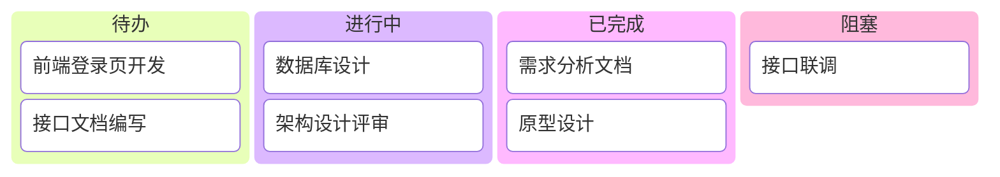
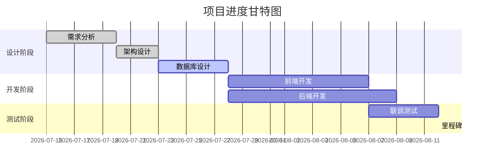
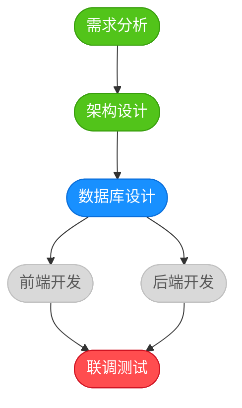

# Skill: Dashboard Visualizer

## 描述

可视化看板工具，生成项目进度和工作数据的可视化展示。为OpenClaw多Agent协作框架提供项目进度跟踪、任务统计、Agent工作负载监控和工作流状态展示能力，支持HTML交互式看板、Mermaid图表和ASCII艺术三种输出格式，并支持实时数据更新。

## 功能

### 1. 项目进度看板 (Kanban风格)

以Kanban看板形式展示项目任务的进度状态。

**支持能力**:
- 任务卡片拖拽排序
- 多列状态分组展示
- 任务优先级标签
- 负责人Avatar显示
- 任务截止时间高亮

### 2. 任务统计图表

对项目任务进行多维度统计分析。

**统计维度**:
- 按状态统计 (待办/进行中/已完成/阻塞)
- 按优先级统计 (高/中/低)
- 按Agent统计 (各Agent处理任务数)
- 按时间统计 (日/周/月趋势)

### 3. Agent工作负载可视化

展示各Agent当前的工作量分布情况，便于任务均衡调度。

**展示内容**:
- 各Agent当前任务数
- 各Agent任务总耗时
- Agent忙闲状态 (空闲/正常/繁忙/过载)
- 任务类型分布

### 4. 工作流状态图

以流程图形式展示当前项目工作流的执行状态。

**展示内容**:
- 当前活动节点
- 已完成节点
- 待执行节点
- 阻塞节点
- 节点间流转关系

### 5. 实时数据更新

支持看板数据的实时刷新和增量更新。

**更新方式**:
- 全量刷新 (重新生成整个看板)
- 增量更新 (仅更新变化部分)
- WebSocket推送 (实时事件驱动)
- 轮询刷新 (定时拉取)

## 看板类型

### 任务看板

四列Kanban风格的看板，展示任务全生命周期状态。

**列定义**:

| 列名 | 状态码 | 说明 |
|------|--------|------|
| 待办 | todo | 新建未分配或待开始的任务 |
| 进行中 | in_progress | 正在由Agent处理的任务 |
| 已完成 | done | 已完成并验证通过的任务 |
| 阻塞 | blocked | 因依赖或问题被阻塞的任务 |

### 甘特图

以时间线形式展示任务的开始时间、结束时间和执行进度。

**展示要素**:
- 任务名称
- 起止时间
- 完成进度 (0%-100%)
- 负责Agent
- 依赖关系
- 里程碑标记

### 统计图表

多类型统计图表，支持数据可视化分析。

**图表类型**:
- **饼图**：任务状态分布占比
- **柱状图**：各Agent任务数量对比
- **折线图**：任务完成趋势变化

### Agent负载图

展示各Agent工作量分布的专项图表。

**展示形式**:
- 横向柱状图 (任务数量)
- 热力图 (负载强度)
- 环形图 (任务占比)
- 仪表盘 (负载率)

### 流程图

展示当前工作流状态的Mermaid流程图。

**展示要素**:
- 工作流节点
- 节点状态 (active/completed/pending/blocked)
- 流转箭头
- 当前执行位置高亮

## 使用示例

### 生成看板

```json
{
  "action": "generate",
  "type": "kanban",
  "data": {
    "title": "项目任务看板",
    "tasks": [
      {
        "id": "task-001",
        "title": "需求分析文档",
        "status": "done",
        "priority": "high",
        "assignee": "requirement-analyst",
        "dueDate": "2026-07-20"
      },
      {
        "id": "task-002",
        "title": "数据库设计",
        "status": "in_progress",
        "priority": "high",
        "assignee": "database-designer",
        "dueDate": "2026-07-25",
        "progress": 60
      },
      {
        "id": "task-003",
        "title": "前端登录页开发",
        "status": "todo",
        "priority": "medium",
        "assignee": "frontend-developer",
        "dueDate": "2026-07-30"
      },
      {
        "id": "task-004",
        "title": "接口联调",
        "status": "blocked",
        "priority": "high",
        "assignee": "backend-developer",
        "dueDate": "2026-07-28",
        "blockReason": "等待接口文档确认"
      }
    ]
  },
  "outputFormat": "html"
}
```

### 生成甘特图

```json
{
  "action": "generate",
  "type": "gantt",
  "data": {
    "title": "项目进度甘特图",
    "tasks": [
      {
        "id": "gantt-001",
        "name": "需求分析",
        "start": "2026-07-15",
        "end": "2026-07-20",
        "progress": 100,
        "assignee": "requirement-analyst"
      },
      {
        "id": "gantt-002",
        "name": "数据库设计",
        "start": "2026-07-20",
        "end": "2026-07-25",
        "progress": 60,
        "assignee": "database-designer"
      },
      {
        "id": "gantt-003",
        "name": "前端开发",
        "start": "2026-07-25",
        "end": "2026-08-05",
        "progress": 0,
        "assignee": "frontend-developer",
        "dependencies": ["gantt-002"]
      },
      {
        "id": "gantt-004",
        "name": "里程碑: MVP交付",
        "type": "milestone",
        "start": "2026-08-05"
      }
    ]
  },
  "outputFormat": "mermaid"
}
```

### 生成统计

```json
{
  "action": "generate",
  "type": "statistics",
  "period": "weekly",
  "data": {
    "startDate": "2026-07-20",
    "endDate": "2026-07-26",
    "statusDistribution": {
      "todo": 12,
      "in_progress": 8,
      "done": 25,
      "blocked": 3
    },
    "priorityDistribution": {
      "high": 10,
      "medium": 18,
      "low": 20
    },
    "agentWorkload": [
      { "agent": "requirement-analyst", "tasks": 5, "hours": 32 },
      { "agent": "architect", "tasks": 3, "hours": 28 },
      { "agent": "frontend-developer", "tasks": 8, "hours": 45 },
      { "agent": "backend-developer", "tasks": 10, "hours": 52 },
      { "agent": "tester", "tasks": 6, "hours": 30 }
    ],
    "completionTrend": [
      { "date": "2026-07-20", "completed": 4 },
      { "date": "2026-07-21", "completed": 6 },
      { "date": "2026-07-22", "completed": 3 },
      { "date": "2026-07-23", "completed": 5 },
      { "date": "2026-07-24", "completed": 4 },
      { "date": "2026-07-25", "completed": 2 },
      { "date": "2026-07-26", "completed": 1 }
    ]
  },
  "outputFormat": "html"
}
```

### 实时更新

```json
{
  "action": "update",
  "dashboardId": "dash-001",
  "data": {
    "taskId": "task-002",
    "changes": {
      "status": "done",
      "progress": 100,
      "completedAt": "2026-07-26T14:30:00+08:00"
    }
  },
  "updateMode": "incremental"
}
```

### 生成Agent负载图

```json
{
  "action": "generate",
  "type": "agent-workload",
  "data": {
    "agents": [
      {
        "name": "requirement-analyst",
        "current": 2,
        "completed": 8,
        "capacity": 5,
        "status": "normal"
      },
      {
        "name": "backend-developer",
        "current": 6,
        "completed": 12,
        "capacity": 5,
        "status": "overload"
      },
      {
        "name": "frontend-developer",
        "current": 1,
        "completed": 10,
        "capacity": 5,
        "status": "idle"
      }
    ]
  },
  "outputFormat": "html"
}
```

### 生成工作流状态图

```json
{
  "action": "generate",
  "type": "workflow",
  "data": {
    "title": "项目开发工作流",
    "nodes": [
      { "id": "n1", "name": "需求分析", "status": "completed" },
      { "id": "n2", "name": "架构设计", "status": "completed" },
      { "id": "n3", "name": "数据库设计", "status": "active" },
      { "id": "n4", "name": "前端开发", "status": "pending" },
      { "id": "n5", "name": "后端开发", "status": "pending" },
      { "id": "n6", "name": "联调测试", "status": "blocked" }
    ],
    "edges": [
      { "from": "n1", "to": "n2" },
      { "from": "n2", "to": "n3" },
      { "from": "n3", "to": "n4" },
      { "from": "n3", "to": "n5" },
      { "from": "n4", "to": "n6" },
      { "from": "n5", "to": "n6" }
    ]
  },
  "outputFormat": "mermaid"
}
```

## 输出格式

### HTML（交互式看板）

生成完整的HTML页面，包含CSS样式和JavaScript交互逻辑，支持浏览器直接打开。

```html
<!DOCTYPE html>
<html lang="zh-CN">
<head>
  <meta charset="UTF-8">
  <meta name="viewport" content="width=device-width, initial-scale=1.0">
  <title>项目看板</title>
  <style>
    * { margin: 0; padding: 0; box-sizing: border-box; }
    body {
      font-family: -apple-system, BlinkMacSystemFont, 'Segoe UI', Roboto, sans-serif;
      background: #f5f7fa;
      color: #333;
      padding: 20px;
    }
    .dashboard-header {
      display: flex;
      justify-content: space-between;
      align-items: center;
      margin-bottom: 24px;
      padding: 16px 24px;
      background: #fff;
      border-radius: 8px;
      box-shadow: 0 2px 8px rgba(0,0,0,0.06);
    }
    .dashboard-title { font-size: 20px; font-weight: 600; color: #1a1a1a; }
    .refresh-btn {
      padding: 8px 16px;
      background: #1890ff;
      color: #fff;
      border: none;
      border-radius: 4px;
      cursor: pointer;
      font-size: 14px;
    }
    .refresh-btn:hover { background: #40a9ff; }

    /* 看板布局 */
    .kanban-board {
      display: grid;
      grid-template-columns: repeat(4, 1fr);
      gap: 16px;
    }
    .kanban-column {
      background: #fff;
      border-radius: 8px;
      padding: 16px;
      box-shadow: 0 2px 8px rgba(0,0,0,0.06);
      min-height: 400px;
    }
    .column-header {
      display: flex;
      justify-content: space-between;
      align-items: center;
      padding-bottom: 12px;
      margin-bottom: 12px;
      border-bottom: 2px solid #f0f0f0;
    }
    .column-title { font-size: 14px; font-weight: 600; }
    .column-count {
      background: #f0f2f5;
      color: #666;
      padding: 2px 8px;
      border-radius: 10px;
      font-size: 12px;
    }

    /* 状态颜色 */
    .column-todo .column-title { color: #666; }
    .column-in-progress .column-title { color: #1890ff; }
    .column-done .column-title { color: #52c41a; }
    .column-blocked .column-title { color: #ff4d4f; }

    /* 任务卡片 */
    .task-card {
      background: #fafafa;
      border: 1px solid #f0f0f0;
      border-radius: 6px;
      padding: 12px;
      margin-bottom: 8px;
      cursor: move;
      transition: box-shadow 0.2s, transform 0.2s;
    }
    .task-card:hover {
      box-shadow: 0 4px 12px rgba(0,0,0,0.1);
      transform: translateY(-2px);
    }
    .task-card.dragging { opacity: 0.5; }
    .task-title {
      font-size: 14px;
      font-weight: 500;
      margin-bottom: 8px;
      color: #1a1a1a;
    }
    .task-meta {
      display: flex;
      justify-content: space-between;
      align-items: center;
      font-size: 12px;
      color: #999;
    }
    .priority-tag {
      padding: 2px 6px;
      border-radius: 3px;
      font-size: 11px;
      font-weight: 500;
    }
    .priority-high { background: #fff1f0; color: #ff4d4f; }
    .priority-medium { background: #fff7e6; color: #fa8c16; }
    .priority-low { background: #f6ffed; color: #52c41a; }

    .assignee {
      display: inline-flex;
      align-items: center;
      gap: 4px;
    }
    .assignee-avatar {
      width: 20px;
      height: 20px;
      border-radius: 50%;
      background: #1890ff;
      color: #fff;
      display: flex;
      align-items: center;
      justify-content: center;
      font-size: 10px;
      font-weight: 600;
    }
    .due-date.overdue { color: #ff4d4f; }

    /* 响应式设计 */
    @media (max-width: 1024px) {
      .kanban-board { grid-template-columns: repeat(2, 1fr); }
    }
    @media (max-width: 640px) {
      .kanban-board { grid-template-columns: 1fr; }
      .dashboard-header { flex-direction: column; gap: 12px; }
    }
  </style>
</head>
<body>
  <div class="dashboard-header">
    <h1 class="dashboard-title">项目任务看板</h1>
    <button class="refresh-btn" onclick="refreshDashboard()">刷新数据</button>
  </div>

  <div class="kanban-board" id="kanbanBoard">
    <div class="kanban-column column-todo">
      <div class="column-header">
        <span class="column-title">待办</span>
        <span class="column-count" id="count-todo">0</span>
      </div>
      <div class="task-list" data-status="todo"></div>
    </div>
    <div class="kanban-column column-in-progress">
      <div class="column-header">
        <span class="column-title">进行中</span>
        <span class="column-count" id="count-in_progress">0</span>
      </div>
      <div class="task-list" data-status="in_progress"></div>
    </div>
    <div class="kanban-column column-done">
      <div class="column-header">
        <span class="column-title">已完成</span>
        <span class="column-count" id="count-done">0</span>
      </div>
      <div class="task-list" data-status="done"></div>
    </div>
    <div class="kanban-column column-blocked">
      <div class="column-header">
        <span class="column-title">阻塞</span>
        <span class="column-count" id="count-blocked">0</span>
      </div>
      <div class="task-list" data-status="blocked"></div>
    </div>
  </div>

  <script>
    // 看板数据
    let dashboardData = {
      tasks: [],
      lastUpdate: null
    };

    // 渲染任务卡片
    function renderTaskCard(task) {
      const initials = (task.assignee || '?').substring(0, 2).toUpperCase();
      const dueDate = task.dueDate ? new Date(task.dueDate) : null;
      const isOverdue = dueDate && dueDate < new Date() && task.status !== 'done';
      const dueClass = isOverdue ? 'due-date overdue' : 'due-date';
      const dueText = dueDate ? dueDate.toLocaleDateString('zh-CN') : '';

      return `
        <div class="task-card" draggable="true" data-task-id="${task.id}">
          <div class="task-title">${task.title}</div>
          <div class="task-meta">
            <span class="priority-tag priority-${task.priority || 'medium'}">
              ${task.priority === 'high' ? '高' : task.priority === 'low' ? '低' : '中'}
            </span>
            <span class="assignee">
              <span class="assignee-avatar">${initials}</span>
              <span>${task.assignee || '-'}</span>
            </span>
            <span class="${dueClass}">${dueText}</span>
          </div>
        </div>
      `;
    }

    // 渲染看板
    function renderBoard() {
      const statusList = ['todo', 'in_progress', 'done', 'blocked'];
      statusList.forEach(status => {
        const list = document.querySelector(`.task-list[data-status="${status}"]`);
        const tasks = dashboardData.tasks.filter(t => t.status === status);
        list.innerHTML = tasks.map(renderTaskCard).join('');
        document.getElementById(`count-${status}`).textContent = tasks.length;
      });
      dashboardData.lastUpdate = new Date();
    }

    // 刷新看板
    function refreshDashboard() {
      fetch('/api/dashboard/data')
        .then(res => res.json())
        .then(data => {
          dashboardData = data;
          renderBoard();
        })
        .catch(err => console.error('刷新失败:', err));
    }

    // 拖拽支持
    document.addEventListener('dragstart', e => {
      if (e.target.classList.contains('task-card')) {
        e.target.classList.add('dragging');
        e.dataTransfer.setData('taskId', e.target.dataset.taskId);
      }
    });
    document.addEventListener('dragend', e => {
      if (e.target.classList.contains('task-card')) {
        e.target.classList.remove('dragging');
      }
    });
    document.querySelectorAll('.task-list').forEach(list => {
      list.addEventListener('dragover', e => e.preventDefault());
      list.addEventListener('drop', e => {
        e.preventDefault();
        const taskId = e.dataTransfer.getData('taskId');
        const newStatus = list.dataset.status;
        updateTaskStatus(taskId, newStatus);
      });
    });

    // 更新任务状态
    function updateTaskStatus(taskId, newStatus) {
      const task = dashboardData.tasks.find(t => t.id === taskId);
      if (task) {
        task.status = newStatus;
        renderBoard();
        fetch('/api/dashboard/update', {
          method: 'POST',
          headers: { 'Content-Type': 'application/json' },
          body: JSON.stringify({ taskId, changes: { status: newStatus } })
        });
      }
    }

    // 初始化
    renderBoard();
  </script>
</body>
</html>
```

### Mermaid图表（Markdown嵌入）



### 甘特图 Mermaid



### 工作流状态图 Mermaid



### ASCII艺术（终端显示）

```
┌────────────────────────────────────────────────────────────────┐
│                     项目任务看板 (共 7 项)                       │
├──────────────┬──────────────┬──────────────┬──────────────────┤
│    待办 (2)   │   进行中 (2) │   已完成 (2) │     阻塞 (1)     │
├──────────────┼──────────────┼──────────────┼──────────────────┤
│ □ 前端登录页 │ ▶ 数据库设计 │ ✓ 需求分析   │ ⚠ 接口联调       │
│   [中] FE    │   [高] DB    │   [高] RA    │   [高] BE        │
│   07-30      │   07-25 60%  │   07-20      │   等待接口文档   │
├──────────────┼──────────────┼──────────────┼──────────────────┤
│ □ 接口文档   │ ▶ 架构设计   │ ✓ 原型设计   │                  │
│   [中] TW    │   [高] AR    │   [中] UI    │                  │
│   08-01      │   07-24 80%  │   07-18      │                  │
└──────────────┴──────────────┴──────────────┴──────────────────┘
图例: □ 待办  ▶ 进行中  ✓ 已完成  ⚠ 阻塞  [优先级] 负责人Agent缩写
```

## HTML看板模板结构

### 模板组件清单

| 组件 | 说明 | 必需 |
|------|------|------|
| `dashboard-header` | 顶部标题栏，含刷新按钮 | 是 |
| `kanban-board` | 看板主容器，4列网格布局 | 是 |
| `kanban-column` | 单列容器，含表头和任务列表 | 是 |
| `task-card` | 任务卡片，可拖拽 | 是 |
| `priority-tag` | 优先级标签 | 否 |
| `assignee-avatar` | 负责人头像 | 否 |
| `progress-bar` | 进度条 (甘特图用) | 否 |
| `chart-container` | 图表容器 (统计图用) | 否 |

### CSS样式规范

**颜色体系**:
- 主色: `#1890ff` (进行中)
- 成功色: `#52c41a` (已完成)
- 警告色: `#fa8c16` (中优先级)
- 危险色: `#ff4d4f` (阻塞/高优先级)
- 中性色: `#666` (待办/低优先级)
- 背景色: `#f5f7fa`
- 卡片色: `#fff`

**字体规范**:
- 标题: 20px / 600
- 列标题: 14px / 600
- 卡片标题: 14px / 500
- 元信息: 12px / 400

**间距规范**:
- 大间距: 24px
- 中间距: 16px
- 小间距: 8px
- 卡片内边距: 12px

### JavaScript交互能力

**核心函数**:
- `renderBoard()` - 渲染整个看板
- `renderTaskCard(task)` - 渲染单个任务卡片
- `refreshDashboard()` - 拉取最新数据并刷新
- `updateTaskStatus(taskId, newStatus)` - 更新任务状态
- `enableDragDrop()` - 启用拖拽功能
- `enableRealtimeUpdate()` - 启用WebSocket实时推送

**事件支持**:
- 卡片拖拽 (`dragstart` / `dragover` / `drop`)
- 状态变更 (`onStatusChange`)
- 数据刷新 (`onRefresh`)
- 实时推送 (`onPush`)
- 卡片点击 (`onCardClick`)

## 响应式设计支持

### 断点定义

| 断点 | 屏幕宽度 | 布局调整 |
|------|----------|----------|
| 桌面 | > 1024px | 4列并排展示 |
| 平板 | 641px - 1024px | 2列布局 |
| 手机 | ≤ 640px | 单列堆叠，标题栏纵向排列 |

### 响应式CSS示例

```css
/* 桌面端 - 4列 */
.kanban-board {
  grid-template-columns: repeat(4, 1fr);
  gap: 16px;
}

/* 平板端 - 2列 */
@media (max-width: 1024px) {
  .kanban-board {
    grid-template-columns: repeat(2, 1fr);
    gap: 12px;
  }
  body { padding: 16px; }
}

/* 手机端 - 1列 */
@media (max-width: 640px) {
  .kanban-board {
    grid-template-columns: 1fr;
    gap: 12px;
  }
  body { padding: 12px; }
  .dashboard-header {
    flex-direction: column;
    gap: 12px;
    align-items: stretch;
  }
  .dashboard-title { font-size: 18px; text-align: center; }
  .refresh-btn { width: 100%; }
  .task-card { padding: 10px; }
  .task-meta { flex-wrap: wrap; gap: 6px; }
}
```

### 移动端适配要点

- 触摸操作支持 (`touch-action`, `-webkit-tap-highlight-color`)
- 卡片字体适当缩小
- 元信息自动换行
- 刷新按钮全宽显示
- 头部纵向排列

## 配置

```json
{
  "outputFormats": ["html", "mermaid", "ascii"],
  "defaultFormat": "html",
  "theme": {
    "primaryColor": "#1890ff",
    "successColor": "#52c41a",
    "warningColor": "#fa8c16",
    "dangerColor": "#ff4d4f",
    "backgroundColor": "#f5f7fa",
    "cardBackgroundColor": "#ffffff",
    "textColor": "#333333"
  },
  "kanban": {
    "columns": ["todo", "in_progress", "done", "blocked"],
    "columnTitles": {
      "todo": "待办",
      "in_progress": "进行中",
      "done": "已完成",
      "blocked": "阻塞"
    },
    "enableDragDrop": true
  },
  "realtime": {
    "enabled": true,
    "mode": "websocket",
    "interval": 30000,
    "endpoint": "/ws/dashboard"
  },
  "responsive": {
    "breakpoints": {
      "desktop": 1024,
      "tablet": 640,
      "mobile": 0
    }
  },
  "export": {
    "path": "./workspaces/dashboard-visualizer/dashboards",
    "naming": "dashboard-{type}-{timestamp}",
    "formats": ["html", "png", "svg"]
  }
}
```

## 集成工具

### Mermaid集成

```javascript
// Mermaid配置
mermaid.initialize({
  startOnLoad: true,
  theme: 'default',
  kanban: { useMaxWidth: true },
  gantt: {
    axisFormat: '%Y-%m-%d',
    barHeight: 20,
    barGap: 4
  },
  flowchart: {
    useMaxWidth: true,
    htmlLabels: true,
    curve: 'basis'
  }
});
```

### Chart.js集成 (统计图表)

```javascript
// 饼图 - 任务状态分布
new Chart(document.getElementById('statusPieChart'), {
  type: 'pie',
  data: {
    labels: ['待办', '进行中', '已完成', '阻塞'],
    datasets: [{
      data: [12, 8, 25, 3],
      backgroundColor: ['#d9d9d9', '#1890ff', '#52c41a', '#ff4d4f']
    }]
  }
});

// 柱状图 - Agent任务数量
new Chart(document.getElementById('agentBarChart'), {
  type: 'bar',
  data: {
    labels: ['需求分析', '架构师', '前端', '后端', '测试'],
    datasets: [{
      label: '任务数',
      data: [5, 3, 8, 10, 6],
      backgroundColor: '#1890ff'
    }]
  }
});

// 折线图 - 完成趋势
new Chart(document.getElementById('trendLineChart'), {
  type: 'line',
  data: {
    labels: ['07-20', '07-21', '07-22', '07-23', '07-24', '07-25', '07-26'],
    datasets: [{
      label: '每日完成数',
      data: [4, 6, 3, 5, 4, 2, 1],
      borderColor: '#1890ff',
      fill: false,
      tension: 0.3
    }]
  }
});
```

### WebSocket实时更新

```javascript
// 建立WebSocket连接
const ws = new WebSocket('ws://localhost:8080/ws/dashboard');

ws.onmessage = (event) => {
  const data = JSON.parse(event.data);
  if (data.type === 'task-update') {
    const task = dashboardData.tasks.find(t => t.id === data.taskId);
    if (task) {
      Object.assign(task, data.changes);
      renderBoard();
    }
  }
};

ws.onclose = () => {
  console.warn('WebSocket断开，5秒后重连...');
  setTimeout(connectWebSocket, 5000);
};
```

## 看板类型对照表

| 看板类型 | type字段 | 适用场景 | 推荐输出格式 |
|----------|----------|----------|--------------|
| 任务看板 | `kanban` | 日常任务管理 | html |
| 甘特图 | `gantt` | 进度时间线管理 | mermaid |
| 统计图表 | `statistics` | 数据分析汇报 | html |
| Agent负载图 | `agent-workload` | 资源调度均衡 | html |
| 工作流状态图 | `workflow` | 流程监控 | mermaid |
| 任务统计 | `statistics` | 周报月报 | html, ascii |
