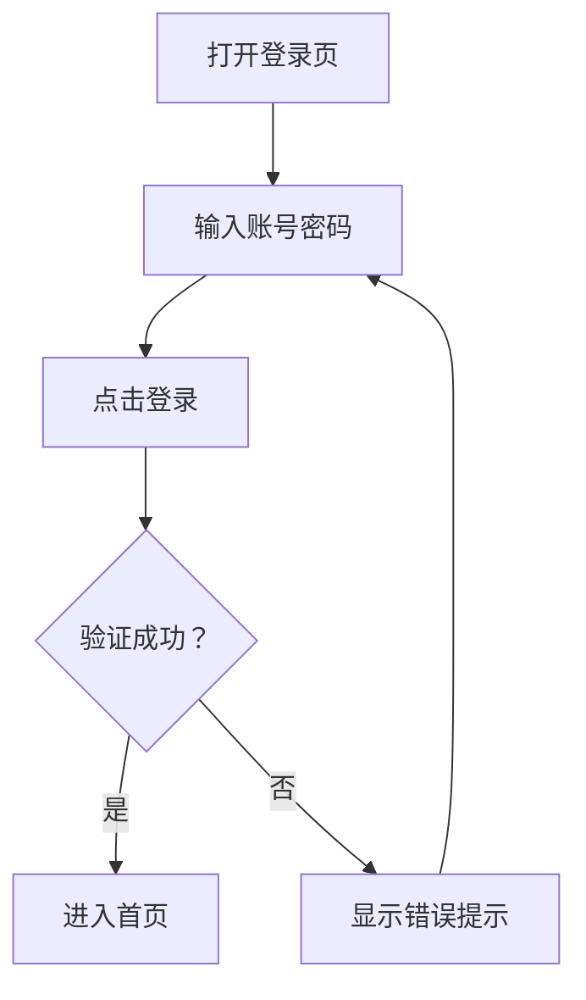
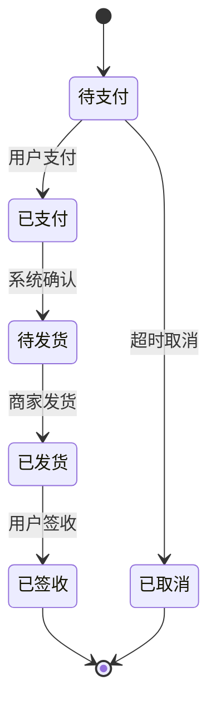
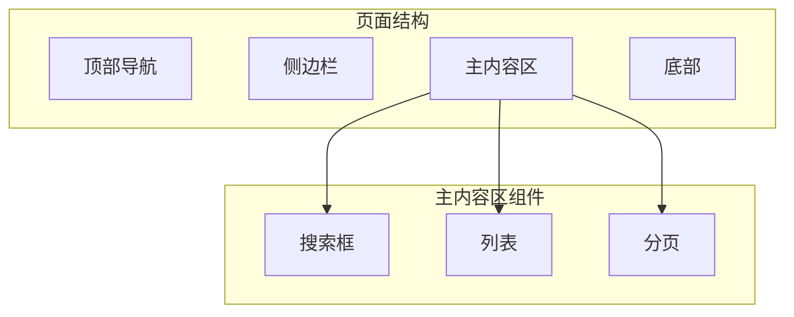

# Skill: Prototype Visualizer

## 描述

原型可视化工具，帮助产品设计师和UI设计师生成可视化的原型图、流程图和交互图。

## 功能

### 1. 原型图生成

生成可视化的页面原型图。

**支持格式**:
- Mermaid流程图
- PlantUML组件图
- ASCII艺术图
- HTML预览页面

### 2. 流程图生成

生成可视化的用户流程图。

**流程类型**:
- 用户旅程图
- 状态流转图
- 业务流程图
- 数据流程图

### 3. 交互原型

生成交互式原型预览。

**交互类型**:
- 页面跳转
- 表单交互
- 状态切换
- 动画效果

### 4. 设计稿预览

生成设计稿预览链接。

**预览类型**:
- 静态图片
- 交互原型
- 设计规范

## 使用示例

### 生成页面原型

```json
{
  "action": "generatePrototype",
  "type": "page",
  "config": {
    "name": "登录页面",
    "layout": "center",
    "components": [
      {
        "type": "input",
        "label": "邮箱/手机号",
        "placeholder": "请输入邮箱或手机号"
      },
      {
        "type": "password",
        "label": "密码",
        "placeholder": "请输入密码"
      },
      {
        "type": "button",
        "text": "登录",
        "variant": "primary"
      }
    ]
  },
  "outputFormat": "html"
}
```

### 生成流程图

```json
{
  "action": "generateFlowchart",
  "type": "user-journey",
  "config": {
    "title": "用户登录流程",
    "steps": [
      { "action": "打开登录页", "type": "start" },
      { "action": "输入账号密码", "type": "input" },
      { "action": "点击登录", "type": "action" },
      { "action": "验证成功？", "type": "decision" },
      { "action": "进入首页", "type": "end", "condition": "是" },
      { "action": "显示错误提示", "type": "error", "condition": "否" }
    ]
  },
  "outputFormat": "mermaid"
}
```

### 生成交互原型

```json
{
  "action": "generateInteractive",
  "type": "prototype",
  "config": {
    "pages": [
      {
        "id": "login",
        "name": "登录页",
        "components": [...]
      },
      {
        "id": "home",
        "name": "首页",
        "components": [...]
      }
    ],
    "interactions": [
      {
        "trigger": "click",
        "source": "login-button",
        "target": "home",
        "animation": "fade"
      }
    ]
  },
  "outputFormat": "html"
}
```

## 输出格式

### Mermaid流程图



### HTML原型预览

```html
<!DOCTYPE html>
<html>
<head>
  <title>登录页面原型</title>
  <style>
    .prototype-container {
      max-width: 375px;
      margin: 0 auto;
      padding: 20px;
    }
    .form-group { margin-bottom: 16px; }
    .form-label { display: block; margin-bottom: 8px; }
    .form-input {
      width: 100%;
      padding: 12px;
      border: 1px solid #ddd;
      border-radius: 4px;
    }
    .btn-primary {
      width: 100%;
      padding: 12px;
      background: #1890FF;
      color: white;
      border: none;
      border-radius: 4px;
    }
  </style>
</head>
<body>
  <div class="prototype-container">
    <h2>登录</h2>
    <div class="form-group">
      <label class="form-label">邮箱/手机号</label>
      <input class="form-input" placeholder="请输入邮箱或手机号">
    </div>
    <div class="form-group">
      <label class="form-label">密码</label>
      <input class="form-input" type="password" placeholder="请输入密码">
    </div>
    <button class="btn-primary">登录</button>
  </div>
</body>
</html>
```

### 状态流转图



### 组件结构图



## 配置

```json
{
  "outputFormats": ["mermaid", "html", "svg", "png"],
  "defaultFormat": "mermaid",
  "theme": {
    "primaryColor": "#1890FF",
    "backgroundColor": "#FFFFFF",
    "textColor": "#333333"
  },
  "preview": {
    "autoOpen": true,
    "port": 3000
  },
  "export": {
    "path": "./workspaces/product-designer/prototypes",
    "naming": "{page-name}-{timestamp}"
  }
}
```

## 集成工具

### Mermaid集成

```javascript
// Mermaid配置
mermaid.initialize({
  startOnLoad: true,
  theme: 'default',
  flowchart: {
    useMaxWidth: true,
    htmlLabels: true,
    curve: 'basis'
  }
});
```

### HTML预览服务

```javascript
// 启动预览服务
const express = require('express');
const app = express();

app.get('/prototype/:id', (req, res) => {
  const prototype = getPrototype(req.params.id);
  res.send(renderPrototype(prototype));
});

app.listen(3000);
```

## 组件库

### 基础组件

| 组件 | 类型 | 属性 |
|------|------|------|
| Button | 按钮 | text, variant, size, disabled |
| Input | 输入框 | label, placeholder, type, required |
| Select | 选择器 | options, placeholder, multiple |
| Checkbox | 复选框 | label, checked, disabled |
| Radio | 单选框 | label, checked, name |
| Switch | 开关 | checked, disabled |
| Upload | 上传 | accept, multiple, maxSize |
| DatePicker | 日期选择 | format, range, disabled |

### 布局组件

| 组件 | 说明 |
|------|------|
| Header | 页面头部 |
| Footer | 页面底部 |
| Sidebar | 侧边栏 |
| Card | 卡片容器 |
| Modal | 弹窗 |
| Drawer | 抽屉 |
| Tabs | 标签页 |
| Collapse | 折叠面板 |

### 业务组件

| 组件 | 说明 |
|------|------|
| LoginForm | 登录表单 |
| RegisterForm | 注册表单 |
| SearchBar | 搜索栏 |
| DataTable | 数据表格 |
| Chart | 图表 |
| Map | 地图 |
